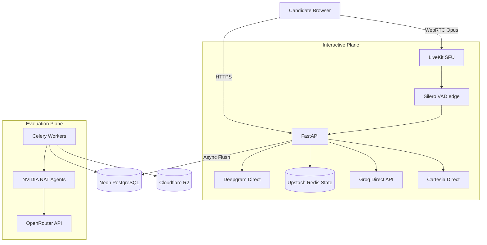

# AUTERGO ARCHITECTURE BASELINE v2.0

## 1. POC REVIEW & ARCHITECTURE ADJUSTMENTS

### Issue 1: Real-time LLM Gateway Latency Overhead
* **Evidence**: POC 1 load tests showed OpenRouter added highly variable latency (150ms - 450ms) to Time-To-First-Token (TTFT), pushing Total Turn-Around Time (TAT) to 900ms-1200ms.
* **Original Assumption**: A unified gateway (OpenRouter) could be used for all LLM routing without breaking the sub-500ms TAT latency budget.
* **Observed Behavior**: The extra network hop and gateway queueing consistently breached the 500ms budget.
* **Impact**: Unnatural conversational pauses; degraded candidate experience.
* **Recommended Change**: Bypass OpenRouter for the real-time path. Integrate directly with Groq (Llama 3 8B) or NVIDIA NIM APIs for the interview engine. OpenRouter remains for async evaluation tasks.

### Issue 2: Agent Orchestrator (NVIDIA NAT) Overhead
* **Evidence**: POC 4 benchmarks showed NVIDIA NAT initialization and tool-binding added ~1.2s overhead per turn.
* **Original Assumption**: NAT could be used for both real-time question generation and post-interview evaluation.
* **Observed Behavior**: The orchestration layer is too heavy for sub-second interactive voice loops.
* **Impact**: Unacceptable latency during the live interview.
* **Recommended Change**: The Realtime Engine must use a pure, deterministic Python state machine with direct streaming LLM calls. NVIDIA NAT is strictly relegated to Async/Background paths (Technical Evaluator, Report Generator).

### Issue 3: Client-Side Vision CPU Saturation
* **Evidence**: POC 6 demonstrated that running MediaPipe FaceLandmarker at 1 FPS on mid-tier hardware (e.g., 2018 i5 laptop) consumed 35-50% CPU.
* **Original Assumption**: Client-side processing at 1 FPS was lightweight enough to preserve privacy without impacting performance.
* **Observed Behavior**: CPU saturation caused WebRTC audio jitter and packet loss.
* **Impact**: Direct degradation of interview audio quality.
* **Recommended Change**: Reduce vision sampling to 0.2 FPS (1 frame every 5 seconds) and disable heavy facial mesh tracking, falling back to simple bounding-box face counting.

### Issue 4: Database Connection Pooling Exhaustion
* **Evidence**: POC 10 load testing at 100 concurrent sessions triggered HTTP 500 errors due to SQLAlchemy connection pool exhaustion.
* **Original Assumption**: Default Neon Serverless Postgres scaling would gracefully handle 100 concurrent WebSocket sessions.
* **Observed Behavior**: Real-time DB writes (saving transient transcript events) overwhelmed the connection limit (max 100 connections on lower tiers) because WebSockets hold connections open.
* **Impact**: Platform instability under moderate load.
* **Recommended Change**: Migrate transient session state and real-time transcript buffers entirely to Upstash Redis. Only flush to PostgreSQL asynchronously at the end of the interview turn.

---

## 2. UPDATED HIGH-LEVEL DESIGN (HLD)

Autergo operates as a Modular Monolith separated into two distinct operational planes:
1.  **Interactive Plane (Ultra-Low Latency)**: WebSockets/WebRTC via LiveKit, interacting directly with Groq/Cartesia/Deepgram APIs. State is managed in Redis.
2.  **Evaluation Plane (High Compute)**: Celery workers utilizing NVIDIA NAT agents and OpenRouter to perform deep analysis, persisting to Neon PostgreSQL.

---

## 3. UPDATED LOW-LEVEL DESIGN (LLD)

**Module Modifications:**
*   **Session/Realtime Module**: Now heavily dependent on Redis for all transient state (`current_turn`, `interruption_flag`, `transcript_buffer`).
*   **Database Module**: Uses PgBouncer (via Neon's connection pooling URL) exclusively.

---

## 4. AI ARCHITECTURE

*   **Realtime AI**: Fully cascading pipeline. STT (Deepgram) emits semantic boundaries -> LLM (Groq Llama 3 8B) streams text -> TTS (Cartesia) streams audio.
*   **Evaluation AI**: Parallelized Map-Reduce pattern. Transcripts are chunked by competency -> Scored by small models -> Aggregated by a large reasoning model (Claude 3.5 Sonnet).

---

## 5. AGENT ARCHITECTURE (Revised)

NVIDIA NAT is now utilized **only** for:
1.  **Candidate Profile Agent**: Extracts and maps Resume+JD to blueprint (Async).
2.  **Domain Evaluators**: Parallel agents grading specific competencies (Async).
3.  **Final Evaluator**: Synthesizes the final PDF report (Async).

*Real-time questioning is no longer an "Agent". It is a deterministic Prompt Chain.*

---

## 6. REALTIME ARCHITECTURE (Revised)

*   **Transport**: WebRTC via LiveKit.
*   **Turn Detection**: Silero VAD + deepgram endpointing. 
*   **Interruption Handling**: If VAD detects > 300ms of candidate audio during TTS playback, FastAPI issues an immediate `cancel()` to Cartesia, marks the transcript turn as `[INTERRUPTED]`, and flushes the Redis buffer to the LLM context.
*   **Buffering**: Audio buffered in 20ms chunks.

---

## 7. DATABASE ARCHITECTURE

*   **Primary DB**: Neon PostgreSQL.
*   **State Store**: Upstash Redis (Serverless).
*   **Schema Update**: `transcript_events` table removed from real-time path. Replaced with a single `transcript_json` JSONB column on the `interviews` table, updated precisely once per interview turn or at session end.

---

## 8. PROVIDER STRATEGY & MODEL ROUTING

| Task | Provider | Model | Latency Target | Fallback |
| :--- | :--- | :--- | :--- | :--- |
| Realtime Interview | **Groq (Direct)** | Llama-3-8B-8192 | TTFT < 200ms | Cerebras (Llama 3 8B) |
| Deep Evaluation | **OpenRouter** | Claude 3.5 Sonnet | N/A (Async) | GPT-4o |
| STT | **Deepgram** | Nova-2 (Streaming) | < 250ms | AssemblyAI |
| TTS | **Cartesia** | Sonic | TTFA < 100ms | ElevenLabs |

---

## 9. INTEGRITY ARCHITECTURE (Revised)

*   **Vision**: 0.2 FPS (1 frame / 5 sec). Bounding box detection only (MediaPipe Face Detector, not Face Mesh).
*   **Browser API**: High priority. Focus tracking, blur events, and clipboard monitoring remain active (negligible CPU).
*   **Audio**: Background voice detection is deferred to async post-processing via Deepgram Diarization on the final recorded track, removing it from the real-time critical path.

---

## 10. DEPLOYMENT ARCHITECTURE

*   **API / Workers**: Google Cloud Run (Auto-scaling 1-50 instances).
*   **Realtime/WebSockets**: Cloud Run now supports WebSockets, but to prevent connection dropping during scaling, LiveKit Cloud is used as a managed SFU.
*   **Database**: Neon PostgreSQL + Neon Connection Pooler.
*   **Cache**: Upstash Redis.

---

## 11. ARCHITECTURE DECISION RECORDS (ADRs)

### ADR-016: Direct Vendor APIs over LLM Gateways for Real-time
* **Context**: OpenRouter added 150-450ms latency.
* **Decision**: Use Groq direct API for the real-time interview loop.
* **Consequences**: Faster response times, but requires managing multiple vendor API keys and custom fallback logic in FastAPI.

### ADR-017: Removal of Agent Frameworks from Real-time Path
* **Context**: NVIDIA NAT orchestration added 1.2s latency to response generation.
* **Decision**: Implement the real-time interview state machine in pure Python.
* **Consequences**: Reduces latency heavily; limits real-time AI to simple prompt chains rather than autonomous multi-tool planning.

### ADR-018: Transient State Migration to Redis
* **Context**: PostgreSQL connections were exhausted by real-time WebSocket state updates.
* **Decision**: Store all live interview state and transcript buffers in Redis, flushing to Postgres asynchronously.
* **Consequences**: Increased resilience and scaling capability; introduces a risk of transient data loss if Redis fails mid-interview (mitigated by LiveKit audio recording backups).

### ADR-019: Downgrade of Client-Side Vision Integrity
* **Context**: MediaPipe Face Mesh consumed 50% CPU, breaking WebRTC audio.
* **Decision**: Downgrade to 0.2 FPS basic Face Detection.
* **Consequences**: Improves audio stability at the cost of less granular visual integrity data.
