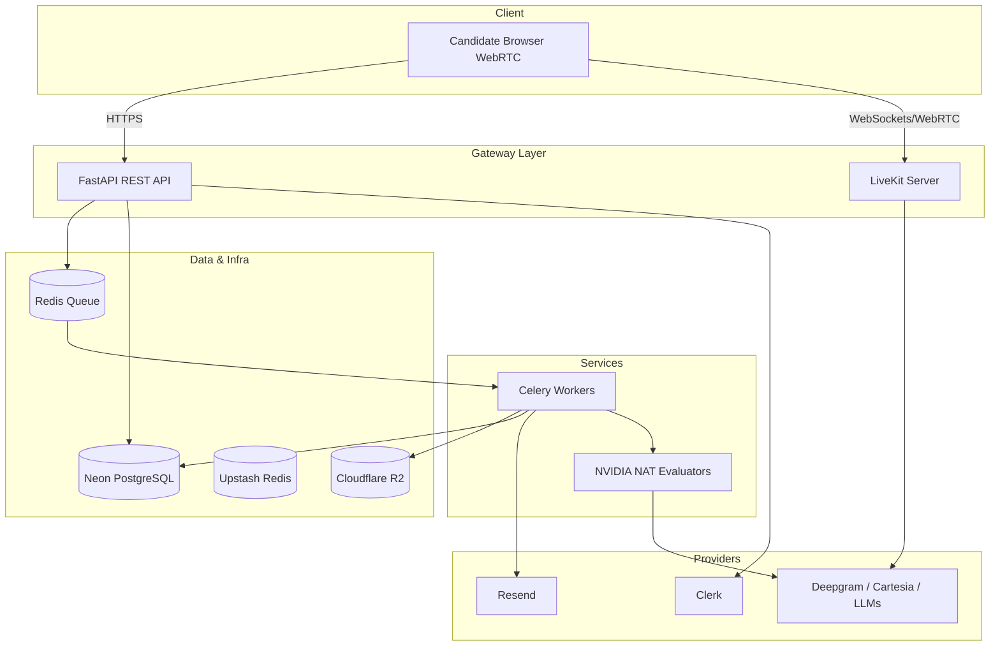
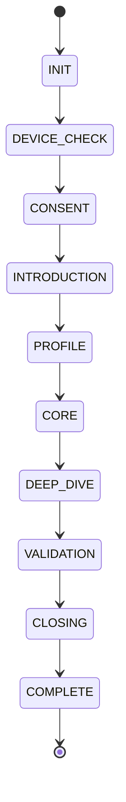
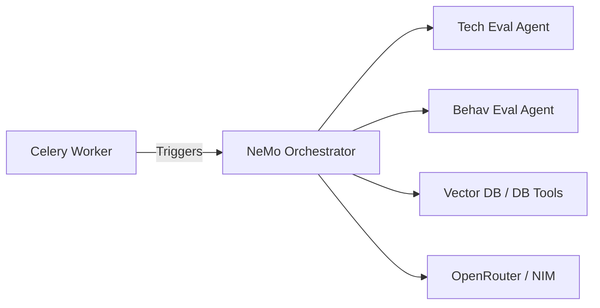
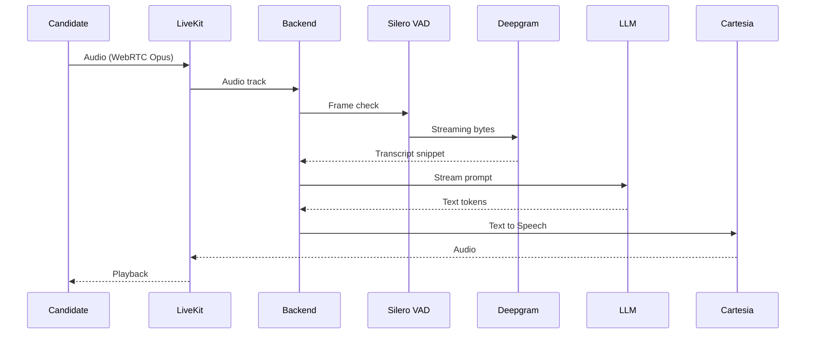
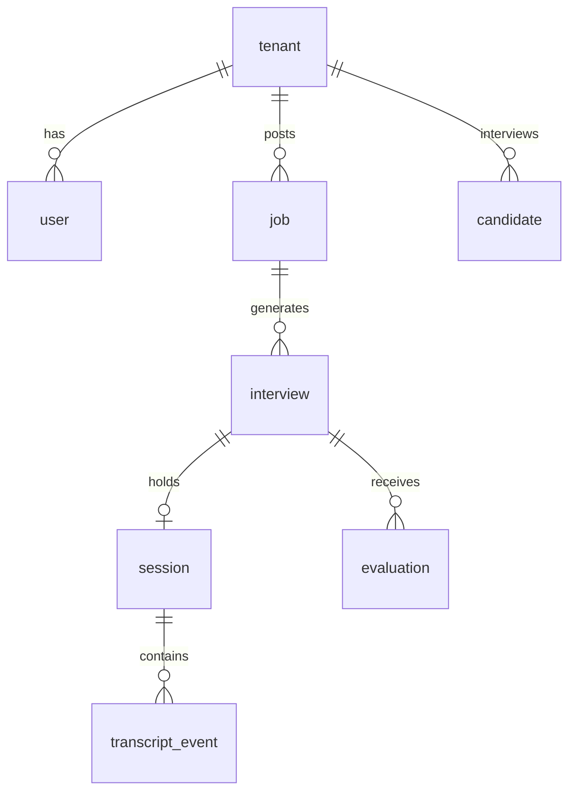

# AUTERGO HIGH-LEVEL AND LOW-LEVEL DESIGN (HLD / LLD) v1.0

## 1. SYSTEM ARCHITECTURE (HLD)

### System Context
The Autergo system is a modular monolith containing the core business logic (FastAPI) and an attached background task queue (Celery/ARQ). The real-time component interacts with a WebRTC SFU (LiveKit) and AI Providers.

### Realtime vs Async Separation
- **Realtime Path (Sub-500ms TAT)**: WebRTC Client -> LiveKit -> VAD -> Deepgram STT -> Fast LLM (Llama 3.1 8B via OpenRouter) -> Cartesia TTS. No heavy evaluation happens here.
- **Async/Background Path**: Celery workers handle deep evaluation via NVIDIA NeMo Agent Toolkit (NAT) agents, email dispatch, integrity aggregation, and PDF report generation.



---

## 2. APPLICATION MODULES (LLD)
1. **Auth Module**: Clerk token verification.
2. **Tenant Module**: Company logic, RLS enforcement.
3. **Job Module**: JD parsing (GLiNER), competency extraction.
4. **Interview Module**: Template and sequence config.
5. **Session Module**: Coordinates WebRTC room creation and token issuance.
6. **Realtime Engine**: Coordinates STT -> LLM -> TTS stream processing.
7. **Agent Orchestrator**: Wraps NAT logic.
8. **Integrity Engine**: Aggregates browser/vision events.

---

## 3. MULTI-TENANCY
**Choice: Shared Schema with Tenant ID (Row-Level Security)**
- **MVP**: The `tenant_id` column on all company-specific tables (Jobs, Candidates, Interviews). RLS guarantees safety. Neon DB handles this effectively.
- **Enterprise (Future)**: Database-per-tenant for large enterprise clients demanding data residency.

---

## 4. INTERVIEW ENGINE (STATE MACHINE)

**Transitions**: Must be deterministic. An LLM acts as a classifier (e.g. `is_evidence_collected: bool`) and the explicit Python state machine transitions states. 

---

## 5. ADAPTIVE QUESTION ENGINE
**Pipeline**: Answer -> STT -> Semantic Turn End -> Quality/Missing Evidence Check -> Next-Question Strategy (Drill down vs Move on) -> Prompt Generation -> Next Question.
**Deterministic Control**: LLMs output structured JSON (Instructor/Pydantic) determining classification. Python strictly evaluates bounds.

---

## 6. MULTI-AGENT DESIGN
- **Interview Planner**: Analyzes JD/Resume -> Generates Blueprint. (Model: Llama 3 70B, Sync).
- **Question Agent (Realtime)**: Generates conversational responses. (Model: Llama 3 8B, Sync, <300ms).
- **Technical/Domain/Behavioral Evaluator**: Process transcript snippets. (Model: GPT-4o Mini, Async).
- **Evidence Aggregator / Final Evaluator**: Merges sub-agent outputs. (Model: Claude 3.5 Sonnet, Async).
- **Integrity Agent**: Assesses cheat probability. (Model: GPT-4o Mini, Async).

---

## 7. NVIDIA NAT INTEGRATION

*Business logic stays in FastAPI. NAT is exclusively invoked by Celery for asynchronous deep evaluation tasks.*

---

## 8. VOICE ARCHITECTURE

- **Barge-in**: Candidate speech detected > cancel TTS/LLM generation context.
- **Latency Budget**: VAD+STT(200ms) + Logic(50ms) + LLM TTFT(250ms) + TTS TTFA(100ms) = 600ms total.

---

## 9. DATABASE (PostgreSQL) ERD


---

## 10. APIs (/api/v1/)
- `POST /sessions/{id}/join` - Returns LiveKit token.
- `GET /jobs` - List tenant jobs.
- `POST /candidates` - Invite candidate.
- `POST /webhooks/livekit` - Handle join/leave events.
*All endpoints require Clerk JWT or Candidate Guest Token.*

---

## 11. EVENT ARCHITECTURE
- `interview.completed` -> Triggers Celery `start_evaluation(interview_id)`
- `evaluation.completed` -> Triggers Celery `generate_report(interview_id)`

---

## 12. SECURITY
- **Boundary**: Cloudflare WAF.
- **Prompt Injection**: Llama Guard 3 on output streams.
- **Coding Sandbox**: Piston in gVisor container (isolated VPC).
- **Secrets**: Infisical injected at runtime. No hardcoding.

---

## 13. REPOSITORY ARCHITECTURE
```text
autergo/
├── api/             # FastAPI routers and controllers
├── core/            # Domain models, State Machines
├── realtime/        # LiveKit, Deepgram, Cartesia logic
├── agents/          # NVIDIA NAT definitions
├── workers/         # Celery tasks
├── infra/           # Terraform / Docker / K8s configs
└── tests/           # Pytest
```

---

## 14. DEPLOYMENT
- **MVP Deployment**: Docker Compose on robust VPS OR Google Cloud Run. Neon Serverless Postgres. Upstash Redis.
- **CI/CD**: GitHub Actions -> Lint -> Pytest -> Trivy -> Build Container -> Push to GCR -> Deploy Cloud Run.

---

## 15. OPEN DECISIONS & POC
- **POC-001**: Cascaded voice loop vs direct Speech-to-Speech (S2S) LLM.

<!-- GOAL_COMPLETE -->
