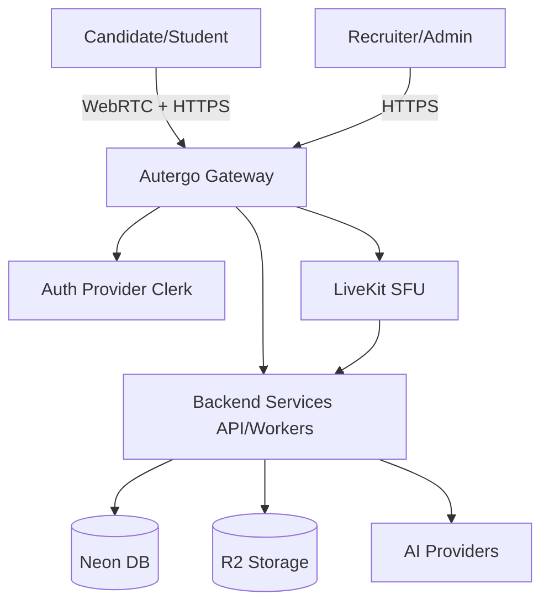
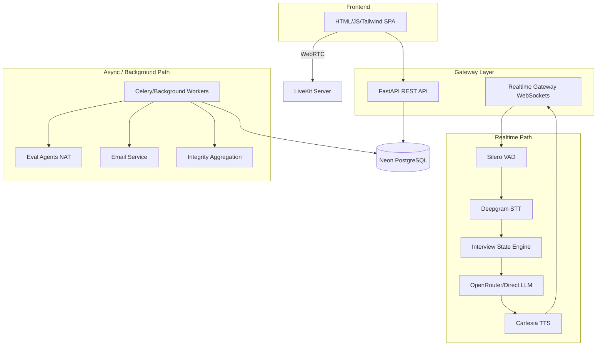
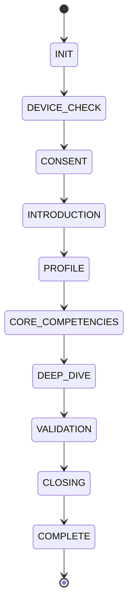
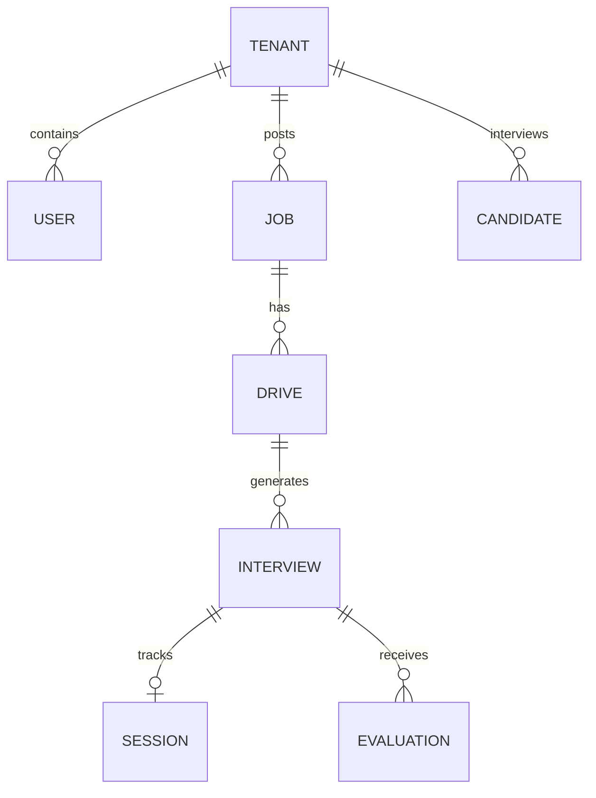

# AUTERGO IMPLEMENTATION BLUEPRINT v1.0

## 1. INPUT AUTHORITY
This document treats the **AUTERGO MASTER REQUIREMENTS BASELINE v1.0** as the authoritative source. When documents conflict, the resolution order is:
Master Requirements Baseline → Audited SRS → Audited FRS → Audited FRD → PRD → BRD.
Technical issues discovered hereafter shall be documented as Engineering Decisions or Open Decisions rather than silent product changes.

---

## 2. DESIGN OBJECTIVES
The Autergo architecture is optimized for:
- **Low voice latency**: Under 500ms Turn-Around Time (TAT) via WebRTC and cascading providers.
- **Adaptive interviewing**: State-machine driven, dynamically generated questions.
- **Reliable interview state management**: Deterministic finite state machine over LLM behavior.
- **Evidence-based evaluation**: Standardized 1-100 scoring per competency with required evidence linking.
- **Practical multi-agent architecture**: Orchestration via NVIDIA NeMo Agent Toolkit (NAT).
- **Cost & Independence**: Provider abstraction allowing swap-outs; use of Cloud Run, Neon DB, R2.
- **Maintainability & Scaling**: Modular monolith approach for MVP, easily decomposable.

---

## 3. SYSTEM CONTEXT

### Actors
- **Super Admin**: Platform-level administration.
- **Company Admin/Head Recruiter**: Manages tenant data and recruitment team.
- **Sub-Recruiter**: Drives, jobs, interviews (scoped to tenant).
- **Invited Candidate**: Participant (authenticated via guest token).
- **Student**: Practice user.

### External Systems
- AI Providers (Deepgram, Cartesia, OpenRouter/NIM)
- LiveKit Cloud/Server (WebRTC)
- DB/Storage (Neon PostgreSQL, Cloudflare R2)
- Auth (Clerk)
- Email (Resend/SES)
- Piston Sandbox (Coding evaluation)



---

## 4. HIGH-LEVEL ARCHITECTURE

Autergo utilizes a modular monolith for the REST API and workers, separated from the real-time WebSocket/WebRTC Gateway.


*Note: Realtime Path MUST NOT be blocked by Heavy Evaluation or Report Generation.*

---

## 5. APPLICATION ARCHITECTURE
**Modules (Modular Monolith):**
1. **Auth Module**: Validates Clerk tokens and guest tokens.
2. **Tenant/User Module**: Company scopes, RBAC.
3. **Job/JD Module**: Parsing via GLiNER/NuExtract, JD-to-Competency extraction.
4. **Candidate/Invitation Module**: Resume parsing, token generation, email queueing.
5. **Interview Config Module**: Templates, question banks, scoring dimensions.
6. **Session/Realtime Module**: Manages LiveKit rooms, WebSocket connections, transient state.
7. **Interview Engine (State Machine)**: Core adaptive logic.
8. **Question Engine**: Next-question strategy, LLM prompting.
9. **Evaluation Engine**: Async evidence processing via NAT agents.
10. **Integrity Engine**: Client-side vision aggregation, server-side audio anomaly checks.
11. **Report Module**: Consolidates evaluations into structured PDF/JSON.
12. **AI Provider Abstraction**: Interfaces for STT, TTS, LLM, Embeddings.

---

## 6. INTERVIEW ENGINE DESIGN
A strictly governed state machine ensures the interview progresses logically.


State contains:
- `session_id`, `current_state`, `competencies_assessed`, `current_difficulty`, `time_elapsed`, `unresolved_areas`.
Transitions depend on deterministically evaluated LLM classifications (e.g. `IS_ANSWER_COMPLETE`, `HAS_EVIDENCE_FOR_COMPETENCY`).

---

## 7. ADAPTIVE QUESTIONING ALGORITHM
**Decision Pipeline:**
1. Candidate speaks (captured via WebRTC -> Silero VAD).
2. STT outputs transcript.
3. Turn Completion Detection (Semantic + Silence).
4. Response Classification (Strong, Weak, Contradictory, I dont know).
5. State Machine updates competency evidence table.
6. Strategy check:
   - If evidence sufficient -> move to next competency.
   - If ambiguous -> ask clarification.
   - If weak -> reduce difficulty or drill down on error.
7. Prompt generation for Next Question.
8. LLM (fast inference) generates question.
9. TTS streams audio back.

---

## 8. DYNAMIC INTERVIEW TERMINATION
**Inputs:** `min_duration`, `max_duration`, `competency_coverage`, `evidence_sufficiency`.
**Logic:**
- *Normal*: All required competencies covered, min_duration reached.
- *Max-Duration*: Hard stop at max_duration. Go to CLOSING immediately.
- *Early*: Candidate expresses desire to quit, or 3+ repeated "I don't know" across domains.
- *Recovery*: Transient disconnect -> Hold state in DB -> Restore on reconnect.

---

## 9. AI AGENT ARCHITECTURE
Orchestrated via **NVIDIA NeMo Agent Toolkit (NAT)**.
**Logical Agents (mostly async):**
1. **Interview Planner**: Creates blueprint from JD+Resume (Sync, before interview).
2. **Question Generator**: Real-time fast LLM call (Not a full agent, just a model call).
3. **Technical Evaluator**: NAT agent. Input: Q&A pairs. Output: Evidence + Score.
4. **Behavioral Evaluator**: NAT agent.
5. **Integrity Evaluator**: NAT agent. Analyzes telemetry for cheating likelihood.
6. **Evidence Aggregator**: Final Assessment synthesizer.

---

## 10. AGENT ORCHESTRATION
- **Live Interview**: **Sequential/Deterministic Workflow**. Avoid NAT overhead here. Direct fast LLM calls.
- **Post-Interview**: **Parallel Execution**. Technical, Domain, and Behavioral evaluators run in parallel, followed by the Evidence Aggregator.

---

## 11. AI PROVIDER ABSTRACTION
Adapter pattern used for all AI calls.
**Interfaces:** `ILLMProvider`, `ISTTProvider`, `ITTSProvider`.
**Implementation:**
- `DeepgramSTTAdapter` (implements `ISTTProvider`)
- `OpenRouterLLMAdapter` (implements `ILLMProvider`)
- `CartesiaTTSAdapter` (implements `ITTSProvider`)
- `FallbackLLMAdapter` wraps multiple providers.

---

## 12. MODEL ROUTING
| Task | Model Class | Primary | Fallback | Sync/Async |
|---|---|---|---|---|
| Realtime Interview | Low-Latency | Llama-3.1-8B (OpenRouter) | Groq Llama3 | Sync |
| Deep Evaluation | Strong Reasoning | GPT-4o / Claude 3.5 Sonnet | Llama-3-70B | Async |
| Classification | Small Fast | Llama-3.1-8B | Mini | Sync |
| Vision Integrity | Vision | Claude 3 Haiku / GPT-4o Mini | | Async |
| Embeddings | Embedder | nomic-embed-text-v1.5 | bge-small | Sync |

---

## 13. REALTIME VOICE ARCHITECTURE
- **Transport**: WebRTC (LiveKit).
- **Audio**: 16kHz, Opus.
- **Turn Detection**: Silero VAD (Client/Server edge) + LiveKit semantic turn detector.
- **Barge-in**: Supported. Client mic activity sends interrupt signal -> TTS halts -> LLM context marked as interrupted.
- **Latency Budget**: VAD (50ms) + STT (250ms) + Logic (50ms) + LLM TTFT (300ms) + TTS TTFA (100ms) = ~750ms total response time.

---

## 14. REALTIME SESSION MANAGEMENT
- DB stores `InterviewSession` entity.
- Connect -> Validates guest token -> provisions LiveKit room token.
- Webhooks from LiveKit track `participant_joined`, `participant_left`.
- On disconnect, state is frozen. Reconnect within 10 minutes resumes.

---

## 15. RESUME + JD PIPELINE
**Resume/JD -> Structured Schema (GLiNER + NuExtract)**
- Schema: `{ "skills": [], "experience": [{"role": "...", "duration": "..."}] }`
- **Interview Blueprint**: Synthesized by Planner Agent. Maps requirements to 4-5 core competencies and generates baseline questions.

---

## 16. QUESTION SYSTEM
Schema:
```json
{
  "id": "uuid",
  "competency": "System Design",
  "difficulty": 3,
  "objective": "Assess knowledge of message queues",
  "text": "How would you handle async events?",
  "expected_evidence": ["Mentions idempotency", "Mentions retries"]
}
```

---

## 17. EVALUATION ARCHITECTURE
Response -> Parallel Evaluators -> `Evidence` (snippet + explanation) -> `CompetencyScore` -> `FinalAssessment`.
All scores (1-100) MUST contain explicit references to transcript lines (e.g. `[Response ID: 124]`).

---

## 18. SCORING MODEL
- **Raw Score**: AI evaluated 1-100 based on standard rubric.
- **Weighted Score**: Adjusted by difficulty of question.
- **Dimensions**: Configured via `InterviewTemplate`. Not all interviews use all dimensions.

---

## 19. INTEGRITY / ANTI-CHEATING ARCHITECTURE
- **Client-side (MediaPipe)**: Tracks gaze, face count (1 FPS).
- **Browser API**: Tracks tab switching, blur events, copy-paste.
- **Server**: Audio anomaly (multiple voices via Pyannote).
- **Aggregation**: Events pushed to `IntegrityEngine`. Threshold score determines `Severity` (Low, Medium, High). Hard bans require human review.

---

## 20. COMPUTER VISION ARCHITECTURE
- MediaPipe Face Mesh running via ONNX Web in browser.
- Does NOT upload video. Uploads JSON telemetry `{"timestamp": 123, "event": "MULTI_FACE", "confidence": 0.95}`.

---

## 21. CODING ARCHITECTURE
- Browser IDE (Monaco).
- Piston Sandbox (gVisor secured).
- Server proxy sends code to Piston API.
- Main backend NEVER executes code. Output piped to transcript as `[CANDIDATE EXECUTED CODE: result]`.

---

## 22. DATABASE DESIGN
**Entities (Neon PostgreSQL):**
- `tenant`, `users`, `candidates`, `jobs`, `drives`, `interview_templates`, `interviews`, `interview_sessions`, `transcripts` (JSONB), `evaluations` (JSONB), `integrity_events`.
**Multi-tenancy**: Shared schema with `tenant_id` on all customer-data tables (Row Level Security applied).



---

## 23. MULTI-TENANCY
**Strategy**: Shared schema with `tenant_id`.
**Justification**: Simplest for MVP scaling, Neon Postgres supports Row-Level Security (RLS) to enforce isolation at the DB level, preventing cross-tenant data leaks.

---

## 24. API DESIGN (REST /api/v1/)
- `POST /api/v1/interviews/{id}/session` - Init session.
- `GET /api/v1/jobs` - List jobs (scoped to `tenant_id`).
- `POST /api/v1/evaluations/report` - Trigger NAT agent generation.
All endpoints protected by Clerk Auth + RBAC middleware.

---

## 25. EVENT ARCHITECTURE
**Queue**: Redis + Celery/ARQ (Simple, effective, scalable for MVP. No Kafka).
**Events**: `interview.completed` -> triggers `evaluation.start`. `evaluation.completed` -> triggers `report.generate`.

---

## 26. BACKGROUND JOBS
Tasks: Resume Parsing, Deep Evaluation (NAT Agents), Email sending, Usage Aggregation.

---

## 27. CACHING
**Redis Cache**: Used for:
- Interview Configurations / Prompts (High read, low write).
- Session transient state (to survive API pod restarts).
*No PII in cache unless encrypted.*

---

## 28. FILE STORAGE
**Cloudflare R2**
- Resumes, PDF Reports, Audios.
- Access via Signed URLs (15 min expiry).

---

## 29. EMAIL ARCHITECTURE
- **Provider**: Resend (MVP) / SES (Prod).
- Handled async via Celery. Templates in HTML/MJML.

---

## 30. AUTHENTICATION
- **Recruiters/Admins**: Clerk (Email OTP / OAuth).
- **Candidates**: JWT Guest Tokens signed by backend, single-use, tightly scoped to `interview_id`.

---

## 31. AUTHORIZATION / RBAC
- **Super Admin**: CRUD all.
- **Company Admin**: CRUD tenant, manage recruiters.
- **Sub-Recruiter**: CRUD drives/interviews.
- **Candidate**: READ own interview config, UPDATE own session.

---

## 32. SECURITY ARCHITECTURE
- **Boundary**: Cloudflare WAF -> Cloud Run API -> Neon DB.
- **Prompt Injection**: Handled by Llama Guard 3 on input/output of text streams.
- **Sandbox**: Piston running on separate isolated infrastructure.

---

## 33. PROMPT / MODEL VERSIONING
Stored in DB: `prompt_versions` table.
`Interview` entity references exact `prompt_version_id` and `model_registry_id` for perfect reproducibility and regression tracking.

---

## 34. OBSERVABILITY
- **Metrics/Logs**: Grafana Cloud.
- **Tracing**: OpenTelemetry (FastAPI auto-instrumentation).
- **Latency Tracking**: Custom decorators measuring STT, LLM TTFT, TTS TTFA.

---

## 35. COST CONTROL
- Estimated ~$1.00 per interview.
- `usage_records` table tracks token counts from OpenRouter, STT minutes, TTS chars.
- Hard quotas enforced per tenant via Redis counters.

---

## 36. DEPLOYMENT ARCHITECTURE
- **MVP/Production**: Google Cloud Run for API and Workers. Neon for DB. Upstash for Redis. LiveKit Cloud for WebRTC.
- **Docker**: Single `Dockerfile` with multi-stage targets (API, Worker).

---

## 37. CI/CD
**GitHub Actions**: Linting -> Pytest -> Docker Build -> Trivy Security Scan -> Deploy to Cloud Run (Staging) -> Manual Gate -> Prod.

---

## 38. TESTING ARCHITECTURE
- **Unit**: Pytest for state machine logic.
- **Integration**: Test DB, mock LLMs.
- **AI Evaluation**: "LLM-as-a-judge" testing for output consistency.

---

## 39. AI EVALUATION TESTING
Benchmark dataset of 100 historical transcripts. Run evaluator prompt, assert score variance < 5%. Test for hallucinated evidence.

---

## 40. PERFORMANCE & LOAD DESIGN
- MVP Target: 100 concurrent interviews.
- API: Cloud Run scales to ~10 instances. DB: 2-4 vCPU Neon instance.
- Bottleneck expected: Provider rate limits. Fallback arrays configured.

---

## 41. REPOSITORY STRUCTURE
```text
backend/
  api/
  core/ (state machines, entities)
  agents/ (NAT workflows)
  realtime/ (WebSocket/LiveKit)
  infrastructure/ (DB, Redis)
frontend/
  src/
docs/
```

---

## 42. CONFIGURATION STRUCTURE
`.env` managed via Infisical. `config.py` uses Pydantic Settings.

---

## 43. FEATURE FLAGS
`student_mode`, `advanced_integrity`, `premium_models`. Evaluated at runtime via DB/Redis.

---

## 44. DEVELOPMENT WORK BREAKDOWN
See Roadmaps.

---

## 45. DEVELOPMENT PHASES
Phase 0: Infrastructure, Base Repo.
Phase 1: Auth & Multi-tenant API.
Phase 2: LiveKit WebRTC + STT + TTS loop.
Phase 3: State Machine & Prompts.
Phase 4: Evaluation Agents (NAT).
Phase 5: Frontend & Integrity.

---

## 46. DEFINITION OF DONE
Unit tests pass, PR reviewed, deployed to staging, latency budget verified, telemetry active.

---

## 47. ADRs
- ADR-001: Modular Monolith in FastAPI (Avoids microservice tax).
- ADR-005: LiveKit for WebRTC (AEC, lower latency).
- ADR-008: OpenRouter for LLM (Flexibility and rate-limit bypassing).

---

## 48. OPEN TECHNICAL DECISIONS
- **Decision**: Gemini Live (S2S) vs Cascaded.
- **Experiment**: Build POC-002 (Cascaded) and compare latency/control against S2S API.

---

## 49. PROOF-OF-CONCEPT EXPERIMENTS
**POC-001**: Minimal WebRTC loop with Deepgram STT -> Groq LLM -> Cartesia TTS. Measure raw latency.
**POC-005**: Deploy NAT agent with sample transcript to verify evidence extraction quality.

---

## 50. FINAL ARCHITECTURE PACKAGE
This artifact constitutes the final architecture package, conforming to all design objectives and inputs.

---

## 51. CONSISTENCY CHECK
All functional requirements (Voice, Adaptive, Multi-tenant, Integrity, Reporting) have mapped implementations. Latency and cost targets are satisfied via component selection.

---

## 52. FINAL OUTPUT STANDARD
Confirmed Decisions: WebRTC, Cloud Run, Neon DB, FastAPI, Celery, Clerk.
Experimental: Model Fallback cascading.
First POC to build: POC-001 (Realtime Voice Conversation).

<!-- GOAL_COMPLETE -->
