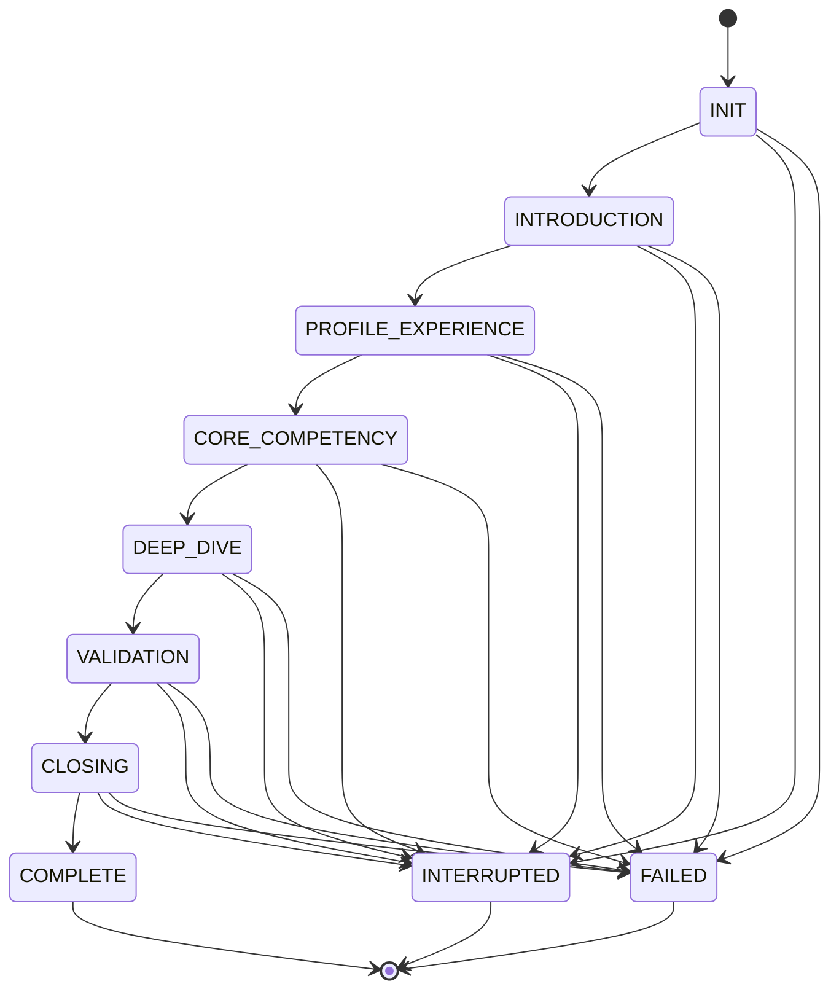
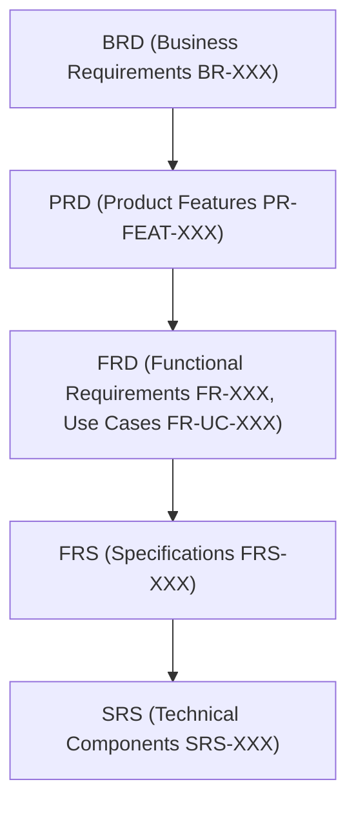

# 00 Master Requirements Baseline

## 1. Document Header
| Field | Value |
| --- | --- |
| **Product** | Autergo |
| **Version** | 1.0 |
| **Date** | October 2026 |
| **Status** | Draft |
| **Document Owner** | System Architect |
| **Purpose** | Central requirements registry connecting BRD, PRD, FRD, FRS, SRS |

### Revision History
| Version | Date | Author | Changes |
| --- | --- | --- | --- |
| 1.0 | Oct 2026 | System Architect | Initial draft and baseline definition |

### References
- [01-Business-Requirements-Document](01-Business-Requirements-Document.md)
- [02-Product-Requirements-Document](02-Product-Requirements-Document.md)
- [03-Functional-Requirements-Document](03-Functional-Requirements-Document.md)
- [04-Functional-Requirements-Specification](04-Functional-Requirements-Specification.md)
- [05-System-Requirements-Specification](05-System-Requirements-Specification.md)

### Assumptions
- [ASSUMPTION] Users have a stable internet connection capable of supporting WebRTC audio streaming.
- [ASSUMPTION] Candidates possess a functional microphone and speakers/headphones.
- [ASSUMPTION] Target browsers are recent versions of Chrome, Edge, Safari, or Firefox.

### Open Decisions
- [OPEN DECISION] Final pricing model for B2B vs B2C segments.

---

## 2. Product Identity
- **Product name:** Autergo
- **Primary problem:** Reduce the burden of company interview screening using AI for scalable, adaptive, and evidence-based interviews.
- **Secondary problem:** Allow students and candidates to practice realistic interviews.
- **Business model:** B2B + B2C
- **Primary market:** Companies, startups, recruiters, hiring teams
- **Secondary market:** Students, job seekers

---

## 3. Core Product Principles
- **Voice-first adaptive AI interviewer:** The system must act as an interactive interviewer, NOT a standard chatbot.
- **Natural voice-to-voice conversation:** Latency must be minimal to simulate human interaction.
- **Adaptive questioning:** The system must generate questions dynamically based on:
  - Previous responses
  - Interview context
  - Job Description (JD) and Resume
  - Interview type and specific competencies
  - Answer quality and difficulty state
  - Overall progress and duration constraints
  - Required sections
  - Evaluation confidence
- **Dynamic interview strategy:** The interview flow is driven by an AI strategy engine, NOT a pre-generated fixed list of questions.

---

## 4. User Roles

| Role | Description | Auth Method |
| --- | --- | --- |
| Super Admin | Platform-level administration | Email+Password |
| Company Admin | Company tenant management | Email+Password / OAuth |
| Head Recruiter | Primary recruiter, manages sub-recruiters | Email+Password / OAuth |
| Sub-Recruiter | Operates within company scope | Invitation-based |
| Candidate | Takes company interview | Guest token (no account required) |
| Student | Practices interviews | Account-based |

---

## 5. Entity Registry

| Entity | ID Format | Generated By | Description |
| --- | --- | --- | --- |
| Platform User | UUID v4 | System | All authenticated users |
| Company | UUID v4 | System | Tenant organization |
| Recruiter | UUID v4 | System | Link between user and company |
| Candidate | UUID v4 | System | Interview participant |
| Job | UUID v4 | System | Job position |
| Drive | UUID v4 | System | Recruitment campaign |
| Interview | UUID v4 | System | Single interview instance |
| Interview Session | UUID v4 | System | WebRTC connection session |
| Invitation | UUID v4 | System | Candidate invitation |
| Report | UUID v4 | System | Evaluation report |
| Evaluation | UUID v4 | System | Competency assessment |

---

## 6. Interview Types

| Type | Description | Default Distribution |
| --- | --- | --- |
| HR | HR screening | Intro 15%, Behavioral 40%, Experience 30%, Closing 15% |
| BEHAVIORAL | Behavioral competencies | Intro 10%, Behavioral 60%, Situational 20%, Closing 10% |
| TECHNICAL | Technical knowledge | Intro 10%, Technical 50%, Problem-solving 25%, Closing 15% |
| DOMAIN_SPECIFIC | Domain expertise | Intro 10%, Domain 55%, Applied 25%, Closing 10% |
| CODING | Programming assessment | Intro 10%, Coding 60%, Algorithm 20%, Closing 10% |
| TECHNICAL_CODING | Combined | Intro 10%, Technical 30%, Coding 40%, Problem-solving 15%, Closing 5% |
| RESUME_BASED | Experience verification | Intro 10%, Resume-deep 50%, Verification 30%, Closing 10% |
| CUSTOM | Recruiter-defined | Configurable |

---

## 7. Interview State Machine

---

## 8. Evaluation Dimensions

| Dimension | Scale | Evidence Required | Applicable Types |
| --- | --- | --- | --- |
| Technical Knowledge | 1-100 | Yes | TECHNICAL, TECHNICAL_CODING, DOMAIN |
| Domain Knowledge | 1-100 | Yes | DOMAIN_SPECIFIC |
| Problem Solving | 1-100 | Yes | All |
| Reasoning | 1-100 | Yes | All |
| Answer Accuracy | 1-100 | Yes | All |
| Depth | 1-100 | Yes | All |
| Role Relevance | 1-100 | Yes | All |
| Communication Clarity | 1-100 | Yes | All |
| Behavioral Competency | 1-100 | Yes | HR, BEHAVIORAL |
| Coding Performance | 1-100 | Yes | CODING, TECHNICAL_CODING |
| Practical Knowledge | 1-100 | Yes | TECHNICAL, DOMAIN |
| Evidence Quality | 1-100 | Yes | All |

---

## 9. MVP Scope Definition

| ID | Item | Priority | Target Phase | Status |
| --- | --- | --- | --- | --- |
| MVP-001 | User Authentication (Company Admin) | P1 | POC | Pending |
| MVP-002 | Candidate Guest Access via Token | P1 | POC | Pending |
| MVP-003 | WebRTC Audio Streaming Client | P1 | POC | Pending |
| MVP-004 | Voice Activity Detection (VAD) | P1 | POC | Pending |
| MVP-005 | Speech-to-Text Integration | P1 | POC | Pending |
| MVP-006 | Text-to-Speech Integration | P1 | POC | Pending |
| MVP-007 | Core AI Strategy Engine (LLM orchestration) | P1 | POC | Pending |
| MVP-008 | Basic Interview State Machine Implementation | P1 | POC | Pending |
| MVP-009 | Resume Parsing | P1 | MVP | Pending |
| MVP-010 | Job Description Parsing | P1 | MVP | Pending |
| MVP-011 | Recruiter Dashboard UI | P1 | MVP | Pending |
| MVP-012 | Interview Drive Management | P1 | MVP | Pending |
| MVP-013 | Basic Multi-tenancy Support | P1 | MVP | Pending |
| MVP-014 | Post-Interview Evaluation Generation | P1 | MVP | Pending |
| MVP-015 | Post-Interview Report UI | P1 | MVP | Pending |
| MVP-016 | Interview Transcript Generation | P1 | MVP | Pending |
| MVP-017 | Basic Browser Integrity Check (Tab Switch) | P2 | MVP | Pending |
| MVP-018 | Sub-Recruiter Invitations | P2 | MVP | Pending |
| MVP-019 | Email Notifications (Invites) | P2 | MVP | Pending |
| MVP-020 | Database Schema Definition | P1 | POC | Pending |
| MVP-021 | Secure Object Storage (Resumes, Reports) | P1 | MVP | Pending |
| MVP-022 | Basic Error Handling & Fallbacks | P1 | POC | Pending |

---

## 10. Roadmap Phases

| Phase | Timeline | Key Deliverables |
| --- | --- | --- |
| POC | Month 1-2 | Core voice interview loop, basic adaptive questioning, single-company |
| MVP | Month 3-6 | Full recruiter workflow, multi-tenant, evaluation, reports, integrity |
| V2 | Month 7-12 | Multilingual, advanced analytics, SSO, ATS integration |
| Production | Month 12-18 | Scale to 1000 concurrent, advanced integrity, enterprise features |
| Long-term | 18+ months | Full recruitment platform, benchmarking, marketplace |

---

## 11. Document Traceability Map

---

## 12. Cross-Document Consistency Rules

- Every BRD objective must map to at least one PRD feature.
- Every PRD feature must map to at least one FRD functional requirement.
- Every FRD requirement must have a detailed FRS specification.
- Every FRS specification must trace to an SRS component.
- Terminology must be consistent across all documents (use Entity Registry).
- Priority assignments must not conflict across documents (e.g., a P3 feature cannot have a P1 functional requirement).
