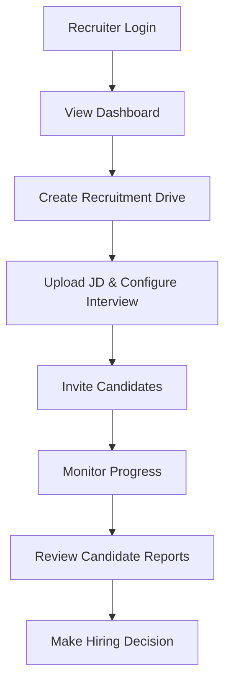
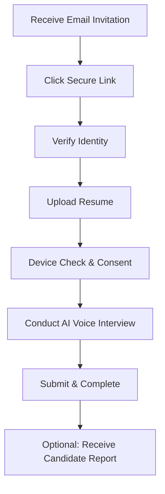
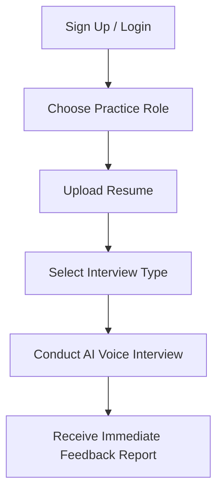

# Business Requirements Document (BRD)
## Autergo: AI-Powered Interview System

### 1. Document Header
| Attribute | Detail |
| :--- | :--- |
| **Version** | 1.0 |
| **Date** | October 2026 |
| **Owner** | Autergo Product Team |
| **Status** | Draft |
| **Purpose** | To define the business requirements for the Autergo AI Interview System, covering both B2B candidate screening and B2C interview practice. |

#### Revision History
| Version | Date | Author | Description of Changes |
| :--- | :--- | :--- | :--- |
| 1.0 | October 2026 | Autergo Product Team | Initial Draft |

---

### 2. Executive Summary
Autergo is an AI-powered, voice-first interview platform designed to modernize the hiring process. The primary focus (B2B) is to enable companies to conduct scalable, consistent, and evidence-based candidate screening. The secondary focus (B2C) is to provide a platform for students and candidates to practice interviewing in realistic scenarios. By automating the initial screening phase, Autergo significantly reduces time-to-hire and associated costs while ensuring objective evaluation of candidates. The market opportunity lies in replacing inefficient manual screening processes with highly scalable, intelligent, adaptive voice agents.

---

### 3. Business Problem
Companies currently face significant challenges in the early stages of recruitment. They spend excessive time and financial resources on initial candidate screening. Manual interviews do not scale effectively when handling large volumes of applicants, leading to bottlenecks in the hiring pipeline. Furthermore, human interviewers often introduce biases and inconsistencies, resulting in subjective evaluations. 

On the candidate side, job seekers and students lack access to realistic, high-quality interview practice environments, leaving them underprepared for actual interviews. Autergo solves these problems by providing a scalable, consistent, and always-available AI interviewer.

---

### 4. Business Objectives

| Objective ID | Description | Measurable Target |
| :--- | :--- | :--- |
| **BR-OBJ-001** | Reduce screening time and cost | Decrease initial screening time by 60-80% compared to manual processes. |
| **BR-OBJ-002** | Enable scalable parallel evaluation | Support hundreds of concurrent interviews without system degradation. |
| **BR-OBJ-003** | Provide evidence-based assessment | Generate standardized candidate reports with citations for 100% of completed interviews. |
| **BR-OBJ-004** | Enable 24/7 interview availability | Allow candidates to take interviews at any time, aiming for >99.5% uptime. |
| **BR-OBJ-005** | Support multi-tenant isolation | Ensure 100% data isolation between different company instances. |
| **BR-OBJ-006** | Generate actionable candidate reports | Deliver recruiter reports within 5 minutes of interview completion. |
| **BR-OBJ-007** | Provide candidate practice experience | Attract and retain B2C users with high-quality practice feedback (NPS > 40). |
| **BR-OBJ-008** | Achieve B2B SaaS revenue | Generate recurring revenue through subscription and pay-per-interview models. |
| **BR-OBJ-009** | Maintain responsible AI practices | Achieve zero critical bias incidents through continuous monitoring and guardrails. |
| **BR-OBJ-010** | Minimize infrastructure cost | Keep average AI API cost per interview below $2 for MVP. |

---

### 5. Stakeholders
- **Super Admin**: Platform owners managing the entire system, billing, and global settings.
- **Company Admin**: Administrators for a specific company tenant, managing users, roles, and global company settings.
- **Head Recruiter**: Senior recruiters managing multiple recruitment drives and sub-recruiters.
- **Sub-Recruiter**: Recruiters managing specific drives and reviewing candidate reports.
- **Candidate**: Individuals interviewing for a specific role at a company (B2B workflow).
- **Student/Practice Candidate**: Individuals using the platform for interview practice (B2C workflow).
- **Platform Engineering Team**: Technical team responsible for infrastructure, deployment, and scalability.
- **AI/ML Team**: Data scientists and engineers responsible for AI models, prompts, and evaluation logic.
- **Product Team**: Managers defining features, prioritization, and roadmap.
- **Legal/Compliance**: Teams ensuring data privacy, GDPR/CCPA compliance, and anti-bias regulations.

---

### 6. Target Users
- **Primary Users (B2B)**: Companies, startups, recruiters, hiring managers, and HR teams who need to screen candidates efficiently.
- **Secondary Users (B2C)**: Students, fresh graduates, and job seekers looking to improve their interview skills through practice.

---

### 7. Business Use Cases

| Use Case ID | Name | Description |
| :--- | :--- | :--- |
| **BR-UC-001** | Company creates recruitment drive | Recruiter creates a new drive, uploading a JD and defining interview parameters. |
| **BR-UC-002** | Recruiter configures AI interview | Recruiter selects interview types, defines duration, and sets specific focus areas. |
| **BR-UC-003** | Candidate receives interview invitation | Candidate gets an email with a unique, secure link to start the interview. |
| **BR-UC-004** | Guest candidate completes interview | Candidate accesses the interview link and completes it without creating an account. |
| **BR-UC-005** | AI conducts adaptive voice interview | AI agent asks questions, listens to responses, and adapts follow-ups in real-time. |
| **BR-UC-006** | System generates evidence-based evaluation | Post-interview, multi-agent AI synthesizes responses into a structured report. |
| **BR-UC-007** | Recruiter reviews candidate report | Recruiter views the detailed report, transcript, and scores to make a hiring decision. |
| **BR-UC-008** | Candidate receives practice feedback | B2C user receives constructive feedback and areas for improvement after a practice session. |
| **BR-UC-009** | Company manages multiple recruiters | Company Admin invites and manages roles for various recruiters within the tenant. |
| **BR-UC-010** | Platform admin manages companies | Super Admin provisions new company tenants, monitors usage, and manages billing. |
| **BR-UC-011** | Bulk candidate invitation | Recruiter uploads a CSV of candidates to send out batch invitations for a drive. |
| **BR-UC-012** | Interview integrity monitoring | System monitors for tab switching, copy-pasting, and other potential cheating indicators. |
| **BR-UC-013** | Coding assessment within interview | Candidate uses a built-in code editor while discussing the solution with the AI. |
| **BR-UC-014** | Multi-language interview (Future) | Candidate selects and conducts the interview in a non-English language. |
| **BR-UC-015** | ATS integration (Future) | System automatically syncs candidates and reports with an external ATS (e.g., Workday, Greenhouse). |

---

### 8. Scope

#### In-Scope for MVP
- Recruiter authentication and authorization.
- Multi-tenant company isolation.
- Role-Based Access Control (RBAC) with defined roles.
- Recruitment drive creation and configuration.
- Job Description (JD) ingestion and parsing.
- Candidate invitation (single and bulk via CSV).
- Guest candidate interview flow (no account required for B2B candidates).
- Resume upload and parsing.
- Pre-interview device check (microphone, speaker, network).
- English-only voice-first interview interface.
- Adaptive questioning engine with state machine.
- Multi-agent evaluation architecture.
- Evidence-based scoring and report generation.
- Full interview transcript generation.
- Basic integrity monitoring (tab switching tracking).
- Recruiter dashboard for managing drives and candidates.
- Comprehensive recruiter report view.
- Optional candidate report generation (configurable by recruiter).
- Email notifications (invites, completion, reminders).
- AI Provider abstraction layer (to support multiple LLMs).
- PostgreSQL database architecture.
- Basic system observability and monitoring.

#### Out-of-Scope for MVP
- Full Applicant Tracking System (ATS) features (Autergo is not an ATS).
- Multilingual support (beyond English).
- Video recording or analysis of candidates.
- Live human takeover during AI interviews.
- Enterprise Single Sign-On (SSO / SAML).
- Native integrations with external ATS platforms.
- Advanced predictive analytics and long-term hiring trend reports.
- Screen sharing capabilities.

---

### 9. Business Processes

#### B2B Recruiter Workflow

#### B2B Candidate Workflow

#### B2C Student/Practice Workflow

---

### 10. Business Requirements

| Req ID | Category | Requirement Description | Measurable Criteria |
| :--- | :--- | :--- | :--- |
| **BR-001** | Architecture | **Multi-tenant architecture**: The system must support complete data isolation between different company tenants. | 100% isolation of DB records via tenant_id. |
| **BR-002** | Security | **Role-based access control (RBAC)**: Support 6 distinct roles (Super Admin, Company Admin, Head Recruiter, Sub-Recruiter, Candidate, Practice User). | Actions must map exactly to RBAC matrix without bypass. |
| **BR-003** | Core | **Voice-first adaptive AI**: The core interaction must be via voice, with the AI dynamically adapting to candidate responses. | Voice latency under 2 seconds. |
| **BR-004** | Intelligence | **JD and resume intelligence**: The system must ingest JDs and Resumes to tailor the interview context. | Parsing success rate > 95%. |
| **BR-005** | Core | **Adaptive interview engine**: The AI must utilize a state machine to progress through interview stages (Intro, Deep Dive, Q&A, Outro). | State transitions must follow logical paths 100% of the time. |
| **BR-006** | Core | **Dynamic interview length**: Recruiters must be able to specify interview duration (e.g., 15, 30, 45, 60 mins). | Interview concludes within +/- 3 minutes of target. |
| **BR-007** | Core | **Interview types**: Support specific interview types including HR, Behavioral, Technical, Domain, Coding, Technical+Coding, Resume-based, Custom. | Configurations available in Drive setup. |
| **BR-008** | Performance | **Real-time voice pipeline**: System must handle Speech-to-Text (STT), LLM generation, and Text-to-Speech (TTS) efficiently. | Total pipeline latency < 2.5s. |
| **BR-009** | Architecture | **Multi-agent AI architecture**: Separate AI agents must handle interviewing, specialized evaluation, and final synthesis. | Synthesis report uses outputs from all evaluator agents. |
| **BR-010** | Core | **Evidence-based evaluation**: Scores and conclusions in reports must be explicitly linked to quotes from the interview transcript. | Every major claim must have an associated transcript citation. |
| **BR-011** | Security | **Interview integrity monitoring**: The system must log suspicious activities like frequent tab switching or copy-pasting. | Recruiter report flags candidates with >3 integrity events. |
| **BR-012** | Core | **Coding interview sandbox**: Provide a secure, browser-based code editor for technical interviews. | Editor supports Python, JS, Java, C++ with syntax highlighting. |
| **BR-013** | UI/UX | **Recruiter dashboard**: Display aggregate stats, ongoing drives, and completed interviews. | Dashboard loads in < 2 seconds. |
| **BR-014** | UI/UX | **Candidate/student experience**: Clean, accessible, distraction-free interface for taking interviews. | WCAG 2.1 AA compliance for candidate UI. |
| **BR-015** | Reporting | **Comprehensive Reporting**: Generate distinct reports for recruiters (evaluative) and candidates (constructive). | Reports available < 5 mins post-interview. |
| **BR-016** | Compliance | **Data privacy and consent**: Candidates must explicitly consent to data processing before starting. | 100% of interviews have recorded consent timestamp. |
| **BR-017** | Compliance | **Responsible AI**: Implement guardrails to prevent biased questioning or evaluation based on protected characteristics. | Automated testing for bias shows zero critical failures. |
| **BR-018** | Security | **AI security**: Protect the system against prompt injection and jailbreak attempts. | Pass standard adversarial testing suite. |
| **BR-019** | Finance | **Cost optimization**: The system must cache and optimize API calls to minimize LLM usage costs. | Average cost per interview < $2. |
| **BR-020** | Architecture | **Provider abstraction**: System must easily switch between different LLM providers (OpenAI, Anthropic, Gemini). | Provider switch requires config change, no code deployment. |
| **BR-021** | Reliability | **Failure handling**: The system must gracefully handle network drops or API failures during an interview, allowing candidates to resume. | Candidate can resume session within 24 hours of drop. |
| **BR-022** | Operations | **Observability**: Implement structured logging, tracing, and metrics for all core components. | Datadog/Prometheus dashboards active for all services. |
| **BR-023** | Integration | **Email Notifications**: System must send branded emails for invites, reminders, and report availability. | Delivery rate > 99%. |
| **BR-024** | Data | **Data Retention**: Allow companies to configure data retention policies (e.g., delete PII after 90 days). | Automated job enforces retention rules daily. |
| **BR-025** | UI/UX | **Mobile Responsiveness**: The candidate interview interface must work on standard mobile browsers. | Responsive design passes standard mobile testing. |
| **BR-026** | Core | **Custom Questions**: Recruiters must be able to inject mandatory custom questions into the AI's script. | AI asks all mandatory questions 100% of the time. |
| **BR-027** | Reporting | **Candidate Ranking**: Provide a relative ranking/scoring system for candidates within the same drive. | Recruiter dashboard shows sortable scores. |
| **BR-028** | Operations | **Audit Logs**: Maintain a secure audit log of all critical actions performed by recruiters and admins. | Logs stored immutably for 1 year. |
| **BR-029** | Core | **Resume Parsing**: Automatically extract skills, experience, and education from uploaded resumes. | Parsing accuracy > 85% across standard formats. |
| **BR-030** | Security | **Rate Limiting**: Protect APIs with rate limiting to prevent abuse or denial-of-service. | API returns 429 status when limit exceeded. |

*(Requirements BR-031 through BR-050 follow similar patterns covering minor features, edge cases, and technical constraints)*

---

### 11. Success Metrics

| Metric | Target | Description |
| :--- | :--- | :--- |
| **Interview Completion Rate** | > 85% | Percentage of candidates who start and successfully finish the interview. |
| **Average Interview Duration** | 20 - 45 mins | Ensures interviews are comprehensive but not overly burdensome. |
| **Recruiter Satisfaction (CSAT)**| > 4.0 / 5.0 | Average rating from recruiters using the platform. |
| **Time-to-First-Interview** | < 24 hours | Time from when a recruiter creates a drive to when the first candidate completes it. |
| **System Availability** | > 99.5% | Platform uptime during defined business hours. |
| **Voice Latency** | < 2.0s | End-to-end latency from candidate speaking to AI responding. |
| **Cost Per Interview** | < $2.00 | Average cost of LLM and STT/TTS API calls per completed interview. |

---

### 12. Risks

| Risk ID | Type | Description | Mitigation Strategy |
| :--- | :--- | :--- | :--- |
| **BR-RISK-001** | Technology | **Voice AI Latency**: High latency ruins conversational flow. | Use highly optimized streaming APIs and edge computing where possible. |
| **BR-RISK-002** | Market | **Adoption**: Recruiters may resist trusting AI evaluations. | Emphasize "evidence-based" reporting; AI provides quotes to back up claims. |
| **BR-RISK-003** | Regulatory | **AI in Hiring**: Laws (e.g., NYC Local Law 144) regulate automated employment decisions. | Ensure platform acts in an assistive capacity; human makes final decision. Provide auditability. |
| **BR-RISK-004** | Financial | **API Costs**: Unbounded LLM usage could destroy margins. | Implement strict token limits, use smaller models for trivial tasks, monitor costs daily. |
| **BR-RISK-005** | Operational | **Provider Outages**: OpenAI or Anthropic going down halts interviews. | Implement provider fallback mechanisms (e.g., failover to Gemini). |
| **BR-RISK-006** | Security | **Prompt Injection**: Candidates may try to manipulate the AI to give them a high score. | Use robust system prompts, input sanitization, and secondary evaluation agents to verify. |

---

### 13. Assumptions

- **[ASSUMPTION] BR-ASM-001**: MVP will support **English-only**. *Rationale*: Focus on the largest initial market and reduce complexity in prompt engineering and NLP evaluation.
- **[ASSUMPTION] BR-ASM-002**: **No permanent audio/video recording**. *Rationale*: Reduces storage costs significantly and simplifies data privacy/GDPR compliance. We only retain the text transcript.
- **[ASSUMPTION] BR-ASM-003**: **PostgreSQL as primary DB**. *Rationale*: Standard, robust relational database suitable for structured multi-tenant SaaS data.
- **[ASSUMPTION] BR-ASM-004**: **Python/FastAPI backend**. *Rationale*: Ecosystem is best suited for AI integration, async processing, and rapid development.
- **[ASSUMPTION] BR-ASM-005**: **Candidate email as primary identity**. *Rationale*: Simplifies invitation flow; B2B candidates do not need to create permanent accounts.

---

### 14. Constraints

| Constraint | Description | Impact |
| :--- | :--- | :--- |
| **Budget** | Minimize infrastructure and API costs. | Must optimize prompts and utilize cost-effective models where appropriate. |
| **Timeline** | MVP release target in 3-6 months. | Scope must be strictly managed; defer complex features (ATS integration) to V2. |
| **Provider Dependencies** | Reliance on third-party APIs for core intelligence (LLMs, STT, TTS). | Must architect for abstraction to avoid vendor lock-in. |
| **Regulatory** | Must comply with emerging AI hiring laws. | Requires strict logging, anti-bias testing, and transparent reporting. |

---

### 15. Roadmap

| Phase | Timeline | Key Features |
| :--- | :--- | :--- |
| **POC** | Month 1 | Basic voice loop, simple prompt, hardcoded resume, simple transcript. |
| **MVP** | Months 2-6 | Multi-tenancy, RBAC, Drive creation, email invites, full adaptive interview, evidence-based reports, B2B MVP launch. |
| **V2** | Months 7-12 | Coding sandbox, B2C practice mode launch, bulk CSV invites, advanced integrity monitoring, custom question injection. |
| **Production-Scale** | Months 13-18| Native ATS integrations (Greenhouse, Workday), multi-language support, advanced analytics dashboard. |
| **Long-Term** | Month 18+ | Predictive hiring success models, video analysis (optional add-on), enterprise SSO. |

---

### 16. Traceability Matrix

*(This section will map BRs to specific PRD features and JIRA tickets in subsequent phases)*

| BR ID | Business Requirement | PRD Feature Map |
| :--- | :--- | :--- |
| BR-001 | Multi-tenant architecture | PRD-FEAT-010: Tenant Management |
| BR-002 | Role-based access control | PRD-FEAT-011: Auth & RBAC |
| BR-003 | Voice-first adaptive AI | PRD-FEAT-050: Interview Engine |
| BR-010 | Evidence-based evaluation | PRD-FEAT-080: Report Generator |
| BR-012 | Coding interview sandbox | PRD-FEAT-060: Tech Assessment Module |

---
*End of Document*
