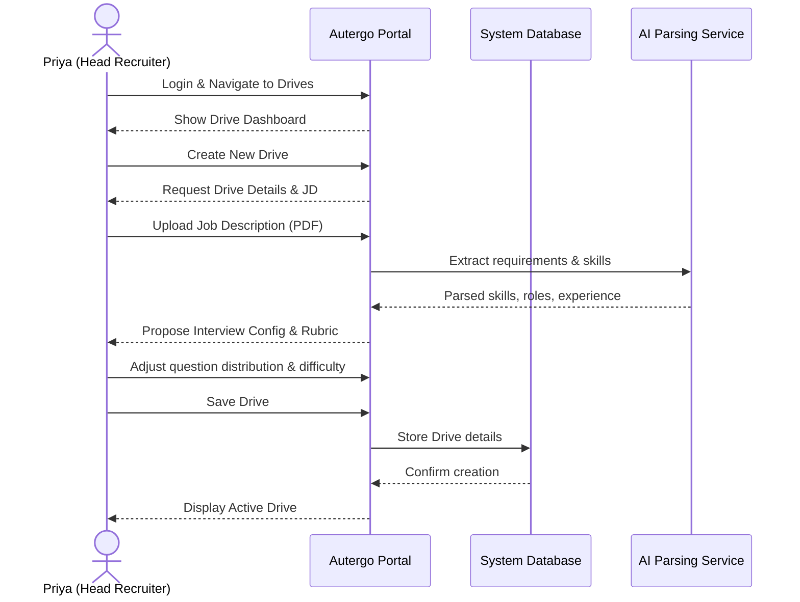
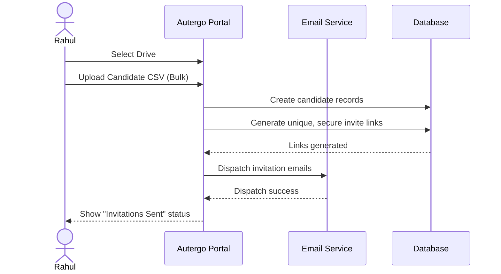
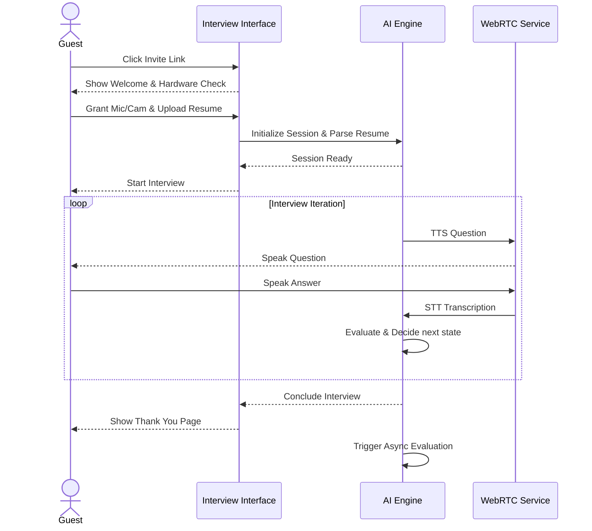
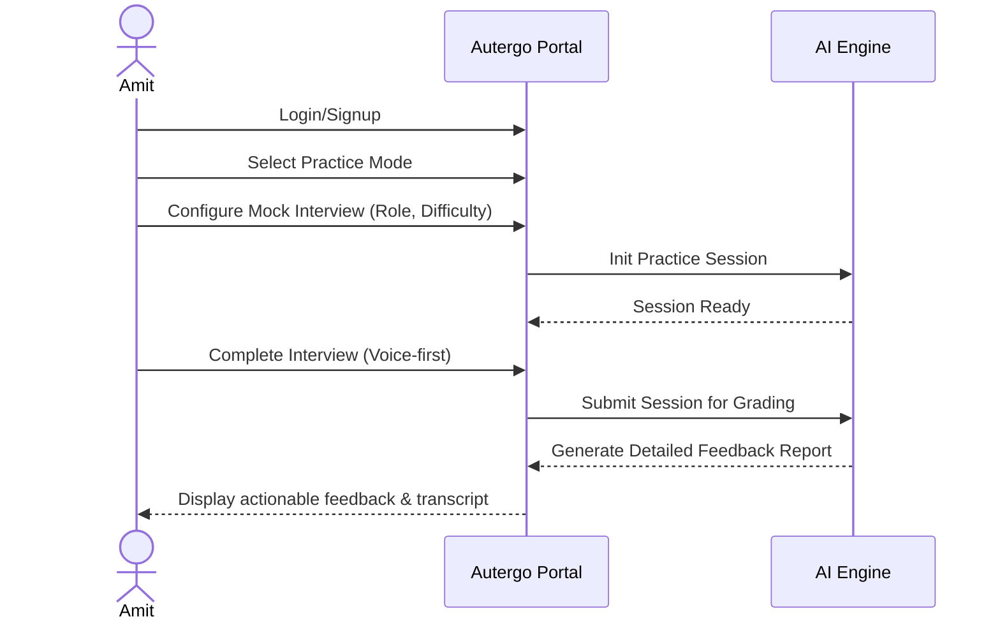
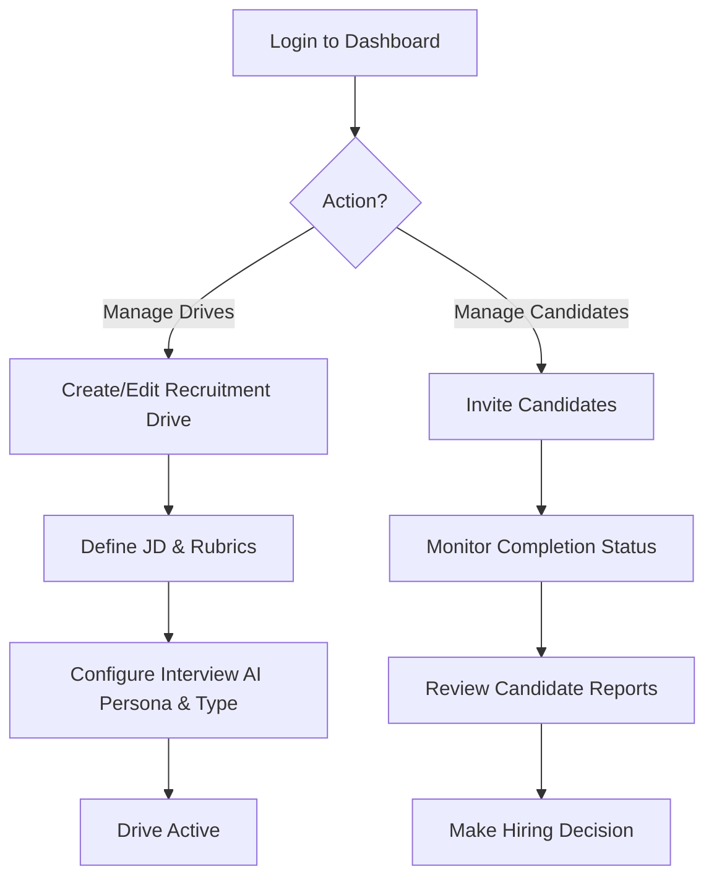
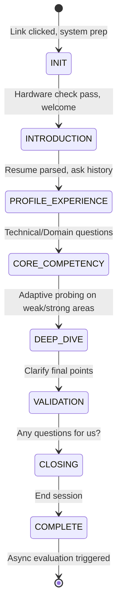

# Autergo Product Requirements Document (PRD)

## 1. Document Header

| Property | Details |
| :--- | :--- |
| **Version** | 1.0 |
| **Date** | October 2026 |
| **Owner** | Autergo Product Team |
| **Status** | Draft |
| **Document Purpose** | Comprehensive product specifications, features, and workflows for the Autergo AI Interview System. |

## 2. Product Context & Vision

### 2.1 Context
Autergo is an AI-powered, voice-first interview platform designed primarily for company-side candidate screening (B2B) and secondarily for student/candidate interview practice (B2C). It operates as a serious, enterprise-grade multi-tenant SaaS platform where data from different organizations is strictly isolated.

### 2.2 Product Vision
An AI-powered voice-first interview platform that reduces hiring screening burden through scalable, adaptive, evidence-based interviews, delivering an equitable and professional experience for both candidates and recruiters.

## 3. Product Goals

| ID | Goal | Description | Traceability |
| :--- | :--- | :--- | :--- |
| **PR-GOAL-001** | Reduce Screening Time | Automate the initial screening process, saving recruiters an average of 45 minutes per candidate. | BR-001 |
| **PR-GOAL-002** | Standardize Evaluation | Ensure all candidates are evaluated against identical, objective criteria without human bias. | BR-002 |
| **PR-GOAL-003** | 24/7 Availability | Allow candidates to take interviews at their convenience across any timezone. | BR-003 |
| **PR-GOAL-004** | Candidate Practice (B2C) | Provide a robust environment for students and job seekers to hone interview skills. | BR-004 |
| **PR-GOAL-005** | Minimize AI Costs | Utilize a dynamic provider abstraction layer and adaptive token usage to maintain low per-interview costs. | BR-005 |
| **PR-GOAL-006** | Responsible AI | Implement safeguards against AI hallucinations, ensure fairness, and log all decision evidence. | BR-006 |

## 4. Personas

### 4.1 Company Users (B2B)

**Priya (Head Recruiter)**
*   **Profile:** Head Recruiter at a 200-person tech startup.
*   **Behavior:** Screens 50+ candidates a week. Highly organized, deeply cares about candidate experience.
*   **Needs:** Bulk invite candidates, view high-level dashboards, drill down into evidence-based scorecards to make rapid progression decisions.

**Rahul (Sub-Recruiter)**
*   **Profile:** Sub-recruiter managing 3 open positions.
*   **Behavior:** Tasks involve daily monitoring of interview completions and follow-ups.
*   **Needs:** Easy-to-use drive management, clear notifications when candidates complete interviews, and accessible reports.

**Sarah (Engineering Hiring Manager)**
*   **Profile:** Senior Engineering Manager.
*   **Behavior:** Reviews technical screenings before deciding to conduct on-site interviews.
*   **Needs:** Deep technical depth in interview transcripts, coding execution logs, and validation of candidate problem-solving skills.

**Platform Admin**
*   **Profile:** Manages the Autergo multi-tenant SaaS.
*   **Behavior:** Monitors system health, manages company subscriptions, configures API limits.
*   **Needs:** Multi-tenant oversight, billing analytics, feature flag toggling, and global system observability.

### 4.2 Candidate Users (B2C & Guest)

**Guest Candidate**
*   **Profile:** Active job seeker invited by a recruiter via a specific link.
*   **Behavior:** Wants minimal friction. Might be anxious about AI interviewing.
*   **Needs:** No account creation required, clear instructions, fair assessment, professional AI interaction, immediate hardware checks.

**Amit (CS Student / Practice Candidate)**
*   **Profile:** Computer Science student preparing for campus placements.
*   **Behavior:** Uses the platform proactively to improve interviewing skills.
*   **Needs:** Detailed feedback on communication, technical accuracy, and behavioral competence. Needs to review transcripts and scoring rubrics.

## 5. User Journeys

### 5.1 Recruiter Creates and Manages Recruitment Drive

### 5.2 Recruiter Invites Candidates

### 5.3 Guest Candidate Completes Interview

### 5.4 Student Practice Workflow

## 6. Product Workflows

### 6.1 End-to-End Recruiter Workflow

### 6.2 Interview State Machine

## 7. Feature Definitions

### 7.1 Platform & Infrastructure

| ID | Feature Name | Description | Priority | Target Phase |
| :--- | :--- | :--- | :--- | :--- |
| **PR-FEAT-001** | Clerk-based Auth | Secure authentication for B2B and B2C users utilizing Clerk (OAuth, email/password). | P0 | MVP |
| **PR-FEAT-002** | RBAC | Role-based access control defining permissions for Super Admin, Company Admin, Head Recruiter, Sub-Recruiter, Candidate. | P0 | MVP |
| **PR-FEAT-003** | Multi-tenant Data Isolation | Strict logical isolation of data (drives, candidates, interviews) between different companies in PostgreSQL. | P0 | MVP |
| **PR-FEAT-004** | Provider Abstraction Layer | Abstraction for LLM, STT, and TTS providers allowing dynamic switching based on cost, latency, or availability. | P0 | MVP |
| **PR-FEAT-005** | Observability & Monitoring | Integration with datadog/sentry for system health, error tracking, and AI latency monitoring. | P1 | MVP |
| **PR-FEAT-006** | Cost Tracking | System to track token usage, STT/TTS minutes, and compute costs per individual interview. | P1 | MVP |
| **PR-FEAT-007** | Audit Logging | Immutable logs for critical actions: drive creation, rubric changes, evaluation generation. | P2 | MVP |

### 7.2 Recruiter & Drive Management

| ID | Feature Name | Description | Priority | Target Phase |
| :--- | :--- | :--- | :--- | :--- |
| **PR-FEAT-008** | Drive Management | CRUD operations for recruitment drives, linking JDs, configurations, and candidates. | P0 | MVP |
| **PR-FEAT-009** | AI Job Description Parsing | Upload a JD (PDF/Text) to automatically extract requirements and suggest interview questions/rubrics. | P0 | MVP |
| **PR-FEAT-010** | Interview Configuration | Configure interview type (HR, Tech, etc.), difficulty, length, and distribution of question categories. | P0 | MVP |
| **PR-FEAT-011** | Evaluation Criteria Definition | Define specific skills and dimensions to be evaluated on a 1-100 scale. | P0 | MVP |
| **PR-FEAT-012** | Single Candidate Invite | Manually add a single candidate and trigger an email invitation with a unique link. | P0 | MVP |
| **PR-FEAT-013** | Bulk Candidate Invite | Upload a CSV of candidates to bulk generate and send secure email invitations. | P0 | MVP |
| **PR-FEAT-014** | Email Notifications | Automated emails for invitations, reminders, and completion notifications to recruiters. | P0 | MVP |
| **PR-FEAT-015** | Interview Templates | Save drive configurations (questions, rubrics, settings) as reusable templates. | P2 | V2 |
| **PR-FEAT-016** | Question Bank Management | Maintain a custom repository of company-specific questions to inject into interviews. | P1 | V2 |
| **PR-FEAT-017** | Recruiter Dashboard | High-level view of active drives, pending interviews, completed interviews, and top candidates. | P0 | MVP |

### 7.3 Candidate Experience & Interview Execution

| ID | Feature Name | Description | Priority | Target Phase |
| :--- | :--- | :--- | :--- | :--- |
| **PR-FEAT-018** | Guest Candidate Flow | Access the interview via a secure token link without creating a user account. | P0 | MVP |
| **PR-FEAT-019** | Resume Upload & Parsing | Candidate uploads resume pre-interview; AI extracts context to personalize the interview. | P0 | MVP |
| **PR-FEAT-020** | Device & Environment Checks | Pre-flight UI to test microphone, camera, network speed, and browser compatibility. | P0 | MVP |
| **PR-FEAT-021** | Voice-first AI Engine | Real-time conversational interface utilizing WebRTC, fast STT, low-latency LLM, and natural TTS. | P0 | MVP |
| **PR-FEAT-022** | Adaptive Questioning | State machine-driven logic that adapts follow-up questions based on candidate responses in real-time. | P0 | MVP |
| **PR-FEAT-023** | AI Persona Configuration | Support for distinct AI personalities (e.g., Professional, Friendly, Formal, Direct). | P1 | MVP |
| **PR-FEAT-024** | Basic Integrity Monitoring | Track tab switching, browser focus loss, and basic media stream drops during the interview. | P0 | MVP |
| **PR-FEAT-025** | Coding Sandbox | Integrated environment for coding interviews, supporting multi-language execution and real-time AI observation. | P2 | MVP |
| **PR-FEAT-026** | Advanced Integrity Monitoring | Webcam gaze tracking, multi-face detection, and phone detection via computer vision models. | P2 | V2 |
| **PR-FEAT-027** | Live Human Takeover | Capability for a recruiter to silently monitor an active session and take over the interview manually. | P3 | V2 |

### 7.4 Evaluation & Reporting

| ID | Feature Name | Description | Priority | Target Phase |
| :--- | :--- | :--- | :--- | :--- |
| **PR-FEAT-028** | Multi-Agent Evaluation System | Background workflow using specialized LLM agents (e.g., Tech Agent, Behavioral Agent, Summary Agent) to evaluate the transcript. | P0 | MVP |
| **PR-FEAT-029** | Evidence-based Scoring | Scores generated on a 1-100 scale for each defined dimension, explicitly cited with transcript snippets as evidence. | P0 | MVP |
| **PR-FEAT-030** | Recruiter Report | Comprehensive report showing overall score, dimension breakdowns, red flags, evidence citations, and full transcript. | P0 | MVP |
| **PR-FEAT-031** | Candidate Report (B2C) | Sanitized report for practice candidates focusing on actionable feedback, strengths, and areas for improvement. | P1 | MVP |
| **PR-FEAT-032** | Student Practice Mode | B2C flow allowing users to self-configure practice interviews and receive detailed Candidate Reports. | P1 | MVP |
| **PR-FEAT-033** | Advanced Analytics | Aggregated insights on candidate performance across drives, bias detection metrics, and question effectiveness. | P2 | V2 |

## 8. Interview Types & Evaluation Dimensions

### 8.1 Supported Interview Types
The platform supports dynamic interview configurations. Key archetypes include:
*   **HR / Behavioral:** Focuses on culture fit, past experiences, conflict resolution.
*   **Technical:** Probes theoretical and architectural knowledge.
*   **Domain-specific:** Tailored to specific roles (e.g., Marketing, Sales, Finance).
*   **Coding:** Hands-on algorithmic or practical coding tasks in the sandbox.
*   **Resume-based:** Deep dive exclusively into the candidate's provided work history.

### 8.2 Question Distribution Configuration
Recruiters can adjust the weighting of the interview state machine. Example configuration for a "Full Stack Engineer" drive:
*   Introduction: 5%
*   Resume / Experience: 20%
*   Technical Knowledge: 30%
*   Coding / Practical: 35%
*   Behavioral: 10%

### 8.3 Standard Evaluation Dimensions
Evaluations are categorized into standardized dimensions to ensure consistency:
1.  **Technical Knowledge:** Accuracy of factual engineering/domain responses.
2.  **Problem Solving & Reasoning:** Ability to structure thoughts logically when faced with an unknown.
3.  **Communication Clarity:** Conciseness, structure, and clarity of spoken responses.
4.  **Behavioral Competency:** Alignment with professional norms, leadership, or teamwork indicators.
5.  **Role Relevance:** Specific alignment of past experience with the JD requirements.

## 9. Report Structure

### 9.1 Recruiter Report (B2B)
Must contain the following sections:
*   **Executive Summary:** Overall score (1-100), hire/no-hire recommendation strength, interview duration, integrity status.
*   **Dimension Scorecard:** Visual breakdown of scores across evaluated dimensions (e.g., Technical 85, Communication 92).
*   **Evidence & Citations:** For every score, explicit quotes from the transcript proving the capability or lack thereof.
*   **Red Flags:** Highlighted areas of concern (e.g., integrity warnings, contradictory statements).
*   **Full Transcript:** Interactive transcript synced with audio/video (if recorded).
*   *Note: Includes internal notes and AI confidence scores not visible to candidates.*

### 9.2 Candidate Practice Report (B2C)
Must contain the following sections:
*   **Performance Overview:** General feedback on the session.
*   **Strengths:** Areas where the candidate excelled, with specific examples.
*   **Areas for Improvement:** Constructive feedback on weak answers, suggesting better approaches.
*   **Transcript Review:** Full transcript with AI annotations on specific responses.
*   *Note: Must strictly filter out system prompts, internal recruiter scoring rubrics, and absolute hiring recommendations.*

## 10. UX Principles & Landing Page

### 10.1 UX Principles
*   **Voice-First:** The primary interaction model for the candidate is speech. Minimal typing unless in a coding sandbox.
*   **Frictionless Entry:** Guest candidates must go from clicking an invite link to starting the interview in under 3 minutes (including hardware checks).
*   **Professionalism:** The UI/UX must exude trust, enterprise security, and fairness.
*   **Actionable Dashboards:** Recruiters should see what needs their attention immediately upon login.
*   **Accessibility:** High contrast, screen-reader friendly setup pages, clear typography.

### 10.2 Landing Page Structure
*   **Hero Section:** "Scale Your Hiring with AI-Powered Voice Interviews"
*   **Primary CTAs:**
    *   `Login as Recruiter / Company Admin` -> Routes to B2B Dashboard.
    *   `Practice Interview (Student/Candidate)` -> Routes to B2C Signup.
*   **Guest Entry Point:** A clearly marked "Have an invite code?" section for candidates who lost their direct link.
*   **Value Propositions:** Highlight time savings, unbiased evaluation, and enterprise security.

## 11. MVP Definition

The Minimum Viable Product (MVP) focuses on proving the core value proposition of an automated, accurate, voice-first screening tool for recruiters.

**MVP Scope Priority Sequence:**
1.  Recruiter Authentication & Multi-tenant Company setup.
2.  Basic RBAC (Admin, Recruiter).
3.  Drive creation & Job Description text/PDF ingestion.
4.  Candidate invitation via email (Single & Bulk CSV).
5.  Guest candidate interview flow (Frictionless entry).
6.  Resume upload & pre-interview parsing.
7.  Device check (Mic/Browser).
8.  English-language voice interview engine (WebRTC + STT + LLM + TTS).
9.  Adaptive questioning logic (Basic State Machine).
10. Basic multi-agent evaluation background jobs.
11. Evidence-based scoring generation.
12. Raw transcript availability.
13. Basic integrity monitoring (Tab switching).
14. Recruiter Dashboard & Recruiter Report viewing.
15. Email notifications infrastructure.
16. Provider abstraction (OpenAI / Deepgram / ElevenLabs integration).
17. PostgreSQL data layer.
18. Basic system monitoring.

*Features excluded from MVP: Coding sandbox, advanced video integrity, live human takeover, candidate practice reports (unless B2C is prioritized early), multilingual support.*

## 12. Future Roadmap

### 12.1 V2 (Post-MVP)
*   Multilingual interview support (Spanish, French, German).
*   Candidate Practice Reports (B2C scaling).
*   Advanced recruiter analytics and bias tracking.
*   Coding Interview Sandbox execution.
*   ATS Integrations (Greenhouse, Lever, Workday).
*   Enterprise SSO (SAML/Okta) for larger organizations.

### 12.2 Production / Scale Phase
*   Advanced computer vision integrity monitoring (gaze tracking, multiple faces).
*   Optional video recording of interviews (strictly opt-in with explicit consent).
*   Calendar integrations for scheduling follow-up human interviews directly from the platform.
*   Live human takeover capabilities.

### 12.3 Long-term Vision
*   Evolution into a full-suite automated recruitment platform.
*   Global candidate benchmarking (anonymized data sets).
*   Company knowledge RAG (AI answers specific candidate questions about company benefits, culture, etc. accurately).

## 13. Product Analytics & Success Metrics

| Metric | Description | Target |
| :--- | :--- | :--- |
| **Interview Completion Rate** | % of invited candidates who complete the interview. | > 85% |
| **Average Interview Duration** | Time spent in active interview state. | 15-25 mins |
| **Time-to-First-Interview** | Time from candidate receiving invite to starting. | < 48 hours |
| **Candidate Satisfaction (CSAT)** | Post-interview survey score from candidates. | > 4.2 / 5.0 |
| **Recruiter Engagement** | Weekly Active Users (WAU) among registered recruiters. | > 70% |
| **Feature Adoption** | % of drives utilizing AI JD parsing vs manual setup. | > 80% |
| **Cost per Interview** | Total AI infrastructure cost (LLM + STT + TTS) per session. | < $1.50 |

## 14. Product Risks & Mitigations

*   **UX Risk (Voice Quality & Latency):** High latency breaks conversational flow.
    *   *Mitigation:* Strict provider abstraction. Use streaming STT/TTS and optimized LLM prompts. Target < 800ms end-to-end latency.
*   **Adoption Risk (Candidate Pushback):** Candidates feeling dehumanized by AI.
    *   *Mitigation:* High-quality, empathetic AI personas. Clear messaging on how this speeds up their process and removes human bias.
*   **AI Quality Risk (Hallucinations/Poor Scoring):** AI evaluates a candidate incorrectly.
    *   *Mitigation:* Multi-agent consensus evaluation. Mandatory evidence citations for every score. Recruiter ability to manually override scores based on the transcript.
*   **Cost Risk:** Unbounded token usage during long or adversarial interviews.
    *   *Mitigation:* Strict timeout limits. Dynamic termination in the state machine if the conversation loops or goes off-topic.

## 15. Assumptions & Open Decisions

### 15.1 Assumptions
*   **[ASSUMPTION]** Candidates will have access to a modern web browser (Chrome, Edge, Safari, Firefox) and a functioning microphone.
*   **[ASSUMPTION]** English is the sole supported language for the MVP phase.
*   **[ASSUMPTION]** Companies will provide relatively standard Job Descriptions in text or PDF format.
*   **[ASSUMPTION]** Video recording is highly sensitive and will be deferred post-MVP due to compliance and storage costs.

### 15.2 Open Decisions
*   **[OPEN DECISION]** *Data Retention:* How long do we store raw audio files before deletion or archival? (Impacts storage costs and GDPR compliance).
*   **[OPEN DECISION]** *B2C Monetization:* Will the Student Practice mode be entirely free (lead gen), freemium, or paid out of the gate?
*   **[OPEN DECISION]** *Coding Sandbox Execution:* Which third-party provider (e.g., Judge0, Docker custom) will handle secure remote code execution for technical interviews?
