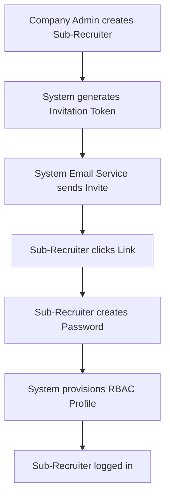
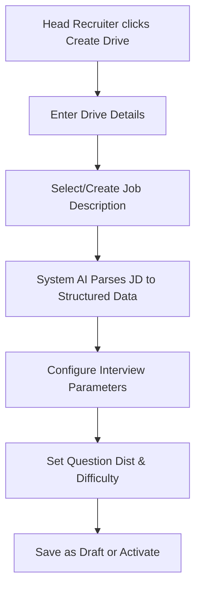
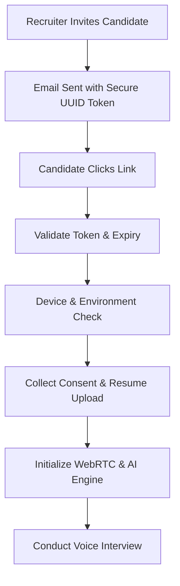
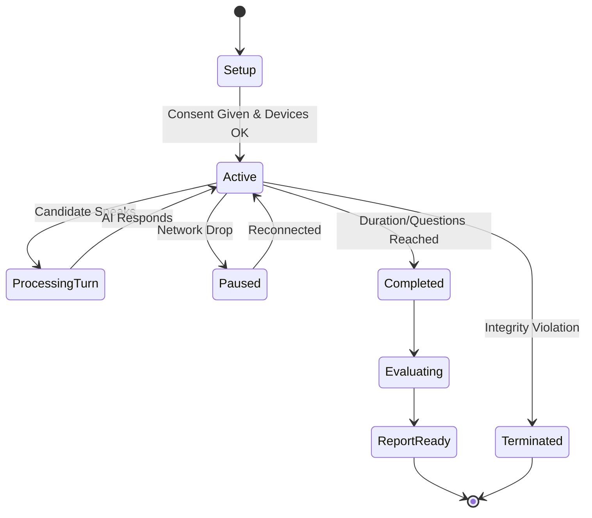
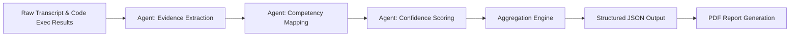

# Functional Requirements Document (FRD)
## Autergo AI Interview System

**Version:** 1.0
**Date:** October 2026
**Status:** Draft
**Document Owner:** Systems Architecture Team

---

## 1. PRODUCT CONTEXT & FUNCTIONAL SCOPE

Autergo is an AI-powered, voice-first interview platform designed primarily for company-side candidate screening (B2B) and secondarily for student interview practice (B2C). It operates as a multi-tenant SaaS application.

The functional scope encompasses:
- End-to-end recruitment drive management.
- Multi-tenant company configurations and role-based access control.
- Voice-first AI interviews with real-time Speech-to-Text (STT) and Text-to-Speech (TTS).
- Real-time client-side and server-side integrity monitoring.
- Post-interview multi-agent evaluation and comprehensive reporting.
- Secure, token-based access for guest candidates.
- Dedicated flows for B2C practice interviews.

---

## 2. ACTORS

1. **Super Admin:** Manages platform-wide settings, tenants, AI providers, and billing.
2. **Company Admin:** Manages company-specific configurations, users, and branding.
3. **Head Recruiter:** Manages recruitment drives, job positions, and interview configurations across the company.
4. **Sub-Recruiter:** Manages specific drives or jobs assigned to them, reviews candidate reports.
5. **Candidate (Guest):** External interviewee joining via a secure token link; no permanent account required.
6. **Student / Practice Candidate:** Registered B2C user taking practice interviews for skill improvement.
7. **System (AI Interviewer):** LLM-based agent conducting the voice interview dynamically.
8. **System (Evaluation Engine):** Multi-agent pipeline assessing interview transcripts and code execution results.
9. **System (Integrity Engine):** Monitoring agent verifying candidate identity, environment, and behavior.
10. **System (Email Service):** Service dispatching invitations, reports, and alerts.

---

## 3. WORKFLOWS

### 3.1 Recruiter Onboarding Workflow

### 3.2 Drive Creation and Configuration

### 3.3 Candidate Invitation & Guest Interview Workflow

### 3.4 Interview State Machine

### 3.5 Evaluation Pipeline

---

## 4. USE CASES

### Authentication & Authorization

#### FR-UC-001: Recruiter Registration and Login
* **Actors:** Company Admin, Head Recruiter, Sub-Recruiter
* **Preconditions:** User is provisioned in the system
* **Trigger:** User navigates to login page
* **Main Flow:** 1. User enters email and password. 2. System validates credentials. 3. System generates JWT. 4. User redirected to dashboard.
* **Alternate Flows:** OAuth login via Google/GitHub.
* **Exception Flows:** Invalid credentials -> Show error.
* **Postconditions:** User is authenticated and session is active.

#### FR-UC-002: Sub-Recruiter Invitation and Onboarding
* **Actors:** Company Admin, Head Recruiter
* **Preconditions:** Company account exists
* **Trigger:** Admin sends invite
* **Main Flow:** 1. Admin enters email. 2. System emails token. 3. User clicks link. 4. User sets password. 5. System activates user.
* **Alternate Flows:** User already exists -> Grants access to new tenant.
* **Exception Flows:** Token expired -> Admin must resend.
* **Postconditions:** Sub-recruiter is active and linked to tenant.

#### FR-UC-003: Student/Practice Candidate Registration
* **Actors:** Student
* **Preconditions:** None
* **Trigger:** User visits B2C portal
* **Main Flow:** 1. User selects OAuth or Email registration. 2. User verifies email. 3. System creates B2C account.
* **Alternate Flows:** N/A
* **Exception Flows:** Email in use -> Prompt login.
* **Postconditions:** Student has access to practice dashboard.

#### FR-UC-004: Guest Candidate Interview Access via Token
* **Actors:** Candidate
* **Preconditions:** Candidate received invite
* **Trigger:** Candidate clicks invite link
* **Main Flow:** 1. System extracts UUID token. 2. System verifies token validity and job status. 3. System grants guest session.
* **Alternate Flows:** N/A
* **Exception Flows:** Token expired or used -> Show error page.
* **Postconditions:** Candidate is placed in interview lobby.

#### FR-UC-005: Role-Based Access Control Enforcement
* **Actors:** All
* **Preconditions:** User is logged in
* **Trigger:** User attempts restricted action
* **Main Flow:** 1. System checks JWT claims. 2. System verifies role against permission matrix. 3. Action is executed.
* **Alternate Flows:** N/A
* **Exception Flows:** Insufficient permissions -> Return 403 Forbidden.
* **Postconditions:** System integrity maintained.

#### FR-UC-006: Company Creation and Configuration
* **Actors:** Super Admin
* **Preconditions:** Super Admin logged in
* **Trigger:** Super Admin adds tenant
* **Main Flow:** 1. Enters company details. 2. Provisions DB schema/tenant ID. 3. Creates Company Admin.
* **Alternate Flows:** N/A
* **Exception Flows:** Duplicate domain -> Error.
* **Postconditions:** Tenant is live.

#### FR-UC-007: Company Settings Management
* **Actors:** Company Admin
* **Preconditions:** Logged in as Company Admin
* **Trigger:** Admin updates settings
* **Main Flow:** 1. Modifies branding (logo, colors). 2. Saves settings. 3. System updates tenant config.
* **Alternate Flows:** N/A
* **Exception Flows:** Invalid image format -> Reject.
* **Postconditions:** Branding updated globally for tenant.

#### FR-UC-008: Recruiter Management
* **Actors:** Company Admin, Head Recruiter
* **Preconditions:** Logged in with rights
* **Trigger:** User updates team
* **Main Flow:** 1. Selects recruiter. 2. Modifies role (Head -> Sub). 3. Saves.
* **Alternate Flows:** Remove recruiter -> revokes access.
* **Exception Flows:** Cannot remove last Company Admin.
* **Postconditions:** Recruiter permissions updated.

#### FR-UC-009: Create Recruitment Drive
* **Actors:** Head Recruiter
* **Preconditions:** Logged in
* **Trigger:** Clicks Create Drive
* **Main Flow:** 1. Enters name, description. 2. Selects Job. 3. Creates drive record.
* **Alternate Flows:** N/A
* **Exception Flows:** Missing mandatory fields -> Prompt.
* **Postconditions:** Drive created in Draft state.

#### FR-UC-010: Configure Drive Settings
* **Actors:** Head Recruiter, Sub-Recruiter
* **Preconditions:** Drive exists
* **Trigger:** Edits drive
* **Main Flow:** 1. Sets dates. 2. Assigns sub-recruiters. 3. Publishes drive.
* **Alternate Flows:** N/A
* **Exception Flows:** Invalid date range -> Error.
* **Postconditions:** Drive state updated to Active.

#### FR-UC-011: Close/Archive Drive
* **Actors:** Head Recruiter
* **Preconditions:** Drive is Active/Closed
* **Trigger:** Clicks Archive
* **Main Flow:** 1. System confirms. 2. Status changed to Archived. 3. Disables pending tokens.
* **Alternate Flows:** N/A
* **Exception Flows:** Candidates currently interviewing -> Graceful termination.
* **Postconditions:** Drive becomes read-only.

#### FR-UC-012: Create/Edit Job Position
* **Actors:** Head Recruiter
* **Preconditions:** Logged in
* **Trigger:** Clicks Add Job
* **Main Flow:** 1. Enters title, department. 2. Saves record.
* **Alternate Flows:** N/A
* **Exception Flows:** N/A
* **Postconditions:** Job record created.

#### FR-UC-013: Upload/Enter Job Description
* **Actors:** Head Recruiter
* **Preconditions:** Job exists
* **Trigger:** Uploads PDF/DOCX
* **Main Flow:** 1. System parses file text. 2. Populates JD field.
* **Alternate Flows:** Manual text entry.
* **Exception Flows:** File too large/unsupported -> Error.
* **Postconditions:** JD text stored.

#### FR-UC-014: AI JD Parsing and Extraction
* **Actors:** System
* **Preconditions:** JD text saved
* **Trigger:** Triggered automatically
* **Main Flow:** 1. LLM extracts skills, experience, responsibilities. 2. System maps to competencies. 3. Displays to recruiter for approval.
* **Alternate Flows:** Recruiter manually edits extracted data.
* **Exception Flows:** AI service timeout -> Retry.
* **Postconditions:** Structured JD data stored for evaluation baseline.

#### FR-UC-015: Configure Interview Type
* **Actors:** Recruiter
* **Preconditions:** Configuring Drive
* **Trigger:** Selects Type
* **Main Flow:** 1. Chooses HR, Technical, or Tech+Coding. 2. System loads appropriate modules.
* **Alternate Flows:** N/A
* **Exception Flows:** Invalid combo -> Prevent.
* **Postconditions:** Interview type locked.

#### FR-UC-016: Configure Question Distribution
* **Actors:** Recruiter
* **Preconditions:** Configuring Drive
* **Trigger:** Adjusts sliders
* **Main Flow:** 1. Sets % for core skills, behavioral, etc. 2. System validates sum = 100%.
* **Alternate Flows:** N/A
* **Exception Flows:** Sum != 100% -> Disable save.
* **Postconditions:** Distribution saved.

#### FR-UC-017: Configure Difficulty Level
* **Actors:** Recruiter
* **Preconditions:** Configuring Drive
* **Trigger:** Selects level
* **Main Flow:** 1. Selects Junior/Mid/Senior. 2. System adjusts AI prompt.
* **Alternate Flows:** N/A
* **Exception Flows:** N/A
* **Postconditions:** Difficulty baseline set.

#### FR-UC-018: Configure Evaluation Criteria
* **Actors:** Recruiter
* **Preconditions:** Configuring Drive
* **Trigger:** Defines criteria
* **Main Flow:** 1. Selects competencies to score. 2. Assigns weights.
* **Alternate Flows:** Uses default templates.
* **Exception Flows:** N/A
* **Postconditions:** Evaluation matrix saved.

#### FR-UC-019: Configure AI Interviewer Personality
* **Actors:** Recruiter
* **Preconditions:** Configuring Drive
* **Trigger:** Selects tone
* **Main Flow:** 1. Selects Friendly, Professional, or Strict. 2. Sets AI voice model.
* **Alternate Flows:** N/A
* **Exception Flows:** Voice model unavailable -> Fallback.
* **Postconditions:** Personality prompt updated.

#### FR-UC-020: Set Interview Duration Constraints
* **Actors:** Recruiter
* **Preconditions:** Configuring Drive
* **Trigger:** Enters minutes
* **Main Flow:** 1. Sets Min (e.g., 15m) and Max (e.g., 45m) time.
* **Alternate Flows:** N/A
* **Exception Flows:** Min > Max -> Error.
* **Postconditions:** Time boundaries set.

#### FR-UC-021: Create/Manage Interview Templates
* **Actors:** Head Recruiter
* **Preconditions:** Logged in
* **Trigger:** Saves config as template
* **Main Flow:** 1. Names template. 2. System stores parameters for reuse.
* **Alternate Flows:** Applies existing template to new drive.
* **Exception Flows:** N/A
* **Postconditions:** Template available globally for company.

#### FR-UC-022: Single Candidate Invitation
* **Actors:** Recruiter
* **Preconditions:** Drive Active
* **Trigger:** Enters candidate email
* **Main Flow:** 1. System creates Candidate record. 2. Generates unique UUID token. 3. Triggers email.
* **Alternate Flows:** N/A
* **Exception Flows:** Email format invalid.
* **Postconditions:** Candidate marked as 'Invited'.

#### FR-UC-023: Bulk Candidate Invitation
* **Actors:** Recruiter
* **Preconditions:** Drive Active
* **Trigger:** Uploads CSV
* **Main Flow:** 1. System parses CSV. 2. Validates rows. 3. Batches invitations. 4. Sends emails asynchronously.
* **Alternate Flows:** N/A
* **Exception Flows:** CSV format error -> Show error rows.
* **Postconditions:** Multiple candidates invited.

#### FR-UC-024: Invitation Email Generation
* **Actors:** System
* **Preconditions:** Invitation triggered
* **Trigger:** Message bus event
* **Main Flow:** 1. Loads template. 2. Injects token link and branding. 3. Dispatches via SMTP/API.
* **Alternate Flows:** N/A
* **Exception Flows:** SMTP failure -> Retry queue.
* **Postconditions:** Email dispatched.

#### FR-UC-025: Invitation Token Validation
* **Actors:** System
* **Preconditions:** Candidate clicks link
* **Trigger:** HTTP Request
* **Main Flow:** 1. Lookup token in DB. 2. Check Expiry. 3. Check Drive state. 4. Return session payload.
* **Alternate Flows:** N/A
* **Exception Flows:** Token void -> Redirect to error.
* **Postconditions:** Session initialized.

#### FR-UC-026: Guest Candidate Entry and Verification
* **Actors:** Candidate
* **Preconditions:** Valid token
* **Trigger:** Page load
* **Main Flow:** 1. Displays welcome screen. 2. Prompts for email/OTP if strict verification is ON.
* **Alternate Flows:** Strict verification OFF -> skip OTP.
* **Exception Flows:** OTP failed -> Access denied.
* **Postconditions:** Candidate identified.

#### FR-UC-027: Resume Upload and AI Parsing
* **Actors:** Candidate
* **Preconditions:** In Lobby
* **Trigger:** Uploads Resume
* **Main Flow:** 1. Candidate uploads PDF. 2. System parses text. 3. AI feeds summary to Interviewer context.
* **Alternate Flows:** Skips upload if optional.
* **Exception Flows:** Parse fail -> Proceeds without resume.
* **Postconditions:** Resume data injected into context.

#### FR-UC-028: Device and Environment Check
* **Actors:** Candidate
* **Preconditions:** In Lobby
* **Trigger:** Starts Check
* **Main Flow:** 1. Requests Cam/Mic permissions. 2. Tests audio input level. 3. Tests video feed.
* **Alternate Flows:** N/A
* **Exception Flows:** No mic detected -> Block entry.
* **Postconditions:** Hardware verified.

#### FR-UC-029: Interview Consent Collection
* **Actors:** Candidate
* **Preconditions:** Hardware OK
* **Trigger:** Checkboxes
* **Main Flow:** 1. Displays privacy policy, recording consent. 2. Candidate accepts. 3. System logs timestamp.
* **Alternate Flows:** N/A
* **Exception Flows:** Declines -> Interview aborted.
* **Postconditions:** Legal consent recorded.

#### FR-UC-030: Voice Interview Session Start
* **Actors:** System
* **Preconditions:** Consent given
* **Trigger:** Candidate clicks Start
* **Main Flow:** 1. Initializes WebRTC. 2. Connects to streaming backend. 3. AI speaks greeting.
* **Alternate Flows:** N/A
* **Exception Flows:** Websocket failure -> Auto-reconnect.
* **Postconditions:** Interview is ACTIVE.

#### FR-UC-031: Adaptive AI Interview Execution
* **Actors:** System (AI)
* **Preconditions:** Interview Active
* **Trigger:** Turn cycle
* **Main Flow:** 1. Evaluates context. 2. Selects next question based on JD/Resume. 3. Adapts difficulty based on previous answer.
* **Alternate Flows:** N/A
* **Exception Flows:** LLM timeout -> Apologizes and repeats.
* **Postconditions:** Transcript updated.

#### FR-UC-032: Interview State Transitions
* **Actors:** System
* **Preconditions:** Interview Active
* **Trigger:** Event trigger
* **Main Flow:** 1. Monitors time, questions asked. 2. Transitions state (e.g., Introduction -> Deep Dive -> Coding -> Wrap-up).
* **Alternate Flows:** N/A
* **Exception Flows:** N/A
* **Postconditions:** State updated.

#### FR-UC-033: Dynamic Interview Length Management
* **Actors:** System
* **Preconditions:** Interview Active
* **Trigger:** Timer tick
* **Main Flow:** 1. Checks Min/Max time constraints. 2. Accelerates or deepens follow-ups to fit time boundary gracefully.
* **Alternate Flows:** N/A
* **Exception Flows:** N/A
* **Postconditions:** Pacing adjusted.

#### FR-UC-034: Interview Completion and Wrap-up
* **Actors:** System
* **Preconditions:** Criteria met
* **Trigger:** Condition reached
* **Main Flow:** 1. AI asks for final questions. 2. AI thanks candidate. 3. Terminates WebRTC. 4. Updates status to 'Completed'.
* **Alternate Flows:** Candidate drops -> System auto-completes after timeout.
* **Exception Flows:** N/A
* **Postconditions:** Data sent to Evaluation Engine.

#### FR-UC-035: Real-time Voice Communication (WebRTC)
* **Actors:** System
* **Preconditions:** Session started
* **Trigger:** WebRTC connect
* **Main Flow:** 1. Establishes peer connection. 2. Streams audio bidirectionally.
* **Alternate Flows:** N/A
* **Exception Flows:** ICE negotiation fails -> Fallback to TURN.
* **Postconditions:** Audio channel open.

#### FR-UC-036: Speech-to-Text Streaming
* **Actors:** System
* **Preconditions:** Audio flowing
* **Trigger:** Candidate speaks
* **Main Flow:** 1. Chunks audio. 2. Sends to STT engine. 3. Returns partial and final transcripts.
* **Alternate Flows:** N/A
* **Exception Flows:** STT service down -> Pause interview, notify.
* **Postconditions:** Text generated.

#### FR-UC-037: AI Response Generation
* **Actors:** System
* **Preconditions:** STT final event
* **Trigger:** Turn detected
* **Main Flow:** 1. Appends text to prompt. 2. Streams LLM response. 3. Pushes text chunks to TTS.
* **Alternate Flows:** N/A
* **Exception Flows:** Content filter triggered -> Generates safe fallback.
* **Postconditions:** Response generated.

#### FR-UC-038: Text-to-Speech Streaming
* **Actors:** System
* **Preconditions:** LLM streaming
* **Trigger:** Text chunk ready
* **Main Flow:** 1. Converts text to audio buffer. 2. Plays on client side via WebRTC.
* **Alternate Flows:** N/A
* **Exception Flows:** TTS delay -> Buffer audio.
* **Postconditions:** Candidate hears response.

#### FR-UC-039: Turn Detection and Barge-in Handling
* **Actors:** System
* **Preconditions:** AI speaking
* **Trigger:** Candidate interrupts
* **Main Flow:** 1. VAD detects candidate speech. 2. Halts TTS playback. 3. Halts LLM generation. 4. Listens to candidate.
* **Alternate Flows:** N/A
* **Exception Flows:** False VAD positive -> Ignore short bursts.
* **Postconditions:** Fluid conversational flow.

#### FR-UC-040: Network Failure and Reconnection
* **Actors:** System
* **Preconditions:** Active
* **Trigger:** Socket drop
* **Main Flow:** 1. UI shows 'Reconnecting'. 2. Client attempts backoff retry. 3. AI resumes from last known state.
* **Alternate Flows:** N/A
* **Exception Flows:** Timeout > 5 mins -> Terminate interview.
* **Postconditions:** Session restored.

#### FR-UC-041: Code Editor Initialization
* **Actors:** Candidate
* **Preconditions:** Coding stage reached
* **Trigger:** State transition
* **Main Flow:** 1. UI renders Monaco editor. 2. AI provides prompt. 3. Selects default language.
* **Alternate Flows:** N/A
* **Exception Flows:** N/A
* **Postconditions:** Editor ready.

#### FR-UC-042: Code Execution in Sandbox
* **Actors:** Candidate
* **Preconditions:** Code written
* **Trigger:** Clicks Run
* **Main Flow:** 1. Packages code. 2. Sends to secure Sandbox (Piston). 3. Returns stdout/stderr.
* **Alternate Flows:** N/A
* **Exception Flows:** Timeout/Infinite Loop -> Kill process, return error.
* **Postconditions:** Output displayed.

#### FR-UC-043: Test Case Evaluation
* **Actors:** System
* **Preconditions:** Code executed
* **Trigger:** Execution return
* **Main Flow:** 1. Runs hidden test cases against code. 2. Records pass/fail ratio.
* **Alternate Flows:** N/A
* **Exception Flows:** N/A
* **Postconditions:** Scores recorded for Evaluation Engine.

#### FR-UC-044: Code Quality Assessment
* **Actors:** System (Evaluation)
* **Preconditions:** Interview complete
* **Trigger:** Post-processing
* **Main Flow:** 1. LLM reviews code for time/space complexity, style, best practices. 2. Adds to technical score.
* **Alternate Flows:** N/A
* **Exception Flows:** N/A
* **Postconditions:** Qualitative code metric generated.

#### FR-UC-045: Webcam Monitoring & Person Detection
* **Actors:** System (Integrity)
* **Preconditions:** Active
* **Trigger:** Video frame tick
* **Main Flow:** 1. MediaPipe analyzes frame. 2. Ensures exact 1 face present.
* **Alternate Flows:** N/A
* **Exception Flows:** 0 faces or >1 faces -> Log anomaly event.
* **Postconditions:** Integrity state updated.

#### FR-UC-046: Phone Detection
* **Actors:** System (Integrity)
* **Preconditions:** Active
* **Trigger:** Video frame tick
* **Main Flow:** 1. YOLO analyzes frame. 2. Detects object 'cell phone'. 3. Logs high-severity anomaly.
* **Alternate Flows:** N/A
* **Exception Flows:** N/A
* **Postconditions:** Flag recorded.

#### FR-UC-047: Gaze Tracking
* **Actors:** System (Integrity)
* **Preconditions:** Active
* **Trigger:** Video frame tick
* **Main Flow:** 1. Tracks iris movement. 2. Calculates off-screen gaze duration. 3. Logs anomaly if > threshold.
* **Alternate Flows:** N/A
* **Exception Flows:** N/A
* **Postconditions:** Attention metric updated.

#### FR-UC-048: Tab Switching Detection
* **Actors:** System (Integrity)
* **Preconditions:** Active
* **Trigger:** Browser blur event
* **Main Flow:** 1. Listens for window.onblur. 2. Starts timer. 3. Logs anomaly upon focus return.
* **Alternate Flows:** N/A
* **Exception Flows:** N/A
* **Postconditions:** Tab switch recorded.

#### FR-UC-049: Copy/Paste Monitoring
* **Actors:** System (Integrity)
* **Preconditions:** Active (Coding)
* **Trigger:** Clipboard event
* **Main Flow:** 1. Intercepts paste in Monaco editor. 2. Analyzes volume of pasted text. 3. Logs event.
* **Alternate Flows:** N/A
* **Exception Flows:** N/A
* **Postconditions:** Paste event recorded.

#### FR-UC-050: Audio Anomaly Detection
* **Actors:** System (Integrity)
* **Preconditions:** Active
* **Trigger:** Audio frame
* **Main Flow:** 1. Analyzes background noise. 2. Detects secondary voices. 3. Logs event.
* **Alternate Flows:** N/A
* **Exception Flows:** N/A
* **Postconditions:** Audio flag recorded.

#### FR-UC-051: Integrity Event Aggregation
* **Actors:** System
* **Preconditions:** Post-interview
* **Trigger:** Processing
* **Main Flow:** 1. Aggregates all integrity events. 2. Calculates overall trust confidence score. 3. Flags report if score < threshold.
* **Alternate Flows:** N/A
* **Exception Flows:** N/A
* **Postconditions:** Trust score finalized.

#### FR-UC-052: Post-Interview Multi-Agent Evaluation
* **Actors:** System (Evaluation)
* **Preconditions:** Interview Completed
* **Trigger:** Status change
* **Main Flow:** 1. Triggers orchestrator. 2. Dispatches transcript to specialized agents (Tech, HR, Comm). 3. Awaits consensus.
* **Alternate Flows:** N/A
* **Exception Flows:** Agent failure -> Retry mechanism.
* **Postconditions:** Evaluation started.

#### FR-UC-053: Competency Scoring
* **Actors:** System (Evaluation)
* **Preconditions:** Agent Processing
* **Trigger:** Step execution
* **Main Flow:** 1. Maps transcript Q&A to defined competencies. 2. Assigns 1-100 score per competency.
* **Alternate Flows:** N/A
* **Exception Flows:** N/A
* **Postconditions:** Scores assigned.

#### FR-UC-054: Evidence Aggregation
* **Actors:** System (Evaluation)
* **Preconditions:** Scoring complete
* **Trigger:** Step execution
* **Main Flow:** 1. Extracts direct quotes from transcript justifying the score. 2. Links evidence to competency.
* **Alternate Flows:** N/A
* **Exception Flows:** N/A
* **Postconditions:** Evidence linked.

#### FR-UC-055: Evaluation Confidence Calculation
* **Actors:** System (Evaluation)
* **Preconditions:** Scoring complete
* **Trigger:** Step execution
* **Main Flow:** 1. AI calculates confidence in its own assessment based on data depth. 2. Appends to report.
* **Alternate Flows:** N/A
* **Exception Flows:** N/A
* **Postconditions:** Final evaluation object built.

#### FR-UC-056: Recruiter Report Generation
* **Actors:** System
* **Preconditions:** Eval complete
* **Trigger:** Pipeline end
* **Main Flow:** 1. Compiles scores, evidence, code, integrity data. 2. Generates comprehensive JSON and PDF.
* **Alternate Flows:** N/A
* **Exception Flows:** PDF Gen failure -> Use fallback HTML.
* **Postconditions:** Recruiter report ready.

#### FR-UC-057: Candidate Report Generation
* **Actors:** System
* **Preconditions:** Eval complete
* **Trigger:** Pipeline end
* **Main Flow:** 1. Compiles filtered data (constructive feedback, no internal scores). 2. Generates JSON/PDF.
* **Alternate Flows:** N/A
* **Exception Flows:** N/A
* **Postconditions:** Candidate report ready.

#### FR-UC-058: Report Email Delivery
* **Actors:** System
* **Preconditions:** Reports ready
* **Trigger:** Event trigger
* **Main Flow:** 1. Checks recruiter setting for candidate delivery. 2. Emails recruiter. 3. Emails candidate if enabled.
* **Alternate Flows:** N/A
* **Exception Flows:** N/A
* **Postconditions:** Emails sent.

#### FR-UC-059: Recruiter Dashboard View
* **Actors:** Recruiter
* **Preconditions:** Logged in
* **Trigger:** Visits Home
* **Main Flow:** 1. System aggregates active drives, pending interviews, recent completions. 2. Renders charts.
* **Alternate Flows:** N/A
* **Exception Flows:** N/A
* **Postconditions:** Dashboard rendered.

#### FR-UC-060: Drive Analytics
* **Actors:** Recruiter
* **Preconditions:** Drive selected
* **Trigger:** Clicks Analytics
* **Main Flow:** 1. Calculates funnel (Invited -> Started -> Completed -> Passed). 2. Displays visuals.
* **Alternate Flows:** N/A
* **Exception Flows:** N/A
* **Postconditions:** Analytics rendered.

#### FR-UC-061: Candidate Detail View
* **Actors:** Recruiter
* **Preconditions:** Report ready
* **Trigger:** Clicks Candidate
* **Main Flow:** 1. Loads Recruiter Report. 2. Displays scores, radar charts, evidence.
* **Alternate Flows:** N/A
* **Exception Flows:** N/A
* **Postconditions:** Detail viewed.

#### FR-UC-062: Interview Transcript View
* **Actors:** Recruiter
* **Preconditions:** In Detail View
* **Trigger:** Clicks Transcript
* **Main Flow:** 1. Loads full text. 2. Highlights key competency moments.
* **Alternate Flows:** N/A
* **Exception Flows:** N/A
* **Postconditions:** Transcript read.

#### FR-UC-063: Integrity Events Review
* **Actors:** Recruiter
* **Preconditions:** In Detail View
* **Trigger:** Clicks Integrity
* **Main Flow:** 1. Lists timeline of anomalies (tab switches, gaze). 2. Displays snapshots if applicable.
* **Alternate Flows:** N/A
* **Exception Flows:** N/A
* **Postconditions:** Integrity reviewed.

#### FR-UC-064: Student Practice Interview Setup
* **Actors:** Student
* **Preconditions:** Logged in
* **Trigger:** Clicks Practice
* **Main Flow:** 1. Uploads resume (optional). 2. Pastes sample JD or selects role. 3. Sets difficulty.
* **Alternate Flows:** N/A
* **Exception Flows:** N/A
* **Postconditions:** Setup complete.

#### FR-UC-065: Practice Interview Execution
* **Actors:** Student
* **Preconditions:** Setup complete
* **Trigger:** Starts
* **Main Flow:** 1. Conducts standard voice interview. 2. Enforces practice time limits.
* **Alternate Flows:** N/A
* **Exception Flows:** N/A
* **Postconditions:** Interview complete.

#### FR-UC-066: Practice Feedback and Recommendations
* **Actors:** System
* **Preconditions:** Practice complete
* **Trigger:** Pipeline end
* **Main Flow:** 1. Generates specialized feedback report focused on improvement. 2. Suggests courses or tips.
* **Alternate Flows:** N/A
* **Exception Flows:** N/A
* **Postconditions:** Feedback delivered.

#### FR-UC-067: Platform Company Management
* **Actors:** Super Admin
* **Preconditions:** Logged in
* **Trigger:** Admin Panel
* **Main Flow:** 1. Lists all tenants. 2. Can suspend, delete, or modify quotas.
* **Alternate Flows:** N/A
* **Exception Flows:** N/A
* **Postconditions:** Tenants managed.

#### FR-UC-068: Platform User Management
* **Actors:** Super Admin
* **Preconditions:** Logged in
* **Trigger:** Admin Panel
* **Main Flow:** 1. Global search for users. 2. Reset passwords, enforce 2FA, ban users.
* **Alternate Flows:** N/A
* **Exception Flows:** N/A
* **Postconditions:** Users managed.

#### FR-UC-069: AI Provider Configuration
* **Actors:** Super Admin
* **Preconditions:** Logged in
* **Trigger:** Admin Panel
* **Main Flow:** 1. Sets API keys for OpenAI/Anthropic/etc. 2. Configures fallback routing.
* **Alternate Flows:** N/A
* **Exception Flows:** Invalid Key -> Fail check.
* **Postconditions:** Provider config saved.

#### FR-UC-070: System Health Monitoring
* **Actors:** Super Admin
* **Preconditions:** Logged in
* **Trigger:** Admin Panel
* **Main Flow:** 1. Displays real-time metrics (latency, error rates).
* **Alternate Flows:** N/A
* **Exception Flows:** N/A
* **Postconditions:** Health viewed.

#### FR-UC-071: Usage and Cost Monitoring
* **Actors:** Super Admin
* **Preconditions:** Logged in
* **Trigger:** Admin Panel
* **Main Flow:** 1. Tracks LLM tokens per tenant. 2. Calculates aggregate API costs.
* **Alternate Flows:** N/A
* **Exception Flows:** N/A
* **Postconditions:** Cost tracked.

#### FR-UC-072: Audit Log Review
* **Actors:** Super Admin
* **Preconditions:** Logged in
* **Trigger:** Admin Panel
* **Main Flow:** 1. Views all system actions, login events, CRUD operations.
* **Alternate Flows:** N/A
* **Exception Flows:** N/A
* **Postconditions:** Audit logged.

#### FR-UC-073: Interview Invitation Email
* **Actors:** System
* **Preconditions:** Triggered
* **Trigger:** Event
* **Main Flow:** 1. Formats template with candidate name and link. 2. Sends.
* **Alternate Flows:** N/A
* **Exception Flows:** N/A
* **Postconditions:** Delivered.

#### FR-UC-074: Interview Completion Notification
* **Actors:** System
* **Preconditions:** Completed
* **Trigger:** Event
* **Main Flow:** 1. Notifies recruiter that candidate finished.
* **Alternate Flows:** N/A
* **Exception Flows:** N/A
* **Postconditions:** Delivered.

#### FR-UC-075: Report Ready Notification
* **Actors:** System
* **Preconditions:** Report Ready
* **Trigger:** Event
* **Main Flow:** 1. Notifies recruiter with link to dashboard.
* **Alternate Flows:** N/A
* **Exception Flows:** N/A
* **Postconditions:** Delivered.

---

## 5. DETAILED FUNCTIONAL REQUIREMENTS

### 5.1 Authentication and Authorization
* **FR-001:** The system MUST support Email+Password authentication using standard hashing algorithms (bcrypt/Argon2).
* **FR-002:** The system MUST support OAuth 2.0 integration for Google and GitHub logins.
* **FR-003:** The system MUST implement secure invitation-based onboarding for Sub-Recruiters containing a time-limited token.
* **FR-004:** The system MUST allow Guest Candidates to access their specific interview session via a cryptographically secure URL token (UUID v4) without requiring an account.
* **FR-005:** The system MUST enforce Role-Based Access Control (RBAC) supporting 6 distinct roles: Super Admin, Company Admin, Head Recruiter, Sub-Recruiter, Candidate, Student.
* **FR-006:** The system MUST enforce strict logical tenant isolation at the database layer; users in Tenant A cannot access data in Tenant B.

### 5.2 Company Management
* **FR-010:** The platform MUST support multi-tenant architecture.
* **FR-011:** Super Admins MUST be able to perform CRUD operations on Companies.
* **FR-012:** Company Admins MUST be able to customize tenant settings including White-labeling/branding (Logo URL, Primary Color Hex).
* **FR-013:** The system MUST dynamically apply company branding to the candidate interview interface based on the associated tenant.

### 5.3 Recruitment Drive & Job Management
* **FR-020:** Recruiters MUST be able to perform CRUD operations on Recruitment Drives.
* **FR-021:** A Drive MUST have one of the following states: Draft, Active, Closed, Archived.
* **FR-022:** Recruiters MUST be able to perform CRUD operations on Job Positions.
* **FR-023:** The system MUST support Job Description (JD) uploads in PDF, DOCX, and raw text formats.
* **FR-024:** The system MUST utilize an AI pipeline to parse uploaded JDs into structured data (Skills, Experience, Responsibilities) for use in the interview configuration.

### 5.4 Interview Configuration
* **FR-030:** Recruiters MUST select an interview type: HR, Technical, or Technical+Coding.
* **FR-031:** Recruiters MUST define the difficulty level (Junior, Mid, Senior) which influences the LLM prompt.
* **FR-032:** Recruiters MUST configure the percentage distribution of question categories (e.g., Core Tech 50%, System Design 30%, Behavioral 20%). The system MUST validate that the sum equals 100%.
* **FR-033:** Recruiters MUST be able to configure evaluation criteria by selecting competencies and assigning weights.
* **FR-034:** Recruiters MUST be able to configure the AI Interviewer's personality tone (Friendly, Professional, Strict).
* **FR-035:** Recruiters MUST set minimum and maximum interview duration boundaries (e.g., 20 - 45 minutes).

### 5.5 Invitation & Candidate Flow
* **FR-040:** The system MUST generate secure, single-use, expirable invitation tokens for candidates.
* **FR-041:** The system MUST support single candidate invitation via email entry.
* **FR-042:** The system MUST support bulk candidate invitation via CSV upload.
* **FR-043:** The system MUST track and display invitation status (Invited, Opened, Started, Completed, Expired).
* **FR-044:** Guest candidates MUST pass a system check verifying microphone, camera (if required), and supported browser before entering the lobby.
* **FR-045:** The system MUST collect and record explicitly timestamped legal consent from the candidate before initiating recording or AI interaction.
* **FR-046:** The system MUST provide an option for candidates to upload their resume, which will be parsed and injected into the AI Interviewer's context.

### 5.6 Voice Interview Execution
* **FR-050:** The system MUST establish a WebRTC connection for low-latency bidirectional audio streaming.
* **FR-051:** The system MUST utilize streaming Speech-to-Text (STT) to convert candidate audio to text in real-time.
* **FR-052:** The AI Engine MUST maintain an adaptive state machine, tracking competencies covered and generating contextually relevant follow-up questions.
* **FR-053:** The system MUST stream LLM-generated text responses into a Text-to-Speech (TTS) engine, streaming the resulting audio back to the candidate.
* **FR-054:** The system MUST implement Voice Activity Detection (VAD) to manage conversational turns.
* **FR-055:** The system MUST handle "barge-in" events: if the candidate interrupts the AI, the system MUST immediately halt TTS playback and LLM generation, listen to the candidate, and adapt the context.

### 5.7 Integrity Monitoring
* **FR-060:** The system MUST run client-side tracking (e.g., MediaPipe) to detect the number of faces in the frame.
* **FR-061:** The system MUST run object detection (e.g., YOLO) to identify unauthorized devices (e.g., cell phones).
* **FR-062:** The system MUST monitor browser events for tab-switching and loss of window focus.
* **FR-063:** The system MUST log all integrity anomalies as timestamped events with a calculated severity/confidence score.
* **FR-064:** Server-side aggregation MUST NOT terminate an interview autonomously based on a single low-confidence anomaly.

### 5.8 Coding Interview Module
* **FR-070:** For Technical+Coding interviews, the UI MUST provide an integrated code editor (e.g., Monaco).
* **FR-071:** The system MUST support multiple programming languages (e.g., Python, JavaScript, Java, C++).
* **FR-072:** The system MUST execute submitted code in an isolated, secure sandbox environment (e.g., Piston/Judge0).
* **FR-073:** The system MUST evaluate code execution against hidden unit test cases and capture the success ratio.

### 5.9 Post-Interview Evaluation
* **FR-080:** The system MUST utilize a Multi-Agent Evaluation pipeline that processes the full interview transcript.
* **FR-081:** The evaluation engine MUST output a competency score ranging from 1 to 100 for each defined criterion.
* **FR-082:** The evaluation engine MUST extract and link direct verbatim evidence (quotes) from the transcript for every score provided.
* **FR-083:** The system MUST output a final confidence score regarding its evaluation accuracy.
* **FR-084:** The system MUST generate structured JSON data and a formatted PDF Report for the recruiter.

### 5.10 Dashboards and Reporting
* **FR-090:** The Recruiter Dashboard MUST display analytics on Drive performance (funnel metrics).
* **FR-091:** The UI MUST display individual Candidate Cards with status, overall score, and integrity trust score.
* **FR-092:** Recruiters MUST be able to view the full text transcript of any completed interview.
* **FR-093:** The system MUST generate a Candidate-facing report that includes constructive feedback but EXCLUDES internal recruiter scoring and integrity flags.

### 5.11 Admin and Notifications
* **FR-100:** Super Admins MUST be able to configure active LLM Providers, Model versions, and System Prompts.
* **FR-101:** The system MUST track API token usage and calculate costs per tenant.
* **FR-102:** The system MUST automatically dispatch email notifications using predefined templates (Invitations, Completion, Report Ready).

---

## 6. BUSINESS RULES

* **FR-BR-001:** Candidates invited to company interviews do NOT require permanent accounts on the platform.
* **FR-BR-002:** Interview type constraints enforce strict modularity: HR stays HR, Technical stays Technical, Technical+Coding is a valid combination. Other arbitrary mixes are invalid.
* **FR-BR-003:** Question distribution percentages configured by the recruiter MUST explicitly sum to 100%.
* **FR-BR-004:** Evaluation scores MUST be exactly between 1 and 100, and a score cannot be recorded without mandatory linked transcript evidence.
* **FR-BR-005:** The Candidate Report MUST NOT contain recruiter-only information, internal notes, or raw integrity flags.
* **FR-BR-006:** The Recruiter controls whether the candidate report is generated and sent to the candidate.
* **FR-BR-007:** The system MUST NOT make autonomous hiring decisions; it provides assessment and scoring only.
* **FR-BR-008:** Protected characteristics (age, race, gender, etc.) MUST NOT be extracted or used in the evaluation AI prompt.
* **FR-BR-009:** Integrity events require confidence scores and photographic/log evidence. No single low-confidence integrity event can terminate an active interview.
* **FR-BR-010:** The interview must end professionally and gracefully, with the AI thanking the candidate, regardless of whether termination is due to completion, time limit, or extreme integrity violation.
* **FR-BR-011:** AI Evaluation agents operate asynchronously post-interview and MUST NOT block the conversational response latency during the live interview.

---

## 7. PERMISSION MATRIX

| Action / Role | Super Admin | Company Admin | Head Recruiter | Sub-Recruiter | Candidate | Student |
| :--- | :---: | :---: | :---: | :---: | :---: | :---: |
| Manage Tenants | Yes | No | No | No | No | No |
| Configure Providers| Yes | No | No | No | No | No |
| Manage Co. Branding| No | Yes | No | No | No | No |
| Invite Sub-Recruiters| No | Yes | Yes | No | No | No |
| Create Drive | No | Yes | Yes | No | No | No |
| Configure Interview| No | Yes | Yes | Yes (Assigned) | No | No |
| Invite Candidates | No | Yes | Yes | Yes (Assigned) | No | No |
| View All Reports | No | Yes | Yes | No | No | No |
| View Assigned Rep. | No | Yes | Yes | Yes | No | No |
| Take Company Int. | No | No | No | No | Yes | No |
| Take Practice Int. | No | No | No | No | No | Yes |

---

## 8. DATA VALIDATION RULES

| Field / Parameter | Validation Rule | Error Message |
| :--- | :--- | :--- |
| **Email Address** | Must match standard RFC 5322 regex. | "Invalid email format." |
| **Password** | Min 8 chars, 1 uppercase, 1 number, 1 special. | "Password does not meet security requirements." |
| **Company Logo** | .png, .jpg, .svg formats. Max 2MB. | "Invalid image format or size exceeds 2MB." |
| **JD Upload** | .pdf, .docx, .txt. Max 5MB. | "Unsupported file type or exceeds 5MB limit." |
| **Question Dist.** | Sum of all category weights == 100. | "Total distribution must equal exactly 100%." |
| **Interview Duration**| 10 <= Min <= Max <= 120. | "Invalid duration limits provided." |
| **Invite Token** | Valid UUID v4, not expired in DB. | "Interview link is invalid or has expired." |

---

## 9. NOTIFICATION TEMPLATES

| Template ID | Name | Trigger | Recipient | Content / Purpose |
| :--- | :--- | :--- | :--- | :--- |
| **NOT-001** | Sub-Recruiter Invite | Admin invites user | Sub-Recruiter | Onboarding link, company context, token expiry. |
| **NOT-002** | Candidate Invite | Recruiter dispatches invite| Candidate | Interview link, instructions, validity timeframe. |
| **NOT-003** | Interview Complete | Candidate finishes session | Sub/Head Recruiter| Notification that candidate completed the interview. |
| **NOT-004** | Report Ready | Evaluation pipeline finishes | Sub/Head Recruiter| Link to view Candidate Report on Dashboard. |
| **NOT-005** | Candidate Feedback | Recruiter approves dispatch | Candidate | Constructive feedback report link/attachment. |
| **NOT-006** | Practice Complete | Student finishes practice | Student | Practice evaluation results and improvement tips. |
