# Software Requirements Specification (SRS) — Autergo

| Property | Value |
|---|---|
| **Version** | 1.0 |
| **Date** | 2026-10-02 |
| **Document Owner** | Autergo Engineering Team |
| **Status** | Draft |
| **Purpose** | Define the complete technical architecture, system design, data architecture, API design, voice pipeline, AI agent architecture, security, privacy, observability, and non-functional requirements for the Autergo AI Interview Platform. This document serves as the foundation for HLD, LLD, API specifications, database design, and all downstream engineering documents. |

## Revision History

| Version | Date | Author | Description |
|---|---|---|---|
| 1.0 | 2026-10-02 | System Architect | Initial comprehensive specification |

## References

| Document | ID Prefix | Purpose |
|---|---|---|
| Business Requirements Document (BRD) | BR-XXX | Business objectives and constraints |
| Product Requirements Document (PRD) | PR-FEAT-XXX | Product features and user journeys |
| Functional Requirements Document (FRD) | FR-XXX | Functional use cases and workflows |
| Functional Requirements Specification (FRS) | FRS-XXX | Detailed functional specifications |
| Master Requirements Baseline | — | Central requirements registry |
| Technology Decision Matrix | — | Technology selection rationale |

---

## 1. System Overview

### 1.1 System Purpose and Scope

**[SRS-OVR-001]** Autergo is an AI-powered, voice-first interview platform that automates candidate screening through adaptive, evidence-based AI interviews. The system operates as a multi-tenant B2B/B2C SaaS application with two primary use cases:

1. **Company-side candidate screening (B2B)**: Companies configure recruitment drives, invite candidates, and receive structured evaluation reports from AI-conducted voice interviews.
2. **Student/candidate interview practice (B2C)**: Individuals practice realistic interviews using the same core adaptive engine and receive personal feedback.

**[SRS-OVR-002]** The system scope encompasses:
- Real-time voice-to-voice AI interview engine with <1500ms end-to-end perceived latency
- Multi-agent AI evaluation producing evidence-backed competency scores (1–100 scale)
- Interview integrity monitoring using browser telemetry, computer vision, and audio analysis
- Multi-tenant data architecture with PostgreSQL Row-Level Security
- Role-based access control supporting 6 distinct user roles
- Provider-agnostic AI abstraction layer supporting multiple LLM, STT, and TTS providers
- Recruiter dashboard with interview management, reports, and analytics
- Coding interview support with secure sandboxed execution

### 1.2 System Boundary and External Interfaces

**[SRS-OVR-003]** The Autergo platform interfaces with the following external systems:

| External System | Interface Type | Purpose | Protocol |
|---|---|---|---|
| Clerk | REST API + Webhook | Authentication, RBAC, organization management | HTTPS |
| Deepgram | WebSocket | Streaming speech-to-text | WSS |
| Cartesia | WebSocket | Streaming text-to-speech | WSS |
| OpenRouter | REST API (SSE) | LLM inference gateway (multi-model) | HTTPS |
| NVIDIA NIM | REST API (SSE) | Optimized LLM inference | HTTPS |
| LiveKit Server | WebRTC + REST API | Real-time audio transport (SFU) | WebRTC/HTTPS |
| Resend | REST API | Transactional email delivery | HTTPS |
| Cloudflare R2 | S3-compatible API | Object storage (resumes, reports) | HTTPS |
| Neon PostgreSQL | TCP (asyncpg) | Primary database | PostgreSQL wire protocol |
| Piston | REST API | Secure code execution sandbox | HTTPS |
| Grafana Cloud | OTLP | Metrics, logs, traces ingestion | HTTPS/gRPC |
| Sentry | SDK | Error and exception tracking | HTTPS |
| Infisical | CLI + REST API | Secrets management | HTTPS |

### 1.3 Users and Operating Environment

**[SRS-OVR-004]** System users:

| User Role | Environment | Primary Interface |
|---|---|---|
| Super Admin | Desktop browser | Admin dashboard |
| Company Admin | Desktop browser | Company management + recruiter dashboard |
| Head Recruiter | Desktop browser | Recruiter dashboard, drive management |
| Sub-Recruiter | Desktop browser | Scoped recruiter dashboard |
| Candidate (Guest) | Desktop/laptop browser with camera + microphone | Voice interview interface |
| Student | Desktop/laptop browser with camera + microphone | Practice interview interface |

**[SRS-OVR-005]** Operating environment requirements:

| Component | Specification |
|---|---|
| Server-side compute | Google Cloud Run (containerized Python/FastAPI) |
| Database | Neon Serverless PostgreSQL 16+ |
| Real-time media server | LiveKit Server (Go-based SFU) |
| Client browsers | Chrome 90+, Firefox 88+, Edge 90+, Safari 15+ |
| Client hardware | Camera, microphone, stable internet ≥1 Mbps |
| Client resolution | Minimum 1024×768 |

### 1.4 System Context Diagram

**[SRS-OVR-006]**

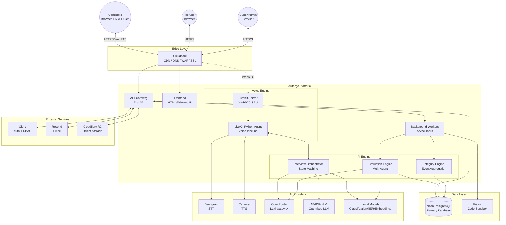

### 1.5 Key Design Decisions

**[SRS-OVR-007]**

| Decision | Choice | Rationale | Alternatives Considered |
|---|---|---|---|
| Voice transport | WebRTC via LiveKit | Hardware AEC in browser prevents echo loops; UDP eliminates TCP head-of-line blocking; native Opus codec with adaptive bitrate; built-in jitter buffer and PLC | WebSocket (rejected: TCP blocking, manual AEC), aiortc (rejected: Python GIL bottleneck at scale) |
| Application architecture | Modular monolith | Simpler deployment/debugging for MVP; logical module boundaries enable future extraction to microservices; single deployment unit reduces infrastructure cost | Microservices (premature for MVP), serverless functions (poor for stateful WebSocket) |
| Database | PostgreSQL with RLS | ACID compliance for interview data integrity; RLS enforces tenant isolation at DB engine level (defense in depth); rich JSONB support for structured AI outputs | MongoDB (rejected: weaker consistency guarantees), per-tenant database (rejected: operational complexity at scale) |
| AI evaluation architecture | Async multi-agent | Evaluation agents must not block real-time voice conversation; async allows parallel evaluation across competencies; structured outputs via Pydantic enforce consistency | Synchronous single-model (rejected: blocks voice path, single point of failure) |
| Frontend technology | HTML/CSS/JS + Tailwind | No build step for MVP; server-rendered pages reduce complexity; Tailwind provides consistent design system; progressive enhancement path to framework if needed | React (rejected: unnecessary complexity for MVP), Next.js (rejected: Node.js dependency conflicts with Python backend) |
| Auth provider | Clerk | 50K MRUs free; native B2B organization/RBAC; invitation flows; OAuth providers; no custom auth code needed | Auth0 (rejected: RBAC gated behind paid tier), Supabase Auth (rejected: weaker organization support), Keycloak (rejected: heavy operational overhead) |

### 1.6 Glossary

| Term | Definition |
|---|---|
| AEC | Acoustic Echo Cancellation — hardware/software that prevents speaker output from being picked up by the microphone |
| Barge-in | When the candidate starts speaking while the AI interviewer is still speaking |
| Drive | A recruitment campaign associated with a specific job position |
| E2E Latency | End-to-end perceived latency from candidate finishing speech to hearing AI response |
| FSM | Finite State Machine — the interview state management model |
| LiveKit Agent | Python process that connects to LiveKit as a participant and processes audio |
| RLS | Row-Level Security — PostgreSQL feature that filters rows based on session variables |
| SFU | Selective Forwarding Unit — media server that routes WebRTC streams |
| TTFA | Time To First Audio — latency from TTS receiving text to first audio bytes output |
| TTFT | Time To First Token — latency from LLM receiving prompt to first token generation |
| Turn | A single speaker's uninterrupted speech in the conversation |
| VAD | Voice Activity Detection — algorithm that determines when someone is speaking |

---

## 2. System Architecture

### 2.1 Architecture Principles

**[SRS-ARCH-001]** The Autergo system adheres to these 15 architectural principles:

| # | Principle | Implementation |
|---|---|---|
| 1 | API-first | All client interactions via versioned REST APIs (`/api/v1/`) or WebSocket events |
| 2 | Modular | Logical service boundaries within monolith; each module has defined interfaces |
| 3 | Provider-agnostic AI | All AI dependencies accessed via `ProviderAbstractionLayer` with adapter pattern |
| 4 | Tenant isolation | PostgreSQL RLS on all tenant-scoped tables; `SET LOCAL` in transaction scope |
| 5 | Event-driven (where useful) | Async evaluation triggered by interview completion events; integrity events as stream |
| 6 | Real-time / evaluation separation | Voice conversation path never blocks on deep evaluation processing |
| 7 | Async heavy processing | Evaluation, report generation, integrity analysis run as background tasks |
| 8 | Structured AI outputs | All agent outputs constrained to Pydantic models with JSON schema enforcement |
| 9 | Evidence-backed evaluation | Every competency score must reference specific transcript evidence |
| 10 | Deterministic workflow | Interview state machine, invitation flow, and drive lifecycle use deterministic state transitions |
| 11 | Secure agent permissions | Each AI agent has explicit tool access boundaries; candidate content never treated as instructions |
| 12 | Observability | All AI calls traced with OpenTelemetry; cost, latency, and token usage tracked per request |
| 13 | Testability | All APIs testable without voice pipeline; mock providers for integration tests |
| 14 | Incremental scalability | Modular monolith → service extraction → container orchestration path |
| 15 | No premature microservices | Single deployment unit for MVP; optimize only after measuring bottlenecks |

### 2.2 High-Level Architecture

**[SRS-ARCH-002]**

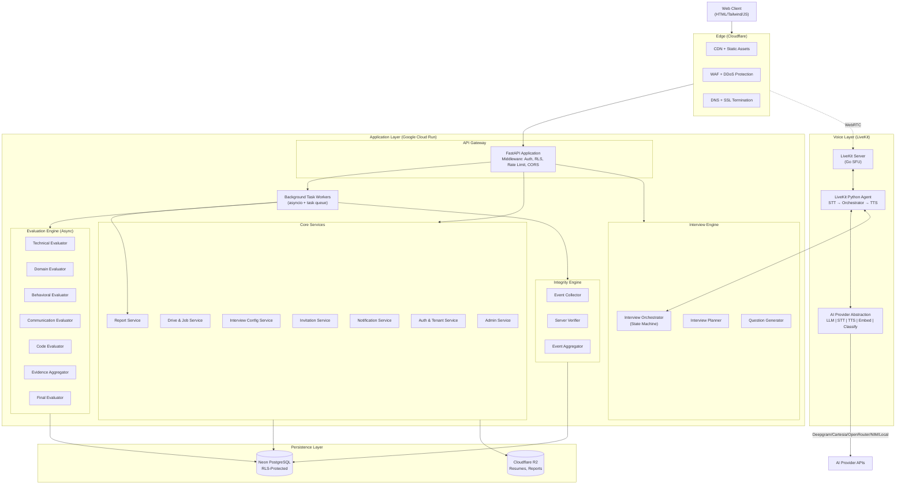

### 2.3 Component Architecture

**[SRS-ARCH-003]** Detailed component descriptions:

#### 2.3.1 API Gateway Layer (FastAPI)
- **Responsibilities**: HTTP request routing, middleware chain execution, WebSocket upgrade handling
- **Middleware stack** (executed in order):
  1. `CORSMiddleware` — configured per-origin allowlist
  2. `RequestIdMiddleware` — generates UUID trace ID per request
  3. `AuthenticationMiddleware` — validates Clerk JWT, extracts user claims
  4. `TenantContextMiddleware` — sets `app.current_tenant_id` for RLS
  5. `RateLimitMiddleware` — per-endpoint, per-tenant rate enforcement
  6. `RequestLoggingMiddleware` — structured JSON access logs
- **Technology**: FastAPI 0.110+, Uvicorn (ASGI), Python 3.12
- **Configuration**: Pydantic `BaseSettings` with Infisical environment injection

#### 2.3.2 Authentication & Authorization Service
- **Auth provider**: Clerk (hosted, managed)
- **JWT validation**: Clerk JWKS endpoint, RS256 signature verification, audience/issuer checks
- **RBAC enforcement**: Two layers:
  1. **API layer**: FastAPI dependency injection checks `required_permission` against JWT claims
  2. **Database layer**: PostgreSQL RLS policies filter all queries by `tenant_id`
- **Session management**: Clerk-managed sessions; backend stateless JWT validation
- **Token types**:
  - Recruiter JWT: 24h expiry, refreshable via Clerk
  - Guest candidate session token: 4h expiry, single-use, tied to invitation
  - Interview invitation token: 64-char cryptographic hex, configurable expiry (default 7 days)

#### 2.3.3 Company/Tenant Management
- **Multi-tenancy model**: Shared database, shared schema with PostgreSQL RLS
- **Tenant context**: Set via `SET LOCAL app.current_tenant_id = :tenant_id` at the start of each database transaction
- **PgBouncer safety**: `SET LOCAL` (not `SET`) ensures context is transaction-scoped and cleaned on COMMIT/ROLLBACK
- **Company settings**: Stored as JSONB in `companies.settings` — includes branding, defaults, limits, interview preferences
- **Tenant isolation verification**: Automated integration tests verify cross-tenant data leakage is impossible

#### 2.3.4 Drive & Job Management
- **Drive lifecycle**: `DRAFT → ACTIVE → PAUSED → CLOSED → ARCHIVED`
- **JD parsing**: Raw text/file → extract text (PyPDF2/python-docx) → GLiNER v2.1 NER + NuExtract-1.5 structured extraction → structured JSON
- **Fallback**: If local parsing confidence < 0.7, escalate to LLM-based parsing via OpenRouter

#### 2.3.5 Interview Configuration Service
- **Configuration model**: Interview type + difficulty + question distribution + evaluation criteria + personality + duration constraints + required sections
- **Template system**: Reusable configurations stored as `interview_templates`
- **Distribution validation**: All section percentages must sum to 100%
- **Interview types**: HR, BEHAVIORAL, TECHNICAL, DOMAIN_SPECIFIC, CODING, TECHNICAL_CODING, RESUME_BASED, CUSTOM

#### 2.3.6 Candidate Invitation Service
- **Token generation**: `secrets.token_hex(32)` → 64-character cryptographic hex string
- **Email delivery**: Via Resend API with retry logic (3 attempts, exponential backoff)
- **Bulk support**: CSV upload, max 500 per batch, async processing with progress tracking
- **Status tracking**: `PENDING → SENT → DELIVERED → OPENED → STARTED → COMPLETED → EXPIRED → FAILED`

#### 2.3.7 Interview Orchestration Engine
- **Core responsibility**: Manages the interview FSM, coordinates between voice pipeline and AI agents
- **State machine**: Deterministic transitions based on interview progress, evidence sufficiency, and duration constraints
- **Context management**: Maintains rolling interview context for LLM, summarizes old turns to fit context window
- **Turn coordination**: Receives candidate speech from voice agent, sends to question generator, returns AI response to voice agent

#### 2.3.8 Voice Pipeline Service
- **Architecture**: LiveKit Python Agent Framework
- **Audio flow**: Browser (WebRTC) → LiveKit SFU → Agent (PCM audio) → Deepgram (STT) → Orchestrator (LLM) → Cartesia (TTS) → Agent → SFU → Browser
- **Key features**: Streaming STT, streaming LLM, streaming TTS, VAD (Silero), semantic turn detection, barge-in handling
- **Latency target**: <1500ms E2E perceived latency

#### 2.3.9 AI Provider Abstraction Layer
- **Purpose**: Decouple interview engine from specific AI providers
- **Interface pattern**: Abstract base classes with provider-specific adapters
- **Provider registry**: Configuration-driven provider selection per task type
- **Health checking**: Periodic provider health probes; automatic failover on failure
- **Cost tracking**: Token usage and cost recorded per request in `agent_runs` table

#### 2.3.10 Multi-Agent Evaluation Engine
- **Execution model**: Async, triggered after interview completion
- **Agent pipeline**: Transcript → parallel evaluator agents → evidence aggregator → final evaluator → report generator
- **Output enforcement**: All agents produce Pydantic-validated structured JSON
- **Prompt injection defense**: Candidate transcript wrapped in `<candidate_submission>` XML tags; never interpreted as instructions

#### 2.3.11 Integrity Monitoring Engine
- **Client-side**: MediaPipe Face Landmarker + YOLO11n INT8 at 1 FPS via ONNX Runtime Web (WebGPU)
- **Browser telemetry**: Page Visibility API, focus/blur events, Fullscreen API, clipboard events
- **Server-side**: Keyframe verification on anomaly, async pyannote speaker diarization
- **Event aggregation**: Temporal analysis, corroboration across signal sources, confidence-weighted scoring
- **Rule**: No single low-confidence event terminates an interview

#### 2.3.12 Coding Interview Service
- **Editor**: Monaco Editor (browser-based, same as VS Code)
- **Languages**: Python, JavaScript, Java, C++, Go, Rust
- **Sandbox**: Piston (MIT) with gVisor runtime — `--network none`, 1 vCPU, 128MB RAM, 3s timeout, 64 PID limit
- **Evaluation**: Test case execution + AI code evaluation (Qwen2.5-Coder-1.5B)

#### 2.3.13 Report Generation Service
- **Recruiter report**: Comprehensive with competency scores, evidence, transcript, integrity events, structured assessment
- **Candidate report**: Limited to performance summary, strengths, improvement areas, recommendations (NO recruiter-only info)
- **Format**: JSON data → HTML template → PDF (WeasyPrint or similar)
- **Delivery**: Email via Resend, stored in Cloudflare R2

#### 2.3.14 Notification Service
- **Provider**: Resend (3K emails/mo free)
- **Templates**: Interview invitation, reminder, completion notification, report ready, sub-recruiter invite, password reset, email verification
- **Delivery tracking**: Status tracked in `notifications` table with retry logic

#### 2.3.15 Admin Service
- **Scope**: Platform-level management (Super Admin only)
- **Capabilities**: Company CRUD, user management, provider configuration, model routing, prompt versioning, system health, usage/cost monitoring, audit logs, account suspension

#### 2.3.16 Observability Service
- **Stack**: OpenTelemetry SDK → Grafana Cloud (metrics/logs/traces) + Sentry (errors)
- **Instrumentation**: All API endpoints, all AI provider calls, all database queries, voice pipeline stages
- **Dashboards**: API performance, voice latency, AI costs, business metrics

### 2.4 Inter-Component Communication

**[SRS-ARCH-004]**

| Communication | Pattern | Protocol | Notes |
|---|---|---|---|
| Client ↔ API | Request/Response | HTTPS REST | Standard API calls |
| Client ↔ LiveKit | Bidirectional streaming | WebRTC (UDP/SRTP) | Audio/video media |
| Client → API | Event stream | WebSocket | Dashboard live updates, interview events |
| API → Background Workers | Async task dispatch | In-process asyncio task queue | MVP: `asyncio.create_task()` with retry; Production: Redis + Celery/ARQ |
| Voice Agent ↔ STT | Bidirectional streaming | WebSocket | PCM audio → transcripts |
| Voice Agent ↔ TTS | Bidirectional streaming | WebSocket | Text tokens → audio chunks |
| Voice Agent ↔ LLM | Streaming | HTTPS SSE | Prompt → streaming tokens |
| Evaluation agents | Async pipeline | In-process function calls | Orchestrated by task worker |

### 2.5 Async Task Processing

**[SRS-ARCH-005]** Background tasks that must not block the main request/response cycle:

| Task | Trigger | Priority | Typical Duration |
|---|---|---|---|
| JD parsing | JD upload/entry | Medium | 5–15s |
| Resume parsing | Resume upload | Medium | 5–15s |
| Post-interview evaluation | Interview completion | High | 30–120s |
| Integrity event aggregation | Interview completion | Medium | 10–30s |
| Recruiter report generation | Evaluation completion | High | 15–45s |
| Candidate report generation | Recruiter trigger | Medium | 10–30s |
| Report email delivery | Report ready | Medium | 2–10s |
| Invitation email sending | Invitation creation | High | 1–5s |
| Bulk invitation processing | CSV upload | Medium | 30–300s |
| Cost aggregation | Hourly cron | Low | 5–30s |

**MVP implementation**: `asyncio.create_task()` with structured error handling and retry logic.
**Production path**: Redis-backed task queue (ARQ or Celery) with dead-letter queue and monitoring.

---

## 3. Deployment Architecture

### 3.1 Environment Matrix

**[SRS-DEPLOY-001]**

| Property | Development | Staging | Production |
|---|---|---|---|
| Cloud Run instances | 0–1 (scale to zero) | 0–2 | 2–10 (min 2) |
| Cloud Run CPU | 1 vCPU | 2 vCPU | 4 vCPU |
| Cloud Run Memory | 512 MB | 1 GB | 2 GB |
| Cloud Run concurrency | 10 | 40 | 80 |
| Database | Neon free (1 GB) | Neon free (branch) | Neon Launch ($19/mo) |
| LiveKit | LiveKit Cloud (free tier) | LiveKit Cloud | Self-hosted or LiveKit Cloud |
| Domain | dev.autergo.com | staging.autergo.com | autergo.com |
| Secrets | Infisical dev env | Infisical staging env | Infisical prod env |
| Monitoring | Sentry only | Sentry + Grafana | Full observability stack |

### 3.2 POC/MVP Deployment

**[SRS-DEPLOY-002]**

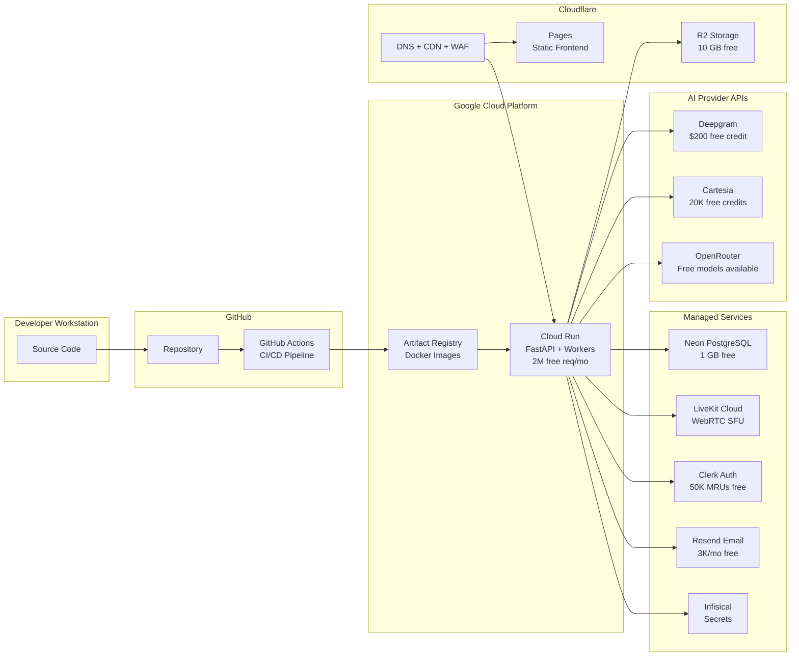

**MVP monthly cost estimate**: \$0–\$20/month (within free tiers for low traffic)

### 3.3 Production Deployment

**[SRS-DEPLOY-003]**

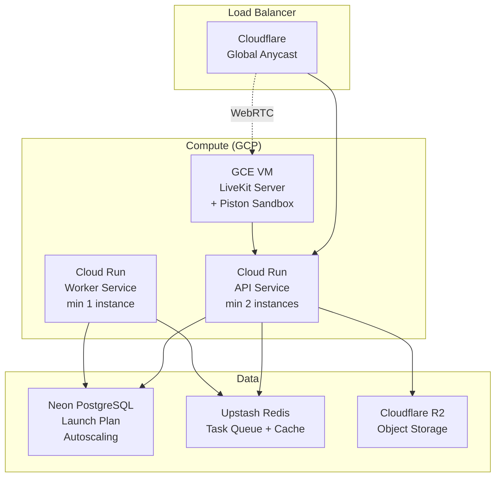

### 3.4 Docker Configuration

**[SRS-DEPLOY-004]** Multi-stage Dockerfile:

```dockerfile
# Stage 1: Dependencies
FROM python:3.12-slim AS dependencies
WORKDIR /app
RUN pip install poetry==1.8.0
COPY pyproject.toml poetry.lock ./
RUN poetry config virtualenvs.create false \
    && poetry install --no-dev --no-interaction --no-ansi

# Stage 2: Application
FROM python:3.12-slim AS application
WORKDIR /app
COPY --from=dependencies /usr/local/lib/python3.12/site-packages /usr/local/lib/python3.12/site-packages
COPY --from=dependencies /usr/local/bin /usr/local/bin
COPY . .

EXPOSE 8080
ENV PORT=8080
HEALTHCHECK --interval=30s --timeout=5s CMD curl -f http://localhost:8080/health || exit 1

CMD ["uvicorn", "app.main:app", "--host", "0.0.0.0", "--port", "8080", "--workers", "4"]
```

### 3.5 CI/CD Pipeline

**[SRS-DEPLOY-005]**

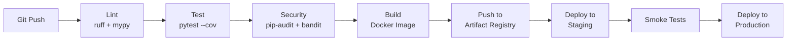

**Pipeline configuration**: GitHub Actions with separate workflows for PR validation (lint + test) and deployment (build + deploy on merge to `main`).

### 3.6 Health Check Endpoints

**[SRS-DEPLOY-006]**

| Endpoint | Purpose | Checks | Response |
|---|---|---|---|
| `GET /health` | Basic liveness | Application running | `200 {"status": "ok"}` |
| `GET /ready` | Readiness probe | DB connection, Clerk reachable, STT/TTS provider available | `200 {"status": "ready", "checks": {...}}` or `503` |
| `GET /live` | Kubernetes liveness | Process alive, not deadlocked | `200 {"status": "alive"}` |

### 3.7 Rollback Strategy

**[SRS-DEPLOY-007]**
- **Cloud Run**: Instant rollback to previous revision via `gcloud run services update-traffic --to-revisions=REVISION=100`
- **Database**: Alembic `downgrade -1` for schema changes; Neon branch restore for data recovery
- **Feature flags**: Environment-variable-based kill switches for new features

---

## 4. Data Architecture

### 4.1 Database Schema

**[SRS-DATA-001]** Complete table definitions with all columns, types, constraints, and indexes.

#### 4.1.1 `users`
| Column | Type | Constraints | Description |
|---|---|---|---|
| id | UUID | PK, DEFAULT gen_random_uuid() | Unique user identifier |
| clerk_id | VARCHAR(255) | UNIQUE, NOT NULL | Clerk external user ID |
| email | VARCHAR(255) | UNIQUE, NOT NULL | User email address |
| full_name | VARCHAR(100) | NOT NULL | Display name |
| avatar_url | TEXT | NULLABLE | Profile photo URL |
| is_platform_admin | BOOLEAN | DEFAULT false | Super admin flag |
| email_verified | BOOLEAN | DEFAULT false | Email verification status |
| last_login_at | TIMESTAMPTZ | NULLABLE | Last successful login |
| created_at | TIMESTAMPTZ | DEFAULT now() | Record creation timestamp |
| updated_at | TIMESTAMPTZ | DEFAULT now() | Last update timestamp |

**Indexes**: `idx_users_email` (email), `idx_users_clerk_id` (clerk_id)

#### 4.1.2 `companies`
| Column | Type | Constraints | Description |
|---|---|---|---|
| id | UUID | PK, DEFAULT gen_random_uuid() | Company tenant ID |
| name | VARCHAR(200) | NOT NULL | Company name |
| slug | VARCHAR(100) | UNIQUE, NOT NULL | URL-safe identifier |
| settings | JSONB | DEFAULT '{}' | Company configuration |
| plan | VARCHAR(50) | DEFAULT 'free' | Subscription plan |
| max_interviews_per_month | INTEGER | DEFAULT 50 | Plan limit |
| is_active | BOOLEAN | DEFAULT true | Account active status |
| created_at | TIMESTAMPTZ | DEFAULT now() | |
| updated_at | TIMESTAMPTZ | DEFAULT now() | |

**Indexes**: `idx_companies_slug` (slug)
**RLS**: Not tenant-scoped (companies table accessed by platform admins and own members)

#### 4.1.3 `company_users`
| Column | Type | Constraints | Description |
|---|---|---|---|
| id | UUID | PK | Link between user and company |
| company_id | UUID | FK → companies.id, NOT NULL | Tenant reference |
| user_id | UUID | FK → users.id, NOT NULL | User reference |
| role | company_role_enum | NOT NULL | COMPANY_ADMIN, HEAD_RECRUITER, SUB_RECRUITER |
| permissions | JSONB | DEFAULT '[]' | Granular permissions array |
| invited_by | UUID | FK → users.id, NULLABLE | Who invited this user |
| status | member_status_enum | DEFAULT 'active' | ACTIVE, DEACTIVATED |
| created_at | TIMESTAMPTZ | DEFAULT now() | |

**Indexes**: `idx_company_users_company` (company_id), `idx_company_users_user` (user_id), UNIQUE (company_id, user_id)
**RLS**: Yes — filtered by `company_id = current_setting('app.current_tenant_id')::uuid`

#### 4.1.4 `jobs`
| Column | Type | Constraints | Description |
|---|---|---|---|
| id | UUID | PK | Job position ID |
| company_id | UUID | FK → companies.id, NOT NULL | Owning tenant |
| title | VARCHAR(200) | NOT NULL | Job title |
| description_raw | TEXT | NOT NULL | Original JD text |
| description_file_url | TEXT | NULLABLE | Uploaded JD file in R2 |
| description_structured | JSONB | NULLABLE | AI-parsed structured JD |
| parsing_confidence | FLOAT | NULLABLE | JD parsing confidence (0.0–1.0) |
| status | job_status_enum | DEFAULT 'draft' | DRAFT, ACTIVE, FILLED, CLOSED |
| created_by | UUID | FK → users.id | Creator |
| created_at | TIMESTAMPTZ | DEFAULT now() | |
| updated_at | TIMESTAMPTZ | DEFAULT now() | |

**Indexes**: `idx_jobs_company` (company_id), `idx_jobs_status` (company_id, status)
**RLS**: Yes

#### 4.1.5 `interview_configs`
| Column | Type | Constraints | Description |
|---|---|---|---|
| id | UUID | PK | Configuration ID |
| company_id | UUID | FK → companies.id, NOT NULL | Owning tenant |
| name | VARCHAR(200) | NULLABLE | Optional config name |
| interview_type | interview_type_enum | NOT NULL | HR, BEHAVIORAL, TECHNICAL, etc. |
| difficulty | difficulty_enum | DEFAULT 'adaptive' | EASY, MEDIUM, HARD, ADAPTIVE |
| question_distribution | JSONB | NOT NULL | `{"introduction": 10, "technical": 50, ...}` |
| evaluation_criteria | JSONB | DEFAULT '[]' | Selected competencies + weights |
| personality | personality_enum | DEFAULT 'professional' | AI interviewer style |
| min_duration_minutes | INTEGER | DEFAULT 15, CHECK (>= 10 AND <= 60) | Minimum interview length |
| max_duration_minutes | INTEGER | DEFAULT 45, CHECK (>= 15 AND <= 120) | Maximum interview length |
| required_sections | JSONB | DEFAULT '[]' | Sections that must be covered |
| custom_instructions | TEXT | NULLABLE | Recruiter custom instructions |
| created_at | TIMESTAMPTZ | DEFAULT now() | |

**Indexes**: `idx_configs_company` (company_id)
**RLS**: Yes
**Validation**: CHECK (min_duration_minutes < max_duration_minutes)

#### 4.1.6 `interview_templates`
| Column | Type | Constraints | Description |
|---|---|---|---|
| id | UUID | PK | Template ID |
| company_id | UUID | FK → companies.id, NOT NULL | Owning tenant |
| name | VARCHAR(200) | NOT NULL | Template name |
| description | TEXT | NULLABLE | Template description |
| config | JSONB | NOT NULL | Full interview configuration snapshot |
| is_default | BOOLEAN | DEFAULT false | Default template flag |
| created_by | UUID | FK → users.id | Creator |
| created_at | TIMESTAMPTZ | DEFAULT now() | |

**RLS**: Yes

#### 4.1.7 `drives`
| Column | Type | Constraints | Description |
|---|---|---|---|
| id | UUID | PK | Drive ID |
| company_id | UUID | FK → companies.id, NOT NULL | Owning tenant |
| job_id | UUID | FK → jobs.id, NOT NULL | Associated job |
| interview_config_id | UUID | FK → interview_configs.id, NOT NULL | Interview configuration |
| title | VARCHAR(200) | NOT NULL | Drive title |
| status | drive_status_enum | DEFAULT 'draft' | DRAFT, ACTIVE, PAUSED, CLOSED, ARCHIVED |
| start_date | DATE | NULLABLE | Scheduled start |
| end_date | DATE | NULLABLE | Scheduled end |
| max_candidates | INTEGER | NULLABLE | Candidate limit |
| created_by | UUID | FK → users.id | Creator |
| created_at | TIMESTAMPTZ | DEFAULT now() | |
| updated_at | TIMESTAMPTZ | DEFAULT now() | |

**Indexes**: `idx_drives_company` (company_id), `idx_drives_status` (company_id, status), `idx_drives_job` (job_id)
**RLS**: Yes

#### 4.1.8 `invitations`
| Column | Type | Constraints | Description |
|---|---|---|---|
| id | UUID | PK | Invitation ID |
| company_id | UUID | FK → companies.id, NOT NULL | Owning tenant |
| drive_id | UUID | FK → drives.id, NOT NULL | Associated drive |
| candidate_email | VARCHAR(255) | NOT NULL | Invitee email |
| token | VARCHAR(64) | UNIQUE, NOT NULL | Secure access token |
| status | invitation_status_enum | DEFAULT 'pending' | PENDING, SENT, DELIVERED, OPENED, STARTED, COMPLETED, EXPIRED, FAILED |
| scheduled_start | TIMESTAMPTZ | NULLABLE | Earliest allowed start |
| scheduled_end | TIMESTAMPTZ | NULLABLE | Latest allowed start |
| custom_message | TEXT | NULLABLE | Recruiter custom message |
| expires_at | TIMESTAMPTZ | NOT NULL | Token expiry timestamp |
| sent_at | TIMESTAMPTZ | NULLABLE | Email sent timestamp |
| opened_at | TIMESTAMPTZ | NULLABLE | Link opened timestamp |
| created_by | UUID | FK → users.id | Inviter |
| created_at | TIMESTAMPTZ | DEFAULT now() | |

**Indexes**: `idx_invitations_token` (token), `idx_invitations_drive` (drive_id), `idx_invitations_email` (company_id, candidate_email), `idx_invitations_status` (company_id, status), `idx_invitations_expiry` (expires_at) WHERE status = 'pending'
**RLS**: Yes

#### 4.1.9 `candidates`
| Column | Type | Constraints | Description |
|---|---|---|---|
| id | UUID | PK | Candidate ID |
| email | VARCHAR(255) | NOT NULL | Candidate email |
| full_name | VARCHAR(100) | NOT NULL | Candidate name |
| resume_raw_url | TEXT | NULLABLE | Resume file URL in R2 |
| resume_structured | JSONB | NULLABLE | AI-parsed resume data |
| resume_parsing_confidence | FLOAT | NULLABLE | Parsing confidence (0.0–1.0) |
| profile_photo_url | TEXT | NULLABLE | Photo URL |
| created_at | TIMESTAMPTZ | DEFAULT now() | |

**Indexes**: `idx_candidates_email` (email)
**Note**: Candidates are NOT tenant-scoped — a candidate may be invited by multiple companies. Tenant isolation is enforced through `interviews` and `invitations` tables.

#### 4.1.10 `interviews`
| Column | Type | Constraints | Description |
|---|---|---|---|
| id | UUID | PK | Interview ID |
| company_id | UUID | FK → companies.id, NOT NULL | Owning tenant |
| drive_id | UUID | FK → drives.id, NOT NULL | Associated drive |
| invitation_id | UUID | FK → invitations.id, UNIQUE, NOT NULL | Source invitation |
| candidate_id | UUID | FK → candidates.id, NOT NULL | Candidate |
| interview_config_id | UUID | FK → interview_configs.id, NOT NULL | Config snapshot |
| status | interview_status_enum | DEFAULT 'pending' | PENDING, IN_PROGRESS, COMPLETED, INTERRUPTED, FAILED, EXPIRED |
| state | interview_state_enum | DEFAULT 'init' | INIT, INTRODUCTION, PROFILE_EXPERIENCE, CORE_COMPETENCY, DEEP_DIVE, VALIDATION, CLOSING, COMPLETE |
| interview_plan | JSONB | NULLABLE | Generated interview strategy |
| competency_coverage | JSONB | DEFAULT '{}' | Tracked competency evidence status |
| evaluation_confidence | FLOAT | DEFAULT 0.0 | Running confidence estimate |
| started_at | TIMESTAMPTZ | NULLABLE | Interview start time |
| completed_at | TIMESTAMPTZ | NULLABLE | Interview completion time |
| duration_seconds | INTEGER | NULLABLE | Total interview duration |
| completion_reason | VARCHAR(50) | NULLABLE | normal, max_duration, sufficient_evidence, candidate_disconnect, system_error |
| metadata | JSONB | DEFAULT '{}' | Additional interview metadata |
| created_at | TIMESTAMPTZ | DEFAULT now() | |

**Indexes**: `idx_interviews_company` (company_id), `idx_interviews_drive` (drive_id), `idx_interviews_candidate` (candidate_id), `idx_interviews_status` (company_id, status), `idx_interviews_invitation` (invitation_id)
**RLS**: Yes

#### 4.1.11 `interview_sessions`
| Column | Type | Constraints | Description |
|---|---|---|---|
| id | UUID | PK | Session ID |
| interview_id | UUID | FK → interviews.id, NOT NULL | Parent interview |
| session_number | INTEGER | NOT NULL | Sequential session number (reconnects) |
| livekit_room_id | VARCHAR(255) | NULLABLE | LiveKit room identifier |
| connected_at | TIMESTAMPTZ | NOT NULL | WebRTC connection time |
| disconnected_at | TIMESTAMPTZ | NULLABLE | Disconnect time |
| disconnect_reason | VARCHAR(100) | NULLABLE | Reason for disconnect |
| client_info | JSONB | DEFAULT '{}' | Browser, OS, device info |

**Indexes**: `idx_sessions_interview` (interview_id)

#### 4.1.12 `interview_turns`
| Column | Type | Constraints | Description |
|---|---|---|---|
| id | UUID | PK | Turn ID |
| interview_id | UUID | FK → interviews.id, NOT NULL | Parent interview |
| turn_number | INTEGER | NOT NULL | Sequential turn number |
| speaker | speaker_enum | NOT NULL | AI, CANDIDATE |
| content | TEXT | NOT NULL | Transcribed/generated text |
| audio_duration_ms | INTEGER | NULLABLE | Audio duration in milliseconds |
| stt_confidence | FLOAT | NULLABLE | STT confidence score |
| question_type | VARCHAR(50) | NULLABLE | For AI turns: introduction, technical, behavioral, etc. |
| target_competency | VARCHAR(100) | NULLABLE | Competency being assessed |
| difficulty_level | VARCHAR(20) | NULLABLE | easy, medium, hard |
| answer_quality | answer_quality_enum | NULLABLE | For candidate turns: WEAK, INCOMPLETE, etc. |
| is_follow_up | BOOLEAN | DEFAULT false | Whether this is a follow-up question |
| latency_metrics | JSONB | DEFAULT '{}' | `{stt_ms, turn_detect_ms, llm_ttft_ms, tts_ttfa_ms, e2e_ms}` |
| timestamp | TIMESTAMPTZ | DEFAULT now() | Turn timestamp |

**Indexes**: `idx_turns_interview` (interview_id), `idx_turns_interview_number` (interview_id, turn_number)

#### 4.1.13 `evaluations`
| Column | Type | Constraints | Description |
|---|---|---|---|
| id | UUID | PK | Evaluation ID |
| interview_id | UUID | FK → interviews.id, NOT NULL | Evaluated interview |
| company_id | UUID | FK → companies.id, NOT NULL | Owning tenant |
| evaluator_type | VARCHAR(50) | NOT NULL | technical, domain, behavioral, communication, coding, final |
| overall_score | FLOAT | NULLABLE, CHECK (>= 1 AND <= 100) | Overall score (1–100) |
| competency_scores | JSONB | NOT NULL | Array of `{competency, score, evidence[], positives[], weaknesses[], confidence}` |
| evidence_summary | JSONB | DEFAULT '[]' | Linked transcript evidence |
| strengths | JSONB | DEFAULT '[]' | Identified strengths |
| weaknesses | JSONB | DEFAULT '[]' | Identified gaps |
| confidence | FLOAT | CHECK (>= 0 AND <= 1) | Evaluation confidence (0.0–1.0) |
| model_used | VARCHAR(100) | NOT NULL | Model identifier |
| prompt_version_id | UUID | FK → prompt_versions.id, NULLABLE | Prompt version used |
| input_tokens | INTEGER | NULLABLE | Token consumption |
| output_tokens | INTEGER | NULLABLE | Token consumption |
| cost_usd | DECIMAL(10,6) | NULLABLE | Inference cost |
| latency_ms | INTEGER | NULLABLE | Processing time |
| created_at | TIMESTAMPTZ | DEFAULT now() | |

**Indexes**: `idx_evaluations_interview` (interview_id), `idx_evaluations_company` (company_id)
**RLS**: Yes

#### 4.1.14 `integrity_events`
| Column | Type | Constraints | Description |
|---|---|---|---|
| id | UUID | PK | Event ID |
| interview_id | UUID | FK → interviews.id, NOT NULL | Parent interview |
| event_type | integrity_event_type_enum | NOT NULL | FACE_ABSENT, MULTIPLE_FACES, PHONE_DETECTED, GAZE_DEVIATION, TAB_SWITCH, COPY_PASTE, FULLSCREEN_EXIT, AUDIO_ANOMALY, VIRTUAL_DEVICE |
| timestamp | TIMESTAMPTZ | NOT NULL | Event occurrence time |
| confidence | FLOAT | CHECK (>= 0 AND <= 1) | Detection confidence |
| evidence | JSONB | DEFAULT '{}' | Supporting data (screenshot hash, coordinates, audio segment) |
| duration_ms | INTEGER | NULLABLE | Event duration |
| severity | severity_enum | DEFAULT 'low' | LOW, MEDIUM, HIGH, CRITICAL |
| detection_source | VARCHAR(50) | NOT NULL | client_vision, client_browser, server_verification, client_audio |
| human_review_recommended | BOOLEAN | DEFAULT false | Flag for recruiter review |
| created_at | TIMESTAMPTZ | DEFAULT now() | |

**Indexes**: `idx_integrity_interview` (interview_id), `idx_integrity_type` (interview_id, event_type)

#### 4.1.15 `reports`
| Column | Type | Constraints | Description |
|---|---|---|---|
| id | UUID | PK | Report ID |
| interview_id | UUID | FK → interviews.id, NOT NULL | Source interview |
| company_id | UUID | FK → companies.id, NOT NULL | Owning tenant |
| report_type | report_type_enum | NOT NULL | RECRUITER, CANDIDATE |
| content | JSONB | NOT NULL | Structured report data |
| pdf_url | TEXT | NULLABLE | Generated PDF in R2 |
| status | report_status_enum | DEFAULT 'generating' | GENERATING, READY, DELIVERED, FAILED |
| recruiter_notes | TEXT | NULLABLE | Added by recruiter |
| created_at | TIMESTAMPTZ | DEFAULT now() | |
| updated_at | TIMESTAMPTZ | DEFAULT now() | |

**Indexes**: `idx_reports_interview` (interview_id), `idx_reports_company` (company_id, report_type)
**RLS**: Yes

#### 4.1.16 `report_deliveries`
| Column | Type | Constraints | Description |
|---|---|---|---|
| id | UUID | PK | Delivery ID |
| report_id | UUID | FK → reports.id, NOT NULL | Report being delivered |
| recipient_email | VARCHAR(255) | NOT NULL | Delivery target |
| delivery_status | delivery_status_enum | DEFAULT 'pending' | PENDING, SENT, DELIVERED, BOUNCED, FAILED |
| sent_at | TIMESTAMPTZ | NULLABLE | Send timestamp |
| delivered_at | TIMESTAMPTZ | NULLABLE | Delivery confirmation |
| failure_reason | TEXT | NULLABLE | Error details |

#### 4.1.17 `notifications`
| Column | Type | Constraints | Description |
|---|---|---|---|
| id | UUID | PK | Notification ID |
| company_id | UUID | FK → companies.id, NULLABLE | Tenant (null for platform notifications) |
| recipient_user_id | UUID | FK → users.id, NULLABLE | Target user |
| recipient_email | VARCHAR(255) | NOT NULL | Target email |
| notification_type | VARCHAR(50) | NOT NULL | INTERVIEW_INVITATION, COMPLETION, REPORT_READY, etc. |
| subject | VARCHAR(500) | NOT NULL | Email subject |
| content | JSONB | NOT NULL | Email template data |
| status | notification_status_enum | DEFAULT 'pending' | PENDING, SENT, DELIVERED, FAILED |
| retry_count | INTEGER | DEFAULT 0 | Delivery attempt count |
| sent_at | TIMESTAMPTZ | NULLABLE | |
| created_at | TIMESTAMPTZ | DEFAULT now() | |

#### 4.1.18 `audit_logs`
| Column | Type | Constraints | Description |
|---|---|---|---|
| id | UUID | PK | Log entry ID |
| company_id | UUID | NULLABLE | Tenant context |
| user_id | UUID | FK → users.id, NULLABLE | Acting user |
| action | VARCHAR(100) | NOT NULL | Action name (e.g., `drive.created`, `invitation.sent`) |
| resource_type | VARCHAR(50) | NOT NULL | Entity type affected |
| resource_id | UUID | NULLABLE | Entity ID affected |
| details | JSONB | DEFAULT '{}' | Action details (before/after) |
| ip_address | INET | NULLABLE | Client IP |
| user_agent | TEXT | NULLABLE | Client user agent |
| created_at | TIMESTAMPTZ | DEFAULT now() | |

**Indexes**: `idx_audit_company` (company_id, created_at DESC), `idx_audit_user` (user_id, created_at DESC), `idx_audit_resource` (resource_type, resource_id)
**Note**: Audit logs are append-only. No UPDATE or DELETE operations permitted.

#### 4.1.19 `model_registry`
| Column | Type | Constraints | Description |
|---|---|---|---|
| id | UUID | PK | Registry entry ID |
| model_name | VARCHAR(200) | NOT NULL | Model identifier (e.g., `deepgram/nova-3`, `openrouter/gpt-4o-mini`) |
| provider | VARCHAR(100) | NOT NULL | Provider name |
| task_type | VARCHAR(50) | NOT NULL | llm, stt, tts, embedding, classification, vision, moderation |
| config | JSONB | NOT NULL | Provider-specific configuration |
| is_active | BOOLEAN | DEFAULT true | Active/disabled toggle |
| is_default | BOOLEAN | DEFAULT false | Default for task type |
| created_at | TIMESTAMPTZ | DEFAULT now() | |

#### 4.1.20 `prompt_versions`
| Column | Type | Constraints | Description |
|---|---|---|---|
| id | UUID | PK | Prompt version ID |
| prompt_name | VARCHAR(200) | NOT NULL | Prompt identifier (e.g., `interviewer_system`, `technical_evaluator`) |
| version | INTEGER | NOT NULL | Sequential version number |
| content | TEXT | NOT NULL | Full prompt text |
| model_target | VARCHAR(200) | NULLABLE | Intended model |
| variables | JSONB | DEFAULT '[]' | Template variable definitions |
| is_active | BOOLEAN | DEFAULT false | Currently active version |
| created_by | UUID | FK → users.id, NULLABLE | Author |
| created_at | TIMESTAMPTZ | DEFAULT now() | |

**UNIQUE**: (prompt_name, version)
**Constraint**: Only one active version per prompt_name (enforced by application logic with partial unique index)

#### 4.1.21 `agent_runs`
| Column | Type | Constraints | Description |
|---|---|---|---|
| id | UUID | PK | Run ID |
| interview_id | UUID | FK → interviews.id, NULLABLE | Associated interview |
| agent_type | VARCHAR(50) | NOT NULL | Agent identifier |
| model_used | VARCHAR(200) | NOT NULL | Model that served the request |
| provider | VARCHAR(100) | NOT NULL | Provider used |
| prompt_version_id | UUID | FK → prompt_versions.id, NULLABLE | Prompt version |
| input_tokens | INTEGER | NOT NULL | Input token count |
| output_tokens | INTEGER | NOT NULL | Output token count |
| cost_usd | DECIMAL(10,6) | NOT NULL | Estimated cost |
| latency_ms | INTEGER | NOT NULL | Total latency |
| status | VARCHAR(20) | NOT NULL | success, failure, timeout |
| error_message | TEXT | NULLABLE | Error details on failure |
| created_at | TIMESTAMPTZ | DEFAULT now() | |

**Indexes**: `idx_agent_runs_interview` (interview_id), `idx_agent_runs_created` (created_at DESC)

#### 4.1.22 `usage_records`
| Column | Type | Constraints | Description |
|---|---|---|---|
| id | UUID | PK | Usage record ID |
| company_id | UUID | FK → companies.id, NOT NULL | Billed tenant |
| interview_id | UUID | FK → interviews.id, NULLABLE | Associated interview |
| service_type | VARCHAR(50) | NOT NULL | stt, tts, llm, embedding, code_execution |
| provider | VARCHAR(100) | NOT NULL | Provider used |
| units_consumed | DECIMAL(12,4) | NOT NULL | Units (tokens, minutes, characters) |
| unit_type | VARCHAR(20) | NOT NULL | tokens, minutes, characters, executions |
| cost_usd | DECIMAL(10,6) | NOT NULL | Calculated cost |
| created_at | TIMESTAMPTZ | DEFAULT now() | |

**Indexes**: `idx_usage_company` (company_id, created_at DESC), `idx_usage_interview` (interview_id)
**RLS**: Yes

#### 4.1.23 `coding_submissions`
| Column | Type | Constraints | Description |
|---|---|---|---|
| id | UUID | PK | Submission ID |
| interview_id | UUID | FK → interviews.id, NOT NULL | Parent interview |
| language | VARCHAR(50) | NOT NULL | Programming language |
| source_code | TEXT | NOT NULL | Submitted code |
| submission_number | INTEGER | NOT NULL | Sequential submission |
| execution_result | JSONB | NULLABLE | `{stdout, stderr, exit_code, execution_time_ms, memory_kb}` |
| test_results | JSONB | NULLABLE | `[{test_id, passed, input, expected, actual, time_ms}]` |
| ai_evaluation | JSONB | NULLABLE | AI code quality assessment |
| created_at | TIMESTAMPTZ | DEFAULT now() | |

### 4.2 ENUM Type Definitions

**[SRS-DATA-002]**

```sql
CREATE TYPE company_role_enum AS ENUM ('COMPANY_ADMIN', 'HEAD_RECRUITER', 'SUB_RECRUITER');
CREATE TYPE member_status_enum AS ENUM ('ACTIVE', 'DEACTIVATED', 'PENDING');
CREATE TYPE job_status_enum AS ENUM ('DRAFT', 'ACTIVE', 'FILLED', 'CLOSED');
CREATE TYPE drive_status_enum AS ENUM ('DRAFT', 'ACTIVE', 'PAUSED', 'CLOSED', 'ARCHIVED');
CREATE TYPE interview_type_enum AS ENUM ('HR', 'BEHAVIORAL', 'TECHNICAL', 'DOMAIN_SPECIFIC', 'CODING', 'TECHNICAL_CODING', 'RESUME_BASED', 'CUSTOM');
CREATE TYPE difficulty_enum AS ENUM ('EASY', 'MEDIUM', 'HARD', 'ADAPTIVE');
CREATE TYPE personality_enum AS ENUM ('PROFESSIONAL', 'FORMAL', 'FRIENDLY', 'CONVERSATIONAL', 'TECHNICAL', 'NEUTRAL', 'STRICT');
CREATE TYPE invitation_status_enum AS ENUM ('PENDING', 'SENT', 'DELIVERED', 'OPENED', 'STARTED', 'COMPLETED', 'EXPIRED', 'FAILED');
CREATE TYPE interview_status_enum AS ENUM ('PENDING', 'IN_PROGRESS', 'COMPLETED', 'INTERRUPTED', 'FAILED', 'EXPIRED');
CREATE TYPE interview_state_enum AS ENUM ('INIT', 'INTRODUCTION', 'PROFILE_EXPERIENCE', 'CORE_COMPETENCY', 'DEEP_DIVE', 'VALIDATION', 'CLOSING', 'COMPLETE');
CREATE TYPE speaker_enum AS ENUM ('AI', 'CANDIDATE');
CREATE TYPE answer_quality_enum AS ENUM ('WEAK', 'INCOMPLETE', 'AMBIGUOUS', 'INCORRECT', 'STRONG', 'EXCEPTIONAL', 'IRRELEVANT', 'REFUSAL', 'CONTRADICTORY');
CREATE TYPE report_type_enum AS ENUM ('RECRUITER', 'CANDIDATE');
CREATE TYPE report_status_enum AS ENUM ('GENERATING', 'READY', 'DELIVERED', 'FAILED');
CREATE TYPE delivery_status_enum AS ENUM ('PENDING', 'SENT', 'DELIVERED', 'BOUNCED', 'FAILED');
CREATE TYPE notification_status_enum AS ENUM ('PENDING', 'SENT', 'DELIVERED', 'FAILED');
CREATE TYPE severity_enum AS ENUM ('LOW', 'MEDIUM', 'HIGH', 'CRITICAL');
CREATE TYPE integrity_event_type_enum AS ENUM ('FACE_ABSENT', 'MULTIPLE_FACES', 'PHONE_DETECTED', 'GAZE_DEVIATION', 'TAB_SWITCH', 'COPY_PASTE', 'FULLSCREEN_EXIT', 'AUDIO_ANOMALY', 'VIRTUAL_DEVICE');
```

### 4.3 RLS Policy Template

**[SRS-DATA-003]** Applied to all tables with `company_id`:

```sql
-- Enable RLS
ALTER TABLE {table_name} ENABLE ROW LEVEL SECURITY;
ALTER TABLE {table_name} FORCE ROW LEVEL SECURITY;

-- Tenant isolation policy
CREATE POLICY tenant_isolation ON {table_name}
    FOR ALL
    USING (company_id = NULLIF(current_setting('app.current_tenant_id', true), '')::uuid)
    WITH CHECK (company_id = NULLIF(current_setting('app.current_tenant_id', true), '')::uuid);

-- Platform admin bypass (optional, per table)
CREATE POLICY admin_bypass ON {table_name}
    FOR ALL
    USING (current_setting('app.is_platform_admin', true) = 'true');
```

### 4.4 Entity Relationship Diagram

**[SRS-DATA-004]**

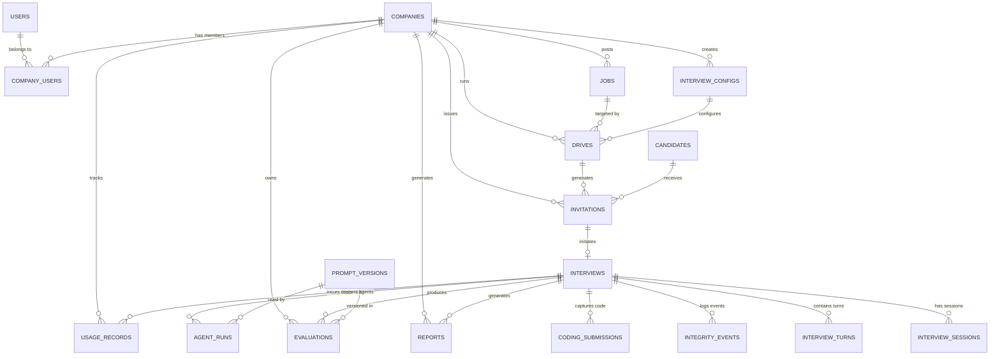

### 4.5 Migration Strategy

**[SRS-DATA-005]**
- **Tool**: Alembic with SQLAlchemy async engine
- **Process**: `alembic revision --autogenerate -m "description"` → review migration → `alembic upgrade head`
- **CI/CD integration**: Migration runs automatically during deployment before new application version starts
- **Rollback**: `alembic downgrade -1` for schema rollback; Neon branch restore for data rollback

### 4.6 Data Retention Policies

**[SRS-DATA-006]**

| Data Type | Retention Period | Deletion Trigger | Notes |
|---|---|---|---|
| Interview transcripts | 2 years | Automatic expiry | Required for audit and dispute resolution |
| Evaluation data | 2 years | Automatic expiry | Tied to transcript retention |
| Integrity events | 1 year | Automatic expiry | May be needed for compliance review |
| Candidate resumes | 1 year | Candidate deletion request or automatic | Stored in R2 with lifecycle policy |
| Audit logs | 3 years | Automatic expiry | Regulatory minimum |
| Usage/cost records | 3 years | Automatic expiry | Financial records |
| Invitation tokens | 90 days after expiry | Automatic cleanup | Security hygiene |
| Agent run logs | 6 months | Automatic expiry | Cost optimization analysis |

---

## 5. API Architecture

### 5.1 Design Principles

**[SRS-API-001]**
- **RESTful**: Resource-oriented URLs, standard HTTP methods, meaningful status codes
- **Versioning**: URL path versioning (`/api/v1/`)
- **Authentication**: Bearer JWT (Clerk-issued) in `Authorization` header
- **Content-Type**: `application/json` for all requests and responses
- **Pagination**: Cursor-based with `cursor` and `limit` query parameters
- **Error format**: Standardized JSON error response
- **Idempotency**: POST endpoints support `Idempotency-Key` header for retry safety

### 5.2 Standard Error Response

**[SRS-API-002]**

```json
{
  "error": {
    "code": "VALIDATION_ERROR",
    "message": "Human-readable error description",
    "details": [
      {"field": "email", "message": "Invalid email format"}
    ],
    "request_id": "req_abc123"
  }
}
```

| HTTP Status | Error Code | Usage |
|---|---|---|
| 400 | BAD_REQUEST | Malformed request |
| 401 | UNAUTHORIZED | Missing or invalid JWT |
| 403 | FORBIDDEN | Insufficient permissions |
| 404 | NOT_FOUND | Resource does not exist |
| 409 | CONFLICT | Duplicate resource |
| 422 | VALIDATION_ERROR | Input validation failure |
| 429 | RATE_LIMITED | Rate limit exceeded |
| 500 | INTERNAL_ERROR | Server error |
| 502 | PROVIDER_ERROR | External provider failure |
| 503 | SERVICE_UNAVAILABLE | Service temporarily unavailable |

### 5.3 Rate Limiting

**[SRS-API-003]**

| Endpoint Category | Requests/Minute (per tenant) | Burst |
|---|---|---|
| Authentication | 20 | 5 |
| Read operations (GET) | 200 | 50 |
| Write operations (POST/PUT/DELETE) | 60 | 15 |
| File uploads | 10 | 3 |
| Bulk operations | 5 | 2 |
| Interview (candidate) | 100 | 30 |
| Admin endpoints | 100 | 25 |
| Health checks | Unlimited | — |

### 5.4 API Endpoint Catalog

**[SRS-API-004]**

#### Authentication

| Method | Path | Description | Auth | Roles |
|---|---|---|---|---|
| POST | `/api/v1/auth/register` | Register recruiter + company | No | — |
| POST | `/api/v1/auth/webhook` | Clerk webhook handler | Webhook signature | System |
| GET | `/api/v1/auth/me` | Get current user profile | Yes | All |

#### Companies

| Method | Path | Description | Auth | Roles |
|---|---|---|---|---|
| GET | `/api/v1/companies/current` | Get current company details | Yes | Admin, Recruiter |
| PUT | `/api/v1/companies/current` | Update company profile | Yes | Admin |
| GET | `/api/v1/companies/current/settings` | Get company settings | Yes | Admin, Head Recruiter |
| PUT | `/api/v1/companies/current/settings` | Update company settings | Yes | Admin |

#### Recruiters

| Method | Path | Description | Auth | Roles |
|---|---|---|---|---|
| GET | `/api/v1/recruiters` | List company recruiters | Yes | Admin, Head Recruiter |
| POST | `/api/v1/recruiters/invite` | Invite sub-recruiter | Yes | Admin, Head Recruiter |
| PUT | `/api/v1/recruiters/{id}/permissions` | Update permissions | Yes | Admin, Head Recruiter |
| DELETE | `/api/v1/recruiters/{id}` | Deactivate recruiter | Yes | Admin, Head Recruiter |

#### Jobs

| Method | Path | Description | Auth | Roles |
|---|---|---|---|---|
| GET | `/api/v1/jobs` | List jobs | Yes | Recruiter |
| POST | `/api/v1/jobs` | Create job | Yes | Recruiter |
| GET | `/api/v1/jobs/{id}` | Get job details | Yes | Recruiter |
| PUT | `/api/v1/jobs/{id}` | Update job | Yes | Recruiter |
| POST | `/api/v1/jobs/{id}/parse-jd` | Trigger AI JD parsing | Yes | Recruiter |

#### Interview Configurations

| Method | Path | Description | Auth | Roles |
|---|---|---|---|---|
| GET | `/api/v1/interview-configs` | List configs | Yes | Recruiter |
| POST | `/api/v1/interview-configs` | Create config | Yes | Recruiter |
| GET | `/api/v1/interview-configs/{id}` | Get config | Yes | Recruiter |
| PUT | `/api/v1/interview-configs/{id}` | Update config | Yes | Recruiter |
| GET | `/api/v1/interview-templates` | List templates | Yes | Recruiter |
| POST | `/api/v1/interview-templates` | Create template | Yes | Recruiter |

#### Drives

| Method | Path | Description | Auth | Roles |
|---|---|---|---|---|
| GET | `/api/v1/drives` | List drives (paginated, filterable) | Yes | Recruiter |
| POST | `/api/v1/drives` | Create drive | Yes | Recruiter |
| GET | `/api/v1/drives/{id}` | Get drive details | Yes | Recruiter |
| PUT | `/api/v1/drives/{id}` | Update drive | Yes | Recruiter |
| PUT | `/api/v1/drives/{id}/status` | Change drive status | Yes | Recruiter |
| GET | `/api/v1/drives/{id}/metrics` | Get drive metrics | Yes | Recruiter |

#### Invitations

| Method | Path | Description | Auth | Roles |
|---|---|---|---|---|
| POST | `/api/v1/invitations` | Create single invitation | Yes | Recruiter |
| POST | `/api/v1/invitations/bulk` | Bulk invite (CSV) | Yes | Recruiter |
| GET | `/api/v1/invitations` | List invitations (by drive) | Yes | Recruiter |
| PUT | `/api/v1/invitations/{id}/resend` | Resend invitation email | Yes | Recruiter |
| DELETE | `/api/v1/invitations/{id}` | Cancel invitation | Yes | Recruiter |
| GET | `/api/v1/invitations/{id}/status` | Check invitation status | Yes | Recruiter |

#### Candidate Flow (Guest — token-authenticated)

| Method | Path | Description | Auth | Roles |
|---|---|---|---|---|
| POST | `/api/v1/candidate/verify-token` | Validate invitation token | No (token in body) | — |
| POST | `/api/v1/candidate/verify-email` | Email OTP verification | Token session | Candidate |
| POST | `/api/v1/candidate/upload-resume` | Upload resume file | Token session | Candidate |
| POST | `/api/v1/candidate/device-check` | Submit device check results | Token session | Candidate |
| POST | `/api/v1/candidate/consent` | Record interview consent | Token session | Candidate |
| POST | `/api/v1/candidate/start-interview` | Initialize interview session | Token session | Candidate |

#### Interviews

| Method | Path | Description | Auth | Roles |
|---|---|---|---|---|
| GET | `/api/v1/interviews` | List interviews (by drive) | Yes | Recruiter |
| GET | `/api/v1/interviews/{id}` | Get interview details | Yes | Recruiter |
| GET | `/api/v1/interviews/{id}/transcript` | Get full transcript | Yes | Recruiter |
| GET | `/api/v1/interviews/{id}/integrity-events` | Get integrity events | Yes | Recruiter |

#### Reports

| Method | Path | Description | Auth | Roles |
|---|---|---|---|---|
| GET | `/api/v1/reports/{id}` | Get report data | Yes | Recruiter |
| GET | `/api/v1/reports/{id}/pdf` | Download report PDF | Yes | Recruiter |
| POST | `/api/v1/reports/{id}/deliver` | Send candidate report email | Yes | Recruiter |
| PUT | `/api/v1/reports/{id}/notes` | Add recruiter notes | Yes | Recruiter |

#### Dashboard

| Method | Path | Description | Auth | Roles |
|---|---|---|---|---|
| GET | `/api/v1/dashboard/overview` | Dashboard summary metrics | Yes | Recruiter |
| GET | `/api/v1/dashboard/drives` | Drives with status counts | Yes | Recruiter |
| GET | `/api/v1/dashboard/analytics` | Interview analytics | Yes | Recruiter |

#### Admin (Super Admin only)

| Method | Path | Description | Auth | Roles |
|---|---|---|---|---|
| GET | `/api/v1/admin/companies` | List all companies | Yes | Super Admin |
| PUT | `/api/v1/admin/companies/{id}` | Update company (suspend, limits) | Yes | Super Admin |
| GET | `/api/v1/admin/users` | List all users | Yes | Super Admin |
| PUT | `/api/v1/admin/users/{id}` | Update user (suspend) | Yes | Super Admin |
| GET | `/api/v1/admin/providers` | List AI provider configs | Yes | Super Admin |
| PUT | `/api/v1/admin/providers/{id}` | Update provider config | Yes | Super Admin |
| GET | `/api/v1/admin/health` | System health dashboard data | Yes | Super Admin |
| GET | `/api/v1/admin/usage` | Usage statistics | Yes | Super Admin |
| GET | `/api/v1/admin/costs` | Cost breakdown | Yes | Super Admin |
| GET | `/api/v1/admin/audit-logs` | Query audit logs | Yes | Super Admin |

#### Health

| Method | Path | Description | Auth | Roles |
|---|---|---|---|---|
| GET | `/health` | Liveness check | No | — |
| GET | `/ready` | Readiness check | No | — |

### 5.5 WebSocket Events

**[SRS-API-005]** WebSocket endpoint at `wss://api.autergo.com/ws`

| Event | Direction | Payload | Purpose |
|---|---|---|---|
| `interview.started` | Server → Recruiter | `{interview_id, candidate_name}` | Live interview notification |
| `interview.completed` | Server → Recruiter | `{interview_id, duration}` | Completion notification |
| `interview.turn` | Server → Recruiter | `{interview_id, turn_number, speaker, summary}` | Live interview progress |
| `drive.metrics_updated` | Server → Recruiter | `{drive_id, metrics}` | Real-time drive counters |
| `report.ready` | Server → Recruiter | `{report_id, interview_id}` | Report generation complete |
| `integrity.alert` | Server → Recruiter | `{interview_id, event_type, severity}` | High-severity integrity event |

---

## 6. Real-time Voice Pipeline Architecture

### 6.1 Voice Pipeline Diagram

**[SRS-VOICE-001]**

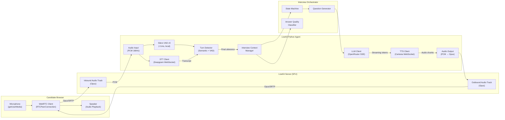

### 6.2 Latency Budget

**[SRS-VOICE-002]**

| Stage | Target Latency | Provider | Measurement Point |
|---|---|---|---|
| WebRTC transport (candidate → SFU → agent) | 50–120ms | LiveKit | Network RTT / 2 |
| STT streaming (audio → interim transcript) | 200–300ms | Deepgram Nova-3 | First interim transcript from speech start |
| VAD speech-end detection | <1ms | Silero VAD v5 | Silence onset to VAD trigger |
| Turn detection (VAD + semantic) | 100–300ms | LiveKit Turn Detector | VAD trigger to turn-complete decision |
| LLM TTFT (prompt → first token) | 200–500ms | OpenRouter/NIM | API call to first SSE token |
| TTS TTFA (first text → first audio) | 40–250ms | Cartesia Sonic | First text token to first audio byte |
| WebRTC transport (agent → SFU → candidate) | 50–120ms | LiveKit | Network RTT / 2 |
| **Total E2E perceived latency** | **<1500ms** | — | Candidate speech end to AI audio start |

### 6.3 Streaming Architecture

**[SRS-VOICE-003]** The voice pipeline is fully streaming with no blocking between stages:

1. **STT streams continuously** — provides interim transcripts in real-time as the candidate speaks
2. **Turn detection runs parallel** — monitors VAD and transcript completeness concurrently
3. **LLM response streams token-by-token** — each token is immediately forwarded to TTS
4. **TTS generates audio incrementally** — begins synthesis as soon as first text tokens arrive (does not wait for full response)
5. **Audio output streams to candidate** — first audio byte plays before LLM has finished generating

### 6.4 Barge-in Handling

**[SRS-VOICE-004]** When candidate starts speaking while AI is generating a response:

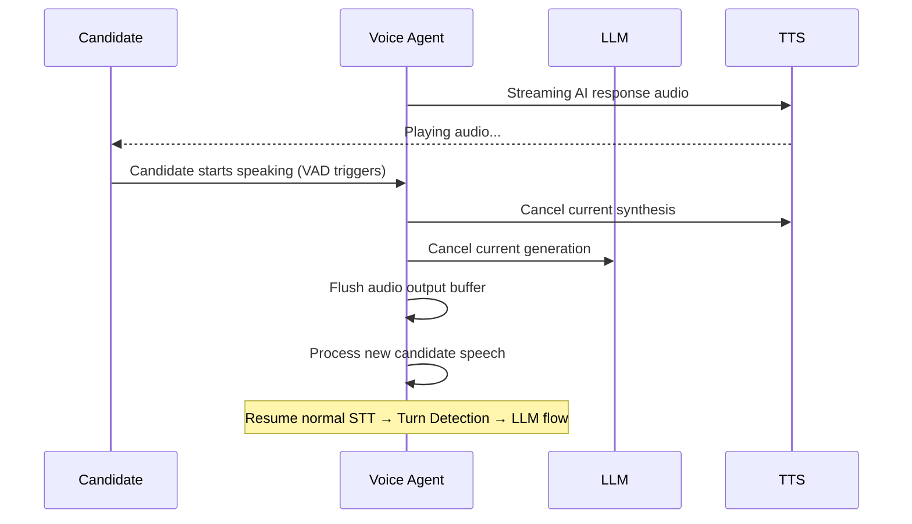

### 6.5 Network Failure Handling

**[SRS-VOICE-005]**

| Failure | Detection | Handling | Recovery |
|---|---|---|---|
| WebRTC disconnect | LiveKit participant leave event | Preserve interview state, start 5-minute reconnection window | Candidate reconnects → restore state → resume from last turn |
| STT WebSocket drop | Connection error / timeout | Switch to fallback STT (AssemblyAI) | Automatic reconnection with exponential backoff |
| TTS WebSocket drop | Connection error / timeout | Switch to fallback TTS (ElevenLabs) | Automatic reconnection |
| LLM timeout (>10s) | Request timeout | Retry with fallback model, use pre-generated bridge phrase ("Let me think about that...") | Fallback model response |
| Microphone failure | Track ended event | Display "Microphone disconnected" warning | Candidate reconnects mic, resume |
| High latency detected | E2E > 3000ms for 3 consecutive turns | Log degradation event, notify recruiter | Attempt provider switch, notify candidate |

### 6.6 Audio Quality Requirements

**[SRS-VOICE-006]**

| Property | Requirement |
|---|---|
| Sample rate | 16 kHz (STT input), 24 kHz (TTS output) |
| Codec | Opus (WebRTC native) |
| Channels | Mono (single speaker) |
| Bitrate | 24–64 kbps (adaptive) |
| Echo cancellation | Hardware AEC via WebRTC (browser-native) |
| Noise suppression | WebRTC built-in NS + Silero VAD filtering |

---

## 7. AI Agent Architecture

### 7.1 Multi-Agent Architecture

**[SRS-AI-001]**

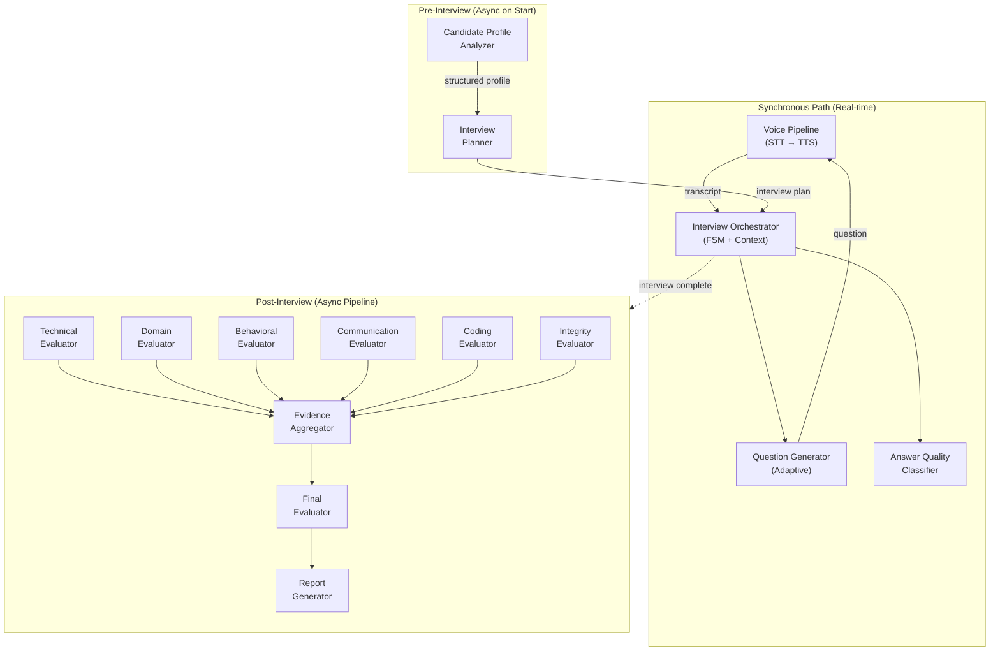

### 7.2 Agent Definitions

**[SRS-AI-002]**

| # | Agent | Purpose | Execution | Model Class | Key Inputs | Key Outputs |
|---|---|---|---|---|---|---|
| 1 | Interview Orchestrator | FSM management, turn coordination | Sync | Deterministic (no LLM) | Turn events, state | State transitions, agent triggers |
| 2 | Candidate Profile Analyzer | Extract structured data from resume + JD | Async (interview start) | GLiNER + NuExtract (local) | Raw resume, raw JD | Structured profile JSON |
| 3 | Interview Planner | Create interview strategy | Async (interview start) | LLM (GPT-4o-mini) | Structured profile, config | Interview plan with competency priorities |
| 4 | Question Generator | Generate next adaptive question | Sync (per turn) | LLM (GPT-4o-mini / Llama-3.3-70B) | Context, plan, coverage, quality history | Question text, target competency, difficulty |
| 5 | Answer Quality Classifier | Classify candidate answer quality | Sync (per turn) | ModernBERT-base (local) | Candidate response text | Quality enum (WEAK–EXCEPTIONAL) |
| 6 | Technical Evaluator | Assess technical knowledge | Async (post-interview) | LLM (GPT-4o / Claude 3.5) | Transcript, JD, rubric | Competency scores + evidence |
| 7 | Domain Evaluator | Assess domain expertise | Async (post-interview) | LLM (GPT-4o / Claude 3.5) | Transcript, JD, rubric | Competency scores + evidence |
| 8 | Behavioral Evaluator | Assess behavioral competencies | Async (post-interview) | LLM (GPT-4o-mini) | Transcript, rubric | Competency scores + evidence |
| 9 | Communication Evaluator | Assess communication clarity | Async (post-interview) | LLM (GPT-4o-mini) | Transcript | Communication score + evidence |
| 10 | Coding Evaluator | Assess code quality | Async (per submission + post) | Qwen2.5-Coder-1.5B (local) | Code, test results, problem | Code quality assessment |
| 11 | Integrity Evaluator | Analyze integrity events | Async (post-interview) | Deterministic + LLM | Integrity events, temporal data | Integrity report |
| 12 | Evidence Aggregator | Combine all evaluation evidence | Async | Deterministic | All evaluator outputs | Unified evidence set |
| 13 | Final Evaluator | Consolidated assessment | Async | LLM (GPT-4o) | Aggregated evidence | Final scores, confidence, assessment |
| 14 | Report Generator | Create structured reports | Async | LLM (GPT-4o-mini) | Final evaluation | Recruiter + candidate reports |

### 7.3 Structured Output Enforcement

**[SRS-AI-003]** All LLM agent outputs are constrained to Pydantic models with JSON schema enforcement:

```python
class CompetencyScore(BaseModel):
    competency: str
    score: int = Field(ge=1, le=100)
    evidence: list[str]  # Transcript quotes
    positives: list[str]
    weaknesses: list[str]
    confidence: float = Field(ge=0.0, le=1.0)
    question_references: list[int]  # Turn numbers

class EvaluationOutput(BaseModel):
    evaluator_type: str
    overall_score: int = Field(ge=1, le=100)
    competency_scores: list[CompetencyScore]
    summary: str
    confidence: float = Field(ge=0.0, le=1.0)
```

### 7.4 Context Window Management

**[SRS-AI-004]** For long interviews (30+ minutes, 50+ turns):
- **Sliding window**: Keep last 20 turns in full detail
- **Summarization**: Older turns summarized into structured context block
- **Context budget**: Max 8K tokens for interview context sent to Question Generator
- **Evidence preservation**: Full transcript always available in database for post-interview evaluation

---

## 8. Model Routing & Provider Abstraction

### 8.1 Model/Task Routing Matrix

**[SRS-MODEL-001]**

| Task | Preferred Model | Fallback | Sync/Async | Cost/1K tokens | Provider |
|---|---|---|---|---|---|
| Conversational interviewing | GPT-4o-mini | Llama-3.3-70B (NIM) | Sync (streaming) | $0.15/$0.60 in/out | OpenRouter |
| JD structured extraction | NuExtract-1.5 | GPT-4o-mini | Async | Local / $0.15 | Local / OpenRouter |
| Resume NER | GLiNER v2.1 | GPT-4o-mini | Async | Local / $0.15 | Local / OpenRouter |
| Answer quality classification | ModernBERT-base | DeBERTa-v3 zero-shot | Sync | Local | Local |
| Technical evaluation | GPT-4o | Llama-3.3-70B | Async | $2.50/$10.00 | OpenRouter |
| Domain evaluation | GPT-4o | Llama-3.3-70B | Async | $2.50/$10.00 | OpenRouter |
| Behavioral evaluation | GPT-4o-mini | Gemini 2.0 Flash | Async | $0.15/$0.60 | OpenRouter |
| Communication evaluation | GPT-4o-mini | Gemini 2.0 Flash | Async | $0.15/$0.60 | OpenRouter |
| Code evaluation | Qwen2.5-Coder-1.5B | GPT-4o-mini | Async | Local / $0.15 | Local / OpenRouter |
| Report generation | GPT-4o-mini | Llama-3.3-70B | Async | $0.15/$0.60 | OpenRouter |
| Embeddings | nomic-embed-text-v1.5 | bge-small-en-v1.5 | Async | Local | Local |
| Reranking | FlashRank | bge-reranker-v2-m3 | Sync | Local | Local |
| Prompt injection detection | Llama Guard 3 (1B) | Rule-based patterns | Sync | Local | Local |
| STT | Deepgram Nova-3 | AssemblyAI | Sync (streaming) | $0.0077/min | Deepgram |
| TTS | Cartesia Sonic | ElevenLabs Flash | Sync (streaming) | ~$0.10/1K chars | Cartesia |
| VAD | Silero VAD v5 | — | Sync | Free (local) | Local |

### 8.2 Provider Abstraction Interfaces

**[SRS-MODEL-002]**

```python
from abc import ABC, abstractmethod
from typing import AsyncGenerator
from pydantic import BaseModel

class LLMProvider(ABC):
    @abstractmethod
    async def complete(self, messages: list[dict], **kwargs) -> str: ...

    @abstractmethod
    async def stream(self, messages: list[dict], **kwargs) -> AsyncGenerator[str, None]: ...

    @abstractmethod
    async def structured_output(self, messages: list[dict], schema: type[BaseModel], **kwargs) -> BaseModel: ...

class STTProvider(ABC):
    @abstractmethod
    async def transcribe_stream(self, audio_stream: AsyncGenerator[bytes, None]) -> AsyncGenerator[dict, None]: ...

class TTSProvider(ABC):
    @abstractmethod
    async def synthesize_stream(self, text_stream: AsyncGenerator[str, None]) -> AsyncGenerator[bytes, None]: ...

class EmbeddingProvider(ABC):
    @abstractmethod
    async def embed(self, texts: list[str]) -> list[list[float]]: ...

class ClassificationProvider(ABC):
    @abstractmethod
    async def classify(self, text: str, labels: list[str]) -> dict[str, float]: ...

class ModerationProvider(ABC):
    @abstractmethod
    async def check(self, text: str) -> dict: ...
```

### 8.3 Provider Health & Failover

**[SRS-MODEL-003]**
- **Health probe**: Periodic lightweight request to each provider (every 60 seconds)
- **Failure detection**: 3 consecutive failures or latency > 5x normal → mark unhealthy
- **Failover**: Automatic switch to fallback provider; alert generated
- **Recovery**: Unhealthy provider probed every 5 minutes; restored after 3 consecutive successes
- **Circuit breaker**: Open after 5 failures in 60 seconds; half-open after 120 seconds

---

## 9. Evaluation Architecture

### 9.1 Evaluation Pipeline

**[SRS-EVAL-001]**

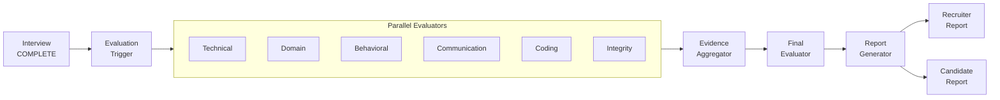

### 9.2 Scoring Methodology

**[SRS-EVAL-002]**
- **Scale**: 1–100 per competency
- **Evidence requirement**: Every score must reference at least one specific transcript quote
- **Confidence**: 0.0–1.0 per competency, based on evidence quantity and quality
- **Anti-bias**: Protected characteristics (accent, gender, age, ethnicity) explicitly excluded from scoring prompts
- **Structured output**: All evaluator outputs constrained to Pydantic schema (see SRS-AI-003)

### 9.3 Evaluation Confidence Calculation

**[SRS-EVAL-003]**
```
confidence = weighted_average(
    evidence_count_factor: 0.3,    # More evidence = higher confidence
    answer_quality_factor: 0.3,    # More non-ambiguous answers = higher confidence  
    coverage_factor: 0.2,          # More competencies covered = higher confidence
    consistency_factor: 0.2        # Agreement between evaluators = higher confidence
)
```

---

## 10. Integrity Architecture

### 10.1 Integrity Pipeline

**[SRS-INT-001]**

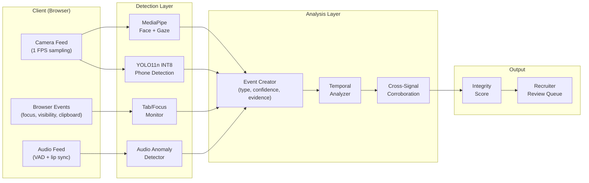

### 10.2 Confidence Thresholds

**[SRS-INT-002]**

| Event Type | Minimum Confidence | Consecutive Frames/Duration | Severity |
|---|---|---|---|
| Face absent | 0.80 | >3 seconds continuous | MEDIUM |
| Multiple faces | 0.85 | >1.5 seconds | HIGH |
| Phone detected | 0.55 | 3 consecutive frames | HIGH |
| Gaze deviation | 0.70 | >3 seconds continuous (Yaw>25° or Pitch>20°) | LOW–MEDIUM |
| Tab switch | 1.0 (deterministic) | Any occurrence | MEDIUM |
| Fullscreen exit | 1.0 (deterministic) | Any occurrence | LOW |
| Copy/paste | 1.0 (deterministic) | Any occurrence | MEDIUM (in coding) |
| Audio anomaly | 0.75 | VAD active + mouth closed >2 seconds | MEDIUM |

---

## 11. Security

### 11.1 Authentication Architecture

**[SRS-SEC-001]** Clerk handles all authentication flows. Backend validates JWT signatures using Clerk's JWKS endpoint.

### 11.2 Authorization

**[SRS-SEC-002]** Two-layer enforcement:
1. **API layer**: FastAPI dependency `require_permission("resource.action")` checks JWT claims
2. **Database layer**: PostgreSQL RLS policies filter all tenant-scoped queries

### 11.3 Prompt Injection Defense

**[SRS-SEC-003]** Multi-layer defense architecture:

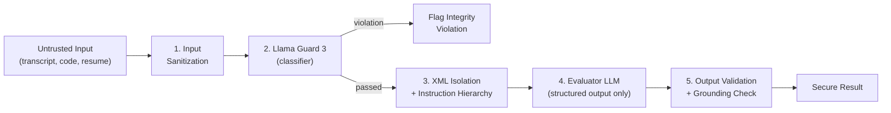

- **Layer 1**: Input sanitization (strip control characters, normalize whitespace)
- **Layer 2**: Llama Guard 3 classifier (~20–40ms, local) screens for injection attempts
- **Layer 3**: Strict XML delimiters (`<candidate_submission>`) with system instruction hierarchy
- **Layer 4**: Evaluator LLM constrained to JSON schema output only (no free-form text)
- **Layer 5**: Output validation cross-checks scores against automated metrics (e.g., code test pass rate)

### 11.4 Tenant Data Isolation

**[SRS-SEC-004]**
- PostgreSQL RLS with `SET LOCAL` (transaction-scoped, PgBouncer-safe)
- Application-level tenant context injection via FastAPI middleware
- Integration tests verify cross-tenant data leakage impossibility

### 11.5 Rate Limiting

**[SRS-SEC-005]** See SRS-API-003 for per-endpoint limits.

### 11.6 Encryption

**[SRS-SEC-006]**
- **In transit**: TLS 1.3 (Cloudflare SSL termination + Cloud Run HTTPS)
- **At rest**: Neon PostgreSQL AES-256 encryption, Cloudflare R2 server-side encryption

---

## 12. Privacy

### 12.1 Data Collection Inventory

**[SRS-PRIV-001]**

| Data Category | Collected | Purpose | Retention | Consent Required |
|---|---|---|---|---|
| Candidate name + email | Yes | Identification | 2 years | Yes (invitation acceptance) |
| Resume | Yes | Interview personalization | 1 year | Yes (explicit upload) |
| Interview transcript | Yes | Evaluation + audit | 2 years | Yes (pre-interview consent) |
| Competency scores | Yes | Assessment | 2 years | Implicit (purpose of system) |
| Integrity events | Yes | Academic integrity | 1 year | Yes (pre-interview consent) |
| Audio/video recordings | No (MVP) | — | — | — |
| Device/browser info | Yes | Compatibility + audit | 1 year | Yes (pre-interview consent) |
| IP address | Yes | Security + audit | 3 years | Implicit (access logs) |

### 12.2 Regulatory Considerations

**[SRS-PRIV-002]**
- **India DPDPA 2023**: Data fiduciary obligations, consent requirements, data principal rights (access, correction, erasure)
- **GDPR** (for international): Right to erasure, data portability, legitimate interest basis
- **[ASSUMPTION]** Full legal compliance review will be conducted before production launch. Current architecture is designed to support compliance requirements but does not claim certified compliance.

---

## 13. Observability

### 13.1 Monitoring Stack

**[SRS-OBS-001]**
- **Metrics**: Grafana Cloud (Prometheus-compatible, 10K series free)
- **Logs**: Grafana Cloud Loki (50 GB free) via structured JSON logging
- **Traces**: Grafana Cloud Tempo (50 GB free) via OpenTelemetry
- **Errors**: Sentry (5K events/mo free) with FastAPI integration

### 13.2 Key Metrics

**[SRS-OBS-002]**

| Category | Metric | Target | Alert Threshold |
|---|---|---|---|
| API | Response time p95 | <200ms | >500ms for 5 min |
| API | Error rate | <1% | >5% for 5 min |
| Voice | E2E latency p95 | <1500ms | >3000ms for 3 turns |
| Voice | STT latency p95 | <300ms | >1000ms |
| Voice | TTS TTFA p95 | <250ms | >500ms |
| AI | LLM TTFT p95 | <500ms | >2000ms |
| AI | Cost per interview | <$2.00 | >$5.00 single interview |
| AI | Provider failure rate | <0.5% | >2% in 10 min |
| Business | Interview completion rate | >85% | <70% daily |
| Business | Avg interview duration | 20–45 min | >60 min avg daily |
| Infra | Database connection pool | <80% utilization | >90% for 5 min |
| Infra | Cloud Run instance count | Auto-scaled | >8 instances sustained |

---

## 14. Non-Functional Requirements

**[SRS-NFR-001]**

| ID | Category | Requirement | Target | Measurement |
|---|---|---|---|---|
| NFR-001 | Performance | API response time | p95 < 200ms | Grafana API latency histogram |
| NFR-002 | Performance | Page load time | < 3 seconds | Lighthouse score |
| NFR-003 | Voice Latency | End-to-end perceived | < 1500ms | Per-turn latency measurement |
| NFR-004 | Voice Latency | STT latency | < 300ms | Provider SDK metrics |
| NFR-005 | Voice Latency | TTS TTFA | < 250ms | Provider SDK metrics |
| NFR-006 | Voice Latency | LLM TTFT | < 500ms | OpenTelemetry span |
| NFR-007 | Scalability | Concurrent interviews (MVP) | 100 | Load test (Locust) |
| NFR-008 | Scalability | Concurrent interviews (prod) | 1,000 | Load test + auto-scale verification |
| NFR-009 | Availability | System uptime (MVP) | 99.5% | Uptime monitoring (Better Stack) |
| NFR-010 | Availability | System uptime (prod) | 99.9% | Uptime monitoring |
| NFR-011 | Reliability | Interview data loss | Zero | Chaos testing + DB backup verification |
| NFR-012 | Reliability | Graceful degradation | Provider failover in <5s | Failover testing |
| NFR-013 | Security | OWASP Top 10 | Full compliance | OWASP ZAP scan |
| NFR-014 | Security | Cross-tenant leakage | Zero tolerance | Automated RLS integration tests |
| NFR-015 | Privacy | Deletion request fulfillment | < 30 days | Operational procedure verification |
| NFR-016 | Maintainability | Code test coverage | > 80% | pytest --cov report |
| NFR-017 | Maintainability | Deployment time | < 5 minutes | CI/CD pipeline metrics |
| NFR-018 | Browser Compat | Supported browsers | Chrome 90+, Firefox 88+, Edge 90+, Safari 15+ | Cross-browser testing |
| NFR-019 | Data Integrity | Transaction consistency | ACID for critical paths | Integration tests |
| NFR-020 | Cost Efficiency | Cost per interview (MVP) | < $2.00 | Usage record aggregation |
| NFR-021 | Disaster Recovery | RTO | 4 hours (MVP) | DR drill |
| NFR-022 | Disaster Recovery | RPO | 1 hour | Neon PITR verification |
| NFR-023 | Accessibility | Dashboard WCAG | Level AA (2.1) | axe-core automated + manual |

---

## 15. Testing Strategy

**[SRS-TEST-001]**

| Test Type | Framework | Coverage Target | Scope |
|---|---|---|---|
| Unit tests | pytest | >80% line coverage | All service logic, utility functions, data validation |
| Integration tests | pytest + httpx (TestClient) | All API endpoints | API request/response, database operations, auth flows |
| Database tests | pytest + Alembic | All migrations | Schema creation, RLS policies, enum types |
| E2E tests | Playwright | Critical user journeys | Recruiter flow, candidate flow, admin flow |
| Load tests | Locust | NFR scalability targets | Concurrent API requests, concurrent interviews |
| Security tests | OWASP ZAP + bandit + pip-audit | OWASP Top 10 | Vulnerability scanning, dependency audit |
| AI quality tests | Custom benchmark suite | Evaluation accuracy >85% | Prompt regression, model comparison, bias detection |
| Voice pipeline tests | Custom latency benchmarks | NFR latency targets | STT/TTS/E2E latency measurement |
| Accessibility tests | axe-core + manual review | WCAG 2.1 AA | Dashboard screens |

---

## 16. DevOps

**[SRS-DEVOPS-001]**

| Area | Technology | Configuration |
|---|---|---|
| Containerization | Docker (multi-stage build) | Base: `python:3.12-slim`, packaged with Poetry |
| CI/CD | GitHub Actions | Lint → Test → Build → Push → Deploy |
| Database migrations | Alembic (async) | Auto-generated, reviewed, applied in CI |
| Secrets | Infisical CLI | `infisical run -- uvicorn app.main:app` |
| Health checks | FastAPI endpoints | `/health` (liveness), `/ready` (readiness) |
| Rollback | Cloud Run revision routing | Instant traffic shift to previous revision |
| Versioning | Semantic Versioning (semver) | Tagged releases on main branch |
| Linting | ruff (Python), mypy (type checking) | Enforced in CI, pre-commit hooks |

---

## 17. Configuration Management

**[SRS-CONFIG-001]** Environment configuration via Pydantic `BaseSettings`:

| Variable | Type | Default | Description |
|---|---|---|---|
| `DATABASE_URL` | str | — | Neon PostgreSQL connection string |
| `CLERK_SECRET_KEY` | str | — | Clerk backend API key |
| `CLERK_PUBLISHABLE_KEY` | str | — | Clerk frontend key |
| `DEEPGRAM_API_KEY` | str | — | Deepgram STT API key |
| `CARTESIA_API_KEY` | str | — | Cartesia TTS API key |
| `OPENROUTER_API_KEY` | str | — | OpenRouter LLM gateway key |
| `RESEND_API_KEY` | str | — | Resend email API key |
| `R2_ACCESS_KEY_ID` | str | — | Cloudflare R2 access key |
| `R2_SECRET_ACCESS_KEY` | str | — | Cloudflare R2 secret |
| `R2_BUCKET_NAME` | str | `autergo-storage` | R2 bucket name |
| `LIVEKIT_URL` | str | — | LiveKit server URL |
| `LIVEKIT_API_KEY` | str | — | LiveKit API key |
| `LIVEKIT_API_SECRET` | str | — | LiveKit API secret |
| `SENTRY_DSN` | str | — | Sentry error tracking DSN |
| `ENVIRONMENT` | str | `development` | dev / staging / production |
| `LOG_LEVEL` | str | `INFO` | Logging level |
| `RATE_LIMIT_ENABLED` | bool | `true` | Enable/disable rate limiting |
| `MAX_INTERVIEW_DURATION_MINUTES` | int | `120` | Platform-wide maximum |
| `PISTON_URL` | str | — | Piston code sandbox URL |

---

## 18. Disaster Recovery

**[SRS-DR-001]**

| Target | MVP | Production |
|---|---|---|
| RTO (Recovery Time Objective) | 4 hours | 1 hour |
| RPO (Recovery Point Objective) | 1 hour | 15 minutes |
| Database backup | Neon PITR (continuous) | Neon PITR + daily snapshot to R2 |
| Application recovery | Redeploy from last known-good Docker image | Auto-scaling + multi-region failover |
| Incident response | Email notification to engineering team | PagerDuty + status page + communication |

---

## 19. Technical Risks

**[SRS-RISK-001]**

| ID | Risk | Probability | Impact | Mitigation | Owner |
|---|---|---|---|---|---|
| RISK-001 | Voice latency exceeds 1500ms target | Medium | High | Provider benchmarking before selection; fallback providers; S2S evaluation | Voice Engineering |
| RISK-002 | Provider outage during live interview | Medium | Critical | Multi-provider failover; interview state preservation; reconnect support | Platform Engineering |
| RISK-003 | AI API cost overrun | Medium | Medium | Token budgets per interview; model routing optimization; cost alerts; local models | AI Engineering |
| RISK-004 | Prompt injection bypasses defenses | Low | High | Multi-layer defense; Llama Guard; structured output; output validation; regular red-team testing | Security |
| RISK-005 | Cross-tenant data leakage | Low | Critical | PostgreSQL RLS; automated integration tests; security audit | Security |
| RISK-006 | WebRTC NAT traversal failures | Medium | Medium | TURN server deployment; fallback to WebSocket text mode | Infrastructure |
| RISK-007 | AI evaluation quality inconsistency | Medium | High | Prompt regression testing; benchmark suite; human evaluation calibration | AI Engineering |
| RISK-008 | Free tier exhaustion (Neon, Clerk, etc.) | High | Low | Cost monitoring; budget alerts; paid tier migration plan documented | Operations |
| RISK-009 | Regulatory non-compliance (DPDPA/GDPR) | Medium | High | Legal review before launch; privacy-by-design architecture; consent management | Legal + Engineering |
| RISK-010 | LiveKit scaling bottleneck | Low | Medium | LiveKit Cloud for managed scaling; self-hosted cluster as alternative | Infrastructure |

---

## 20. Technical Assumptions

| ID | Assumption | Rationale |
|---|---|---|
| [ASSUMPTION-001] | Candidates have stable internet connection ≥1 Mbps | WebRTC Opus codec requires ~24–64 kbps; 1 Mbps provides comfortable margin |
| [ASSUMPTION-002] | Browser hardware AEC is sufficient for echo cancellation | Modern browsers (Chrome, Firefox, Edge, Safari) all implement AEC via WebRTC |
| [ASSUMPTION-003] | Clerk's organization model maps to Autergo's company tenant model | Clerk supports multi-org with role-based membership |
| [ASSUMPTION-004] | PostgreSQL RLS provides sufficient multi-tenant security | RLS is enforced at database engine level, independent of application bugs |
| [ASSUMPTION-005] | MVP can operate within free tiers of selected services | Based on research of current free tier limits for <100 active users |
| [ASSUMPTION-006] | Deepgram Nova-3 accuracy is sufficient for technical interview vocabulary | Deepgram claims SOTA accuracy; validation benchmark required |
| [ASSUMPTION-007] | OpenRouter provides sufficient reliability for production LLM inference | OpenRouter adds ~30–80ms proxy overhead; multi-model fallback mitigates outages |
| [ASSUMPTION-008] | Python 3.12 with asyncio provides sufficient concurrency for MVP scale | FastAPI + uvicorn handles thousands of concurrent connections; voice processing offloaded to LiveKit |

---

## 21. Open Engineering Decisions

| ID | Decision | Options | Recommendation | Deciding Factor |
|---|---|---|---|---|
| [DECISION-001] | STT provider selection | Deepgram vs AssemblyAI | Deepgram (latency benchmark needed) | Latency and accuracy on technical vocabulary |
| [DECISION-002] | TTS provider selection | Cartesia vs ElevenLabs | Cartesia (latency benchmark needed) | TTFA latency and voice naturalness |
| [DECISION-003] | S2S vs cascaded pipeline | OpenAI Realtime / Gemini Live vs STT→LLM→TTS | Cascaded for MVP (more control) | Cost, control over evaluation, customizability |
| [DECISION-004] | LiveKit deployment | LiveKit Cloud vs self-hosted | LiveKit Cloud for MVP (simplicity) | Cost at scale, operational overhead |
| [DECISION-005] | NAT vs custom orchestration | NVIDIA NAT vs custom Python orchestration | Evaluate NAT; fallback to custom if integration friction | Developer experience, feature parity |
| [DECISION-006] | Vector database necessity | pgvector vs dedicated vector DB vs no vector | Evaluate need during implementation; defer if not required | Whether semantic search provides measurable benefit for question retrieval |
| [DECISION-007] | Code sandbox selection | Piston vs Judge0 | Piston (MIT license preferred) | License compatibility (Judge0 is GPL-3.0) |
| [DECISION-008] | Background task infrastructure | asyncio tasks vs Redis + ARQ/Celery | asyncio for MVP; Redis + ARQ for production | Scale requirements, reliability needs |

---

## Appendix A: Requirement Traceability Summary

| SRS Section | Traces to FRS | Traces to FRD | Traces to PRD | Traces to BRD |
|---|---|---|---|---|
| SRS-ARCH (Architecture) | FRS-001–174 | FR-001–100 | PR-FEAT-001–050 | BR-001–050 |
| SRS-DATA (Database) | FRS-014, FRS-016–032 | FR-006–014 | PR-FEAT-002–015 | BR-001–005 |
| SRS-API (API Design) | FRS-001–174 | FR-001–100 | PR-FEAT-001–050 | BR-001–050 |
| SRS-VOICE (Voice Pipeline) | FRS-081–092 | FR-035–040 | PR-FEAT-025–030 | BR-003, BR-008 |
| SRS-AI (AI Agents) | FRS-065–080, 115–126 | FR-031, FR-052–055 | PR-FEAT-025–035, 040–045 | BR-003, BR-005, BR-009–010 |
| SRS-INT (Integrity) | FRS-101–114 | FR-045–051 | PR-FEAT-040 | BR-011 |
| SRS-SEC (Security) | FRS-001–010 | FR-001–005 | PR-FEAT-001–002 | BR-002, BR-016–018 |
| SRS-NFR (Non-Functional) | — | — | PR-GOAL-001–010 | BR-OBJ-001–010 |

---

*End of Software Requirements Specification — Autergo v1.0*
